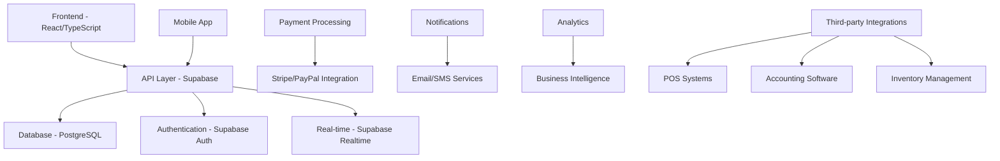

# 🏢 FranchiseHub Business Documentation Suite

## Executive Overview

FranchiseHub is a comprehensive franchise management platform that revolutionizes how franchisors and franchisees operate, scale, and succeed. Our fully-implemented system provides end-to-end franchise lifecycle management, from initial application processing to ongoing operational excellence.

**🎯 Market Position**: Next-generation SaaS platform targeting the $2.4B+ global franchise management software market with 12-15% CAGR growth.

**💡 Value Proposition**: Complete franchise ecosystem management with real-time analytics, automated workflows, and scalable infrastructure designed for modern franchise operations.

---

## 📚 Documentation Navigation

### 📊 **1. Executive Business Plan**
**[📖 View Complete Business Plan →](./executive-business-plan/README.md)**

- [Market Analysis](./executive-business-plan/market-analysis.md) - $2.4B+ market opportunity
- [Competitive Analysis](./executive-business-plan/competitive-analysis.md) - Positioning vs. FranConnect, Naranga
- [Revenue Model](./executive-business-plan/revenue-model.md) - SaaS tiers: $99-$599/month per location
- [Target Segments](./executive-business-plan/target-segments.md) - Primary: 5-50 location franchisors
- [Go-to-Market Strategy](./executive-business-plan/go-to-market.md) - 18-month launch timeline
- [Financial Projections](./executive-business-plan/financial-projections.md) - 5-year P&L with unit economics
- [Technology Scalability](./executive-business-plan/technology-scalability.md) - React/Supabase stack for 10K+ users

### 🎭 **2. Business Scenarios**
**[📖 View All Scenarios →](./business-scenarios/README.md)**

| Scenario | Target Audience | Business Impact | ROI Timeline |
|----------|----------------|-----------------|--------------|
| [Coffee Chain Startup](./business-scenarios/coffee-chain-startup/) | New Franchisors (5 locations) | 40% faster expansion | 8 months |
| [Regional Expansion](./business-scenarios/regional-expansion/) | Mid-size Franchisors (15→50 locations) | 60% operational efficiency | 6 months |
| [Multi-Brand Empire](./business-scenarios/multi-brand-empire/) | Enterprise Franchisors (3+ brands) | 35% cost reduction | 12 months |
| [Multi-Location Franchisee](./business-scenarios/multi-location-franchisee/) | Power Franchisees (8+ locations) | 25% inventory optimization | 4 months |
| [Franchise Consultant](./business-scenarios/franchise-consultant/) | Consultants (25+ clients) | 50% client management efficiency | 3 months |
| [Crisis Management](./business-scenarios/crisis-management/) | All Users | 80% faster response time | Immediate |
| [Seasonal Operations](./business-scenarios/seasonal-operations/) | Seasonal Franchises | 30% inventory waste reduction | 6 months |

### ⚖️ **3. Business Rules Documentation**
**[📖 View Business Rules →](./business-rules/README.md)**

- [Access Control Matrix](./business-rules/access-control.md) - Role-based permissions framework
- [Financial Transaction Rules](./business-rules/financial-transactions.md) - Payment processing & royalty calculations
- [Inventory Management Rules](./business-rules/inventory-management.md) - Reorder algorithms & approval thresholds
- [Order Processing Workflows](./business-rules/order-processing.md) - 8-stage lifecycle management
- [Application Review Criteria](./business-rules/application-review.md) - Scoring matrix & qualification thresholds
- [Compliance Framework](./business-rules/compliance.md) - GDPR, audit trails, data retention
- [Integration Standards](./business-rules/integration-standards.md) - API specifications & third-party protocols

### 🚀 **4. Future Roadmap**
**[📖 View Roadmap →](./roadmap/README.md)**

- [Phase 1 Enhancements](./roadmap/phase-1.md) (6 months) - Mobile app, advanced analytics
- [Phase 2 Expansion](./roadmap/phase-2.md) (12 months) - AI optimization, multi-currency
- [Phase 3 Innovation](./roadmap/phase-3.md) (18-24 months) - IoT, blockchain, ML forecasting
- [World-Class Aspirations](./roadmap/aspirations.md) - Global marketplace, automated legal docs

### 📈 **5. Investor Materials**
**[📖 View Investor Package →](./investor-materials/README.md)**

- [Executive Summary Deck](./investor-materials/executive-deck.pdf) - 20-slide presentation
- [Demo Script](./investor-materials/demo-script.md) - Key system capabilities showcase
- [Financial Models](./investor-materials/financial-models.xlsx) - Detailed projections & unit economics
- [Risk Assessment](./investor-materials/risk-assessment.md) - Mitigation strategies
- [Exit Strategy](./investor-materials/exit-strategy.md) - Valuation methodologies

---

## 🎯 **Key Success Metrics**

### Market Opportunity
- **Total Addressable Market (TAM)**: $2.4B+ global franchise management software
- **Serviceable Addressable Market (SAM)**: $480M (franchisors with 5-100 locations)
- **Serviceable Obtainable Market (SOM)**: $24M (5% market share target in 5 years)

### Financial Targets
- **Year 1 Revenue**: $2.4M ARR (200 locations @ $1,000 average monthly revenue)
- **Year 3 Revenue**: $24M ARR (2,000 locations)
- **Year 5 Revenue**: $60M ARR (5,000 locations)
- **Target Churn Rate**: <5% annually
- **Customer Acquisition Cost (CAC)**: $2,500
- **Lifetime Value (LTV)**: $50,000 (LTV:CAC ratio of 20:1)

### Operational Excellence
- **System Uptime**: 99.9% SLA
- **Customer Satisfaction**: >90% NPS score
- **Implementation Time**: <30 days average
- **Support Response**: <2 hours for critical issues

---

## 🏗️ **System Architecture Overview**

---

## 📋 **Implementation Status**

### ✅ **Completed Features**
- **User Management**: Multi-role authentication (Franchisor, Franchisee, Admin, User)
- **Franchise Lifecycle**: Package selection, application processing, approval workflows
- **Order Management**: Complete 8-stage order lifecycle with real-time tracking
- **Inventory Management**: Stock tracking, low-stock alerts, automated reordering
- **Financial Processing**: Invoice generation, payment processing, transaction history
- **Analytics Dashboard**: Real-time metrics, performance tracking, financial reporting
- **Notification System**: Real-time alerts, email notifications, system updates

### 🔄 **Current Scope**
- **Geographic Focus**: Philippines market (expandable globally)
- **Industry Focus**: Food service franchises (expandable to all industries)
- **Scale Optimization**: 1-100 locations per franchise system
- **Language Support**: English (multi-language roadmap available)

### 📊 **Technical Specifications**
- **Frontend**: React 18, TypeScript, Tailwind CSS, shadcn/ui
- **Backend**: Supabase (PostgreSQL, Real-time, Auth, Storage)
- **State Management**: React Query for server state, Zustand for client state
- **Testing**: Comprehensive API testing suite with real data validation
- **Security**: Row-level security, role-based access control, audit logging

---

## 🤝 **Partnership Opportunities**

### Strategic Partnerships
- **Franchise Brokers**: Integration with franchise listing platforms
- **POS Vendors**: Direct integration with major POS systems
- **Accounting Software**: QuickBooks, Xero, SAP integration
- **Payment Processors**: Stripe, PayPal, regional payment gateways

### Channel Partners
- **Franchise Consultants**: White-label solutions and revenue sharing
- **Technology Integrators**: Implementation and customization services
- **Industry Associations**: International Franchise Association partnerships

---

## 📞 **Contact Information**

**Development Team**: JC de las Alas (Lead Developer)  
**Business Contact**: [Contact Information]  
**Demo Requests**: [Scheduling Link]  
**Investment Inquiries**: [Investment Contact]

---

## 📄 **Document Version Control**

- **Version**: 1.0.0
- **Last Updated**: July 2025
- **Next Review**: August 2025
- **Document Owner**: Business Development Team

---

*This documentation suite represents a comprehensive business plan for FranchiseHub, a fully-implemented franchise management platform ready for commercial deployment and investor presentation.*
