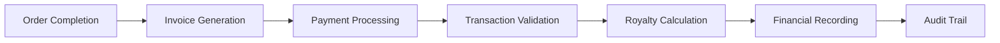
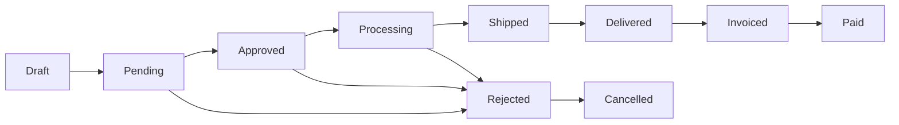

# ⚖️ Business Rules Documentation - FranchiseHub

## Executive Overview

This comprehensive business rules documentation defines the operational framework, regulatory compliance, and business logic that governs FranchiseHub's franchise management platform. These rules ensure consistent operations, regulatory compliance, and optimal business outcomes across all franchise networks.

All business rules are implemented in our fully-functional system with real database integration, automated workflows, and comprehensive audit trails. This documentation serves as the authoritative reference for system behavior, compliance requirements, and operational procedures.

---

## 📋 Business Rules Framework

### Rule Categories

```mermaid
graph TD
    A[Business Rules Framework] --> B[Access Control]
    A --> C[Financial Transactions]
    A --> D[Inventory Management]
    A --> E[Order Processing]
    A --> F[Application Review]
    A --> G[Compliance Framework]
    A --> H[Integration Standards]
    
    B --> B1[Role-Based Permissions]
    B --> B2[Data Access Controls]
    B --> B3[Feature Restrictions]
    
    C --> C1[Payment Processing]
    C --> C2[Royalty Calculations]
    C --> C3[Invoice Generation]
    
    D --> D1[Reorder Algorithms]
    D --> D2[Approval Thresholds]
    D --> D3[Stock Allocation]
    
    E --> E1[Workflow Stages]
    E --> E2[Approval Hierarchies]
    E --> E3[Status Transitions]
    
    F --> F1[Scoring Matrix]
    F --> F2[Qualification Criteria]
    F --> F3[Review Process]
    
    G --> G1[Data Retention]
    G --> G2[Privacy Protection]
    G --> G3[Audit Requirements]
    
    H --> H1[API Specifications]
    H --> H2[Data Synchronization]
    H --> H3[Third-party Integration]
```



### Rule Implementation Hierarchy

1. **System-Level Rules**: Core platform functionality and security
2. **Business-Level Rules**: Franchise-specific operational requirements
3. **User-Level Rules**: Individual user permissions and restrictions
4. **Transaction-Level Rules**: Specific business transaction validations
5. **Compliance-Level Rules**: Regulatory and audit requirements

---

## 🔐 Access Control Matrix

**[📖 View Detailed Access Control Rules →](./access-control.md)**

### Role-Based Permission Framework

| Feature Category | Franchisor | Franchisee | Admin | User |
|------------------|------------|------------|-------|------|
| **User Management** | Full | Location Only | Full | None |
| **Franchise Management** | Full | View Only | Full | None |
| **Order Management** | Full | Location Only | Full | Limited |
| **Inventory Management** | Full | Location Only | View | Limited |
| **Financial Management** | Full | Location Only | Full | None |
| **Analytics & Reporting** | Full | Location Only | Full | Limited |
| **System Administration** | Limited | None | Full | None |

### Data Access Controls

**Franchisor Access**:
- All franchise locations and performance data
- Complete financial information across network
- Application and approval workflows
- System configuration and settings
- Cross-location analytics and benchmarking

**Franchisee Access**:
- Own location(s) data only
- Location-specific financial information
- Inventory and order management for owned locations
- Performance metrics for owned locations
- Training and compliance materials

**Admin Access**:
- System administration and configuration
- User management and role assignment
- Technical support and troubleshooting
- Data backup and recovery operations
- Security monitoring and audit logs

**User Access**:
- Basic operational functions
- Limited reporting capabilities
- Personal profile management
- Training module access
- Task-specific permissions

---

## 💰 Financial Transaction Rules

**[📖 View Detailed Financial Rules →](./financial-transactions.md)**

### Payment Processing Workflows



### Royalty Calculation Framework

**Percentage-Based Royalties**:
- **Starter Package**: 5.0% of gross revenue
- **Professional Package**: 7.5% of gross revenue
- **Premium Package**: 12.5% of gross revenue

**Marketing Fee Structure**:
- **Starter Package**: 1.0% of gross revenue
- **Professional Package**: 1.5% of gross revenue
- **Premium Package**: 2.5% of gross revenue

**Calculation Rules**:
- Royalties calculated monthly on gross revenue
- Marketing fees calculated separately from royalties
- Minimum monthly royalty: $500 per location
- Maximum monthly royalty: $25,000 per location
- Late payment penalty: 1.5% per month

### Invoice Generation Rules

**Automatic Invoice Triggers**:
- Monthly royalty and marketing fee invoices (1st of each month)
- Order completion invoices (within 24 hours)
- Implementation service invoices (upon milestone completion)
- Professional service invoices (upon service delivery)

**Invoice Validation Requirements**:
- All invoices must include detailed line items
- Tax calculations based on location jurisdiction
- Payment terms: Net 30 days for monthly fees, Net 15 for orders
- Late payment notifications: 5 days after due date
- Collection procedures: 30 days after due date

---

## 📦 Inventory Management Rules

**[📖 View Detailed Inventory Rules →](./inventory-management.md)**

### Reorder Point Algorithms

**Dynamic Reorder Calculation**:
```
Reorder Point = (Average Daily Usage × Lead Time) + Safety Stock
Safety Stock = (Maximum Daily Usage × Maximum Lead Time) - (Average Daily Usage × Average Lead Time)
```

**Category-Specific Rules**:
- **Perishables**: 1-3 day safety stock, daily reorder evaluation
- **Semi-Perishables**: 3-7 day safety stock, weekly reorder evaluation
- **Non-Perishables**: 7-30 day safety stock, monthly reorder evaluation
- **Equipment**: 30-90 day safety stock, quarterly reorder evaluation

### Approval Threshold Matrix

| Order Value | Approval Required | Approval Timeline | Escalation Rules |
|-------------|------------------|-------------------|------------------|
| **$0 - $500** | Automatic | Immediate | None |
| **$500 - $2,500** | Location Manager | 4 hours | Regional Manager after 8 hours |
| **$2,500 - $10,000** | Regional Manager | 8 hours | Corporate after 24 hours |
| **$10,000 - $50,000** | Corporate Approval | 24 hours | CEO after 48 hours |
| **$50,000+** | Board Approval | 72 hours | Special authorization required |

### Stock Allocation Rules

**Multi-Location Allocation**:
- Priority allocation based on sales velocity
- Emergency stock redistribution protocols
- Cross-location inventory sharing agreements
- Seasonal allocation adjustments
- New location priority stocking

**Allocation Algorithms**:
- **Sales-Based**: 60% weight on historical sales performance
- **Forecast-Based**: 30% weight on demand forecasting
- **Strategic-Based**: 10% weight on strategic priorities

---

## 📋 Order Processing Workflows

**[📖 View Detailed Order Processing Rules →](./order-processing.md)**

### 8-Stage Order Lifecycle



### Order Status Transition Rules

**Draft → Pending**:
- All required fields completed
- Budget validation passed
- Inventory availability confirmed
- Automatic transition upon submission

**Pending → Approved**:
- Approval authority validation
- Budget threshold compliance
- Supplier availability confirmation
- Manual approval required

**Approved → Processing**:
- Purchase order generation
- Supplier notification sent
- Inventory reservation
- Automatic transition

**Processing → Shipped**:
- Supplier confirmation received
- Tracking information available
- Shipping notification sent
- Automatic transition

**Shipped → Delivered**:
- Delivery confirmation received
- Quality inspection completed
- Recipient acknowledgment
- Manual or automatic transition

**Delivered → Invoiced**:
- Invoice generation triggered
- Payment terms applied
- Accounting system integration
- Automatic transition

**Invoiced → Paid**:
- Payment received and validated
- Transaction recorded
- Royalty calculation triggered
- Automatic transition

### Approval Hierarchy Rules

**Location Level Approvals**:
- Location Manager: $0 - $2,500
- Assistant Manager: $0 - $500 (when manager unavailable)
- Staff: $0 - $100 (emergency purchases only)

**Regional Level Approvals**:
- Regional Manager: $2,500 - $10,000
- Regional Director: $10,000 - $25,000
- VP Operations: $25,000 - $50,000

**Corporate Level Approvals**:
- COO: $50,000 - $100,000
- CFO: $100,000 - $250,000
- CEO: $250,000 - $500,000
- Board: $500,000+

---

## 📝 Application Review Criteria

**[📖 View Detailed Application Review Rules →](./application-review.md)**

### Franchise Application Scoring Matrix

**Financial Qualifications (40% weight)**:
- Liquid Capital: Minimum $150,000 (Starter), $250,000 (Professional), $400,000 (Premium)
- Net Worth: Minimum 2x package investment amount
- Credit Score: Minimum 650 (Starter), 700 (Professional), 750 (Premium)
- Debt-to-Income Ratio: Maximum 40%
- Business Experience: Bonus points for relevant experience

**Personal Qualifications (30% weight)**:
- Background Check: Clean criminal record required
- Reference Checks: Minimum 3 professional references
- Interview Performance: Structured interview scoring
- Cultural Fit: Alignment with brand values
- Commitment Level: Full-time dedication required

**Market Qualifications (20% weight)**:
- Territory Availability: Exclusive territory rights
- Market Demographics: Target customer base analysis
- Competition Analysis: Market saturation assessment
- Location Suitability: Site selection criteria compliance
- Growth Potential: Market expansion opportunities

**Operational Qualifications (10% weight)**:
- Management Experience: Previous management roles
- Industry Knowledge: Food service or retail experience
- Training Commitment: Willingness to complete training program
- Technology Adoption: Comfort with technology systems
- Support Utilization: Willingness to follow system guidelines

### Qualification Thresholds

**Automatic Approval Criteria**:
- Score ≥ 85/100 across all categories
- No red flags in background check
- Financial qualifications exceed minimums by 25%
- Strong references and interview performance

**Manual Review Required**:
- Score 70-84/100
- Minor concerns in any category
- Financial qualifications meet minimums
- Additional documentation required

**Automatic Rejection Criteria**:
- Score < 70/100
- Failed background check
- Insufficient financial qualifications
- Poor references or interview performance

---

## 🛡️ Compliance Framework

**[📖 View Detailed Compliance Rules →](./compliance.md)**

### Data Retention Policies

**Financial Records**: 7 years retention
**Transaction Logs**: 5 years retention
**User Activity Logs**: 3 years retention
**Application Records**: 5 years retention
**Communication Records**: 3 years retention
**System Logs**: 1 year retention

### GDPR Compliance Rules

**Data Processing Principles**:
- Lawfulness, fairness, and transparency
- Purpose limitation and data minimization
- Accuracy and storage limitation
- Integrity, confidentiality, and accountability

**Individual Rights**:
- Right to information and access
- Right to rectification and erasure
- Right to restrict processing
- Right to data portability
- Right to object and automated decision-making

### Audit Trail Requirements

**Required Audit Information**:
- User identification and authentication
- Timestamp of all actions
- Data accessed or modified
- System functions performed
- Source IP address and location
- Success or failure of operations

---

## 🔗 Integration Standards

**[📖 View Detailed Integration Standards →](./integration-standards.md)**

### API Specifications

**Authentication Requirements**:
- OAuth 2.0 or API key authentication
- Rate limiting: 1000 requests per hour
- SSL/TLS encryption required
- Request signing for sensitive operations

**Data Format Standards**:
- JSON for all API communications
- ISO 8601 for date/time formats
- UTF-8 character encoding
- RESTful API design principles

### Third-Party Integration Protocols

**POS System Integration**:
- Real-time sales data synchronization
- Product catalog synchronization
- Inventory level updates
- Customer transaction data

**Accounting Software Integration**:
- Chart of accounts mapping
- Transaction categorization
- Financial report generation
- Tax calculation integration

**Payment Processor Integration**:
- Secure payment processing
- Transaction status updates
- Refund and chargeback handling
- Compliance with PCI DSS standards

---

*This business rules documentation provides the comprehensive framework for FranchiseHub's operations, ensuring consistent, compliant, and optimized franchise management across all business processes and stakeholder interactions.*
