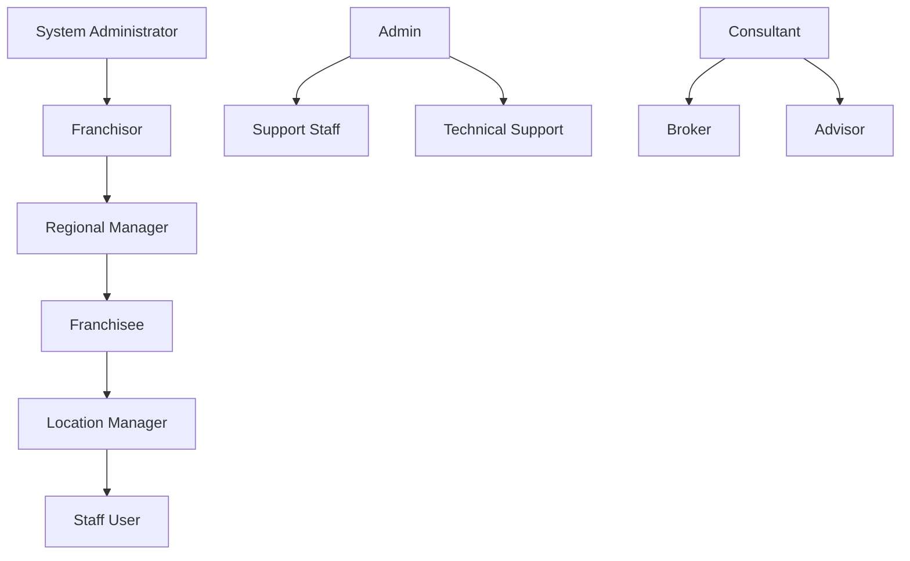
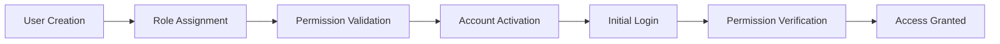

# 🔐 Access Control Matrix - FranchiseHub

## Executive Summary

FranchiseHub implements a comprehensive role-based access control (RBAC) system that ensures appropriate data access, feature availability, and operational permissions based on user roles and organizational hierarchy. This framework protects sensitive information while enabling efficient franchise operations.

---

## 🎭 User Role Definitions

### Role Hierarchy

### Primary Roles

**Franchisor**:
- **Definition**: Franchise brand owner with full network oversight
- **Scope**: All locations, complete financial data, system configuration
- **Typical Users**: CEO, COO, CFO, VP Operations
- **Access Level**: Full platform access with administrative privileges

**Franchisee**:
- **Definition**: Individual franchise owner operating one or more locations
- **Scope**: Owned locations only, location-specific data and operations
- **Typical Users**: Franchise owners, multi-unit operators
- **Access Level**: Location-specific access with operational permissions

**Admin**:
- **Definition**: System administrator with technical and support responsibilities
- **Scope**: System configuration, user management, technical support
- **Typical Users**: IT administrators, customer support, technical staff
- **Access Level**: Administrative functions without business data access

**User**:
- **Definition**: Location staff with limited operational responsibilities
- **Scope**: Basic operational functions, limited reporting
- **Typical Users**: Store managers, shift supervisors, staff members
- **Access Level**: Task-specific permissions with restricted data access

---

## 📊 Comprehensive Permission Matrix

### User Management Permissions

| Function | Franchisor | Franchisee | Admin | User |
|----------|------------|------------|-------|------|
| **Create Users** | ✅ All Roles | ✅ Location Staff Only | ✅ All Roles | ❌ |
| **Edit User Profiles** | ✅ All Users | ✅ Own Location Only | ✅ All Users | ✅ Own Profile |
| **Delete Users** | ✅ All Users | ✅ Location Staff Only | ✅ All Users | ❌ |
| **Assign Roles** | ✅ All Roles | ✅ User Role Only | ✅ All Roles | ❌ |
| **View User List** | ✅ All Users | ✅ Location Staff Only | ✅ All Users | ✅ Location Staff |
| **Reset Passwords** | ✅ All Users | ✅ Location Staff Only | ✅ All Users | ❌ |
| **Manage Permissions** | ✅ All Permissions | ❌ | ✅ All Permissions | ❌ |

### Franchise Management Permissions

| Function | Franchisor | Franchisee | Admin | User |
|----------|------------|------------|-------|------|
| **Create Franchises** | ✅ | ❌ | ✅ | ❌ |
| **Edit Franchise Details** | ✅ All Franchises | ✅ Own Franchise Only | ✅ All Franchises | ❌ |
| **View Franchise List** | ✅ All Franchises | ✅ Own Franchise Only | ✅ All Franchises | ✅ Own Franchise |
| **Manage Locations** | ✅ All Locations | ✅ Own Locations Only | ✅ All Locations | ✅ View Own Location |
| **Franchise Applications** | ✅ All Applications | ✅ View Status Only | ✅ All Applications | ❌ |
| **Package Management** | ✅ | ❌ | ✅ | ❌ |
| **Territory Management** | ✅ | ✅ View Only | ✅ | ❌ |

### Order Management Permissions

| Function | Franchisor | Franchisee | Admin | User |
|----------|------------|------------|-------|------|
| **Create Orders** | ✅ All Locations | ✅ Own Locations Only | ✅ All Locations | ✅ Own Location |
| **Approve Orders** | ✅ All Orders | ✅ Own Location Orders | ✅ All Orders | ✅ <$500 Orders |
| **View Order History** | ✅ All Orders | ✅ Own Location Orders | ✅ All Orders | ✅ Own Location Orders |
| **Cancel Orders** | ✅ All Orders | ✅ Own Location Orders | ✅ All Orders | ✅ Own Created Orders |
| **Modify Orders** | ✅ Pending Orders | ✅ Own Pending Orders | ✅ Pending Orders | ✅ Own Draft Orders |
| **Order Reporting** | ✅ All Locations | ✅ Own Locations Only | ✅ All Locations | ✅ Basic Reports |
| **Bulk Operations** | ✅ | ✅ Own Locations | ✅ | ❌ |

### Inventory Management Permissions

| Function | Franchisor | Franchisee | Admin | User |
|----------|------------|------------|-------|------|
| **View Inventory Levels** | ✅ All Locations | ✅ Own Locations Only | ✅ All Locations | ✅ Own Location |
| **Adjust Inventory** | ✅ All Locations | ✅ Own Locations Only | ✅ All Locations | ✅ Own Location |
| **Set Reorder Points** | ✅ All Locations | ✅ Own Locations Only | ✅ All Locations | ❌ |
| **Inventory Reports** | ✅ All Locations | ✅ Own Locations Only | ✅ All Locations | ✅ Basic Reports |
| **Stock Transfers** | ✅ All Locations | ✅ Between Own Locations | ✅ All Locations | ❌ |
| **Waste Tracking** | ✅ All Locations | ✅ Own Locations Only | ✅ All Locations | ✅ Own Location |

### Supplier Management Permissions

| Function | Franchisor | Franchisee | Admin | User |
|----------|------------|------------|-------|------|
| **View Suppliers** | ✅ All Suppliers | ❌ No Access | ✅ Read-Only | ❌ No Access |
| **Create Suppliers** | ✅ Full Access | ❌ No Access | ❌ No Access | ❌ No Access |
| **Edit Suppliers** | ✅ Full Access | ❌ No Access | ❌ No Access | ❌ No Access |
| **Delete Suppliers** | ✅ Full Access | ❌ No Access | ❌ No Access | ❌ No Access |
| **Supplier Products** | ✅ Full CRUD | ❌ No Access | ✅ Read-Only | ❌ No Access |
| **Supplier Contracts** | ✅ Full CRUD | ❌ No Access | ✅ Read-Only | ❌ No Access |
| **Supplier Performance** | ✅ Full CRUD | ❌ No Access | ✅ Read-Only | ❌ No Access |
| **Purchase Orders** | ✅ Full CRUD | ✅ View Own Only | ✅ Read-Only | ❌ No Access |
| **Supplier Communications** | ✅ Full CRUD | ❌ No Access | ✅ Read-Only | ❌ No Access |

### Financial Management Permissions

| Function | Franchisor | Franchisee | Admin | User |
|----------|------------|------------|-------|------|
| **View Financial Reports** | ✅ All Locations | ✅ Own Locations Only | ✅ All Locations | ❌ |
| **Process Payments** | ✅ All Payments | ✅ Own Location Payments | ✅ All Payments | ❌ |
| **Generate Invoices** | ✅ All Invoices | ✅ Own Location Invoices | ✅ All Invoices | ❌ |
| **Manage Payment Methods** | ✅ All Methods | ✅ Own Methods Only | ✅ All Methods | ❌ |
| **Royalty Calculations** | ✅ All Locations | ✅ View Own Only | ✅ All Locations | ❌ |
| **Transaction History** | ✅ All Transactions | ✅ Own Transactions | ✅ All Transactions | ❌ |
| **Financial Analytics** | ✅ All Data | ✅ Own Data Only | ✅ All Data | ❌ |

### Analytics & Reporting Permissions

| Function | Franchisor | Franchisee | Admin | User |
|----------|------------|------------|-------|------|
| **Executive Dashboard** | ✅ | ❌ | ✅ | ❌ |
| **Location Dashboard** | ✅ All Locations | ✅ Own Locations Only | ✅ All Locations | ✅ Own Location |
| **Performance Analytics** | ✅ All Data | ✅ Own Data Only | ✅ All Data | ✅ Limited Data |
| **Custom Reports** | ✅ All Data | ✅ Own Data Only | ✅ All Data | ❌ |
| **Data Export** | ✅ All Data | ✅ Own Data Only | ✅ All Data | ❌ |
| **Benchmarking** | ✅ All Locations | ✅ Anonymous Benchmarks | ✅ All Locations | ❌ |
| **Forecasting** | ✅ All Locations | ✅ Own Locations Only | ✅ All Locations | ❌ |

### System Administration Permissions

| Function | Franchisor | Franchisee | Admin | User |
|----------|------------|------------|-------|------|
| **System Configuration** | ✅ Limited | ❌ | ✅ Full | ❌ |
| **Backup Management** | ❌ | ❌ | ✅ | ❌ |
| **Security Settings** | ✅ Limited | ❌ | ✅ Full | ❌ |
| **Integration Management** | ✅ Limited | ❌ | ✅ Full | ❌ |
| **Audit Logs** | ✅ Own Organization | ❌ | ✅ All Logs | ❌ |
| **System Monitoring** | ❌ | ❌ | ✅ | ❌ |
| **Support Tickets** | ✅ Create/View Own | ✅ Create/View Own | ✅ All Tickets | ✅ Create/View Own |

---

## 🔒 Data Access Controls

### Location-Based Data Access

**Franchisor Access**:
- All franchise locations within their network
- Cross-location analytics and benchmarking
- Consolidated financial reporting
- Network-wide performance metrics
- Comparative analysis across all locations

**Franchisee Access**:
- Only locations they own or operate
- Location-specific financial data
- Performance metrics for owned locations
- Inventory and operational data for owned locations
- Limited benchmarking (anonymous comparisons)

**User Access**:
- Single location where they are employed
- Operational data relevant to their role
- Basic performance metrics
- Limited historical data access
- No access to financial or sensitive information

### Financial Data Access Controls

**Revenue and Profitability Data**:
- **Franchisor**: All locations, detailed P&L, royalty calculations
- **Franchisee**: Own locations only, detailed financial reports
- **Admin**: All data for support purposes, no business decision access
- **User**: No access to financial data

**Cost and Expense Data**:
- **Franchisor**: All cost centers, supplier pricing, network-wide expenses
- **Franchisee**: Own location costs, approved supplier pricing
- **Admin**: All data for technical support
- **User**: No access to cost data

**Payment and Transaction Data**:
- **Franchisor**: All payment methods, transaction history, royalty payments
- **Franchisee**: Own payment methods and transactions
- **Admin**: All data for support and troubleshooting
- **User**: No access to payment data

### Personal Data Access Controls

**Customer Information**:
- **Franchisor**: Aggregated customer data, no personal identifiers
- **Franchisee**: Customer data for own locations, with privacy controls
- **Admin**: Technical access only, no business use
- **User**: Customer data relevant to their operational role

**Employee Information**:
- **Franchisor**: Aggregated employee metrics, no personal details
- **Franchisee**: Employee data for own locations
- **Admin**: User account information for support
- **User**: Own profile information only

---

## 🛡️ Security Implementation

### Authentication Requirements

**Multi-Factor Authentication (MFA)**:
- **Required for**: Franchisor, Admin roles
- **Optional for**: Franchisee, User roles
- **Methods**: SMS, email, authenticator app
- **Backup**: Recovery codes, admin override

**Password Requirements**:
- Minimum 12 characters
- Mix of uppercase, lowercase, numbers, symbols
- No common passwords or dictionary words
- Password history: Cannot reuse last 12 passwords
- Expiration: 90 days for privileged accounts, 180 days for standard users

**Session Management**:
- Session timeout: 30 minutes of inactivity
- Concurrent session limit: 3 sessions per user
- Automatic logout on browser close
- Session invalidation on role changes

### Authorization Enforcement

**Permission Validation**:
- Every API request validates user permissions
- Database-level row security policies
- Real-time permission checking
- Audit logging of all access attempts

**Data Filtering**:
- Automatic data filtering based on user role
- Location-based data restrictions
- Financial data masking for unauthorized users
- Sensitive information redaction

**Feature Restrictions**:
- UI elements hidden based on permissions
- API endpoints restricted by role
- Bulk operations limited by scope
- Administrative functions protected

---

## 📋 Permission Management Workflows

### User Onboarding Process

**Steps**:
1. **User Creation**: Admin or authorized user creates new account
2. **Role Assignment**: Appropriate role assigned based on job function
3. **Permission Validation**: System validates role permissions
4. **Account Activation**: User receives activation email
5. **Initial Login**: User completes initial login and password setup
6. **Permission Verification**: System verifies access permissions
7. **Access Granted**: User gains access to authorized features

### Role Change Process

**Role Elevation**:
- Requires approval from higher-level administrator
- Temporary elevation available for specific tasks
- Automatic expiration of temporary permissions
- Audit trail of all role changes

**Role Reduction**:
- Immediate effect for security purposes
- Notification to affected user
- Data access revocation
- Session invalidation

### Permission Audit Process

**Regular Audits**:
- Monthly permission review for all users
- Quarterly comprehensive access audit
- Annual role and permission certification
- Automated detection of permission anomalies

**Audit Reports**:
- User access summary by role
- Permission changes over time
- Unused permissions identification
- Security violation reports

---

## 🔍 Monitoring and Compliance

### Access Monitoring

**Real-Time Monitoring**:
- Failed login attempt tracking
- Unusual access pattern detection
- Privilege escalation monitoring
- Data access anomaly detection

**Alerting System**:
- Immediate alerts for security violations
- Daily summary of access activities
- Weekly permission change reports
- Monthly compliance reports

### Compliance Requirements

**SOC 2 Compliance**:
- Logical access controls
- User access provisioning and deprovisioning
- Privileged access management
- Access review and certification

**GDPR Compliance**:
- Data access logging
- Right to access implementation
- Data portability controls
- Consent management

**Industry Standards**:
- ISO 27001 access control requirements
- NIST cybersecurity framework alignment
- PCI DSS access control standards
- Local regulatory compliance

---

*This access control matrix ensures that FranchiseHub maintains the highest standards of security, privacy, and operational efficiency while enabling appropriate access to information and functionality based on user roles and business requirements.*
