# 📝 Application Review Criteria - FranchiseHub

## Executive Summary

FranchiseHub's franchise application review system provides a comprehensive, standardized framework for evaluating potential franchisees. This scoring matrix ensures consistent, fair, and thorough evaluation of all franchise applications while maintaining high standards for franchise network quality.

---

## 🎯 Application Scoring Matrix

### Overall Scoring Framework

```mermaid
graph TD
    A[Total Score: 100 Points] --> B[Financial Qualifications: 40 Points]
    A --> C[Personal Qualifications: 30 Points]
    A --> D[Market Qualifications: 20 Points]
    A --> E[Operational Qualifications: 10 Points]
    
    B --> B1[Liquid Capital: 15 Points]
    B --> B2[Net Worth: 10 Points]
    B --> B3[Credit Score: 8 Points]
    B --> B4[Debt-to-Income: 5 Points]
    B --> B5[Business Experience: 2 Points]
    
    C --> C1[Background Check: 10 Points]
    C --> C2[References: 8 Points]
    C --> C3[Interview Performance: 7 Points]
    C --> C4[Cultural Fit: 3 Points]
    C --> C5[Commitment Level: 2 Points]
    
    D --> D1[Territory Analysis: 8 Points]
    D --> D2[Demographics: 5 Points]
    D --> D3[Competition: 4 Points]
    D --> D4[Location Suitability: 3 Points]
    
    E --> E1[Management Experience: 4 Points]
    E --> E2[Industry Knowledge: 3 Points]
    E --> E3[Technology Comfort: 2 Points]
    E --> E4[Training Commitment: 1 Point]
```



### Scoring Thresholds

**Automatic Approval**: 85-100 points
- Exceptional candidates meeting all criteria
- Fast-track processing (5-7 business days)
- Premium package recommendations
- Priority territory selection

**Manual Review Required**: 70-84 points
- Good candidates requiring additional evaluation
- Standard processing (10-14 business days)
- Additional documentation may be requested
- Interview panel review required

**Conditional Approval**: 60-69 points
- Marginal candidates with specific conditions
- Extended processing (14-21 business days)
- Mandatory training requirements
- Probationary period consideration

**Automatic Rejection**: Below 60 points
- Candidates not meeting minimum standards
- Immediate notification (1-2 business days)
- Feedback provided for improvement
- Reapplication allowed after 12 months

---

## 💰 Financial Qualifications (40 Points)

### Liquid Capital Requirements (15 Points)

**Scoring Criteria**:
- **15 Points**: Liquid capital ≥ 150% of package requirement
- **12 Points**: Liquid capital = 125-149% of package requirement
- **10 Points**: Liquid capital = 110-124% of package requirement
- **8 Points**: Liquid capital = 100-109% of package requirement
- **5 Points**: Liquid capital = 90-99% of package requirement
- **0 Points**: Liquid capital < 90% of package requirement

**Package-Specific Requirements**:
- **Starter Package**: Minimum $150,000 liquid capital
- **Professional Package**: Minimum $250,000 liquid capital
- **Premium Package**: Minimum $400,000 liquid capital

**Acceptable Liquid Assets**:
- Cash and cash equivalents
- Savings and checking accounts
- Money market accounts
- Certificates of deposit
- Marketable securities (stocks, bonds)
- Retirement accounts (with penalty consideration)

### Net Worth Assessment (10 Points)

**Scoring Criteria**:
- **10 Points**: Net worth ≥ 3x package investment
- **8 Points**: Net worth = 2.5-2.99x package investment
- **6 Points**: Net worth = 2.0-2.49x package investment
- **4 Points**: Net worth = 1.5-1.99x package investment
- **2 Points**: Net worth = 1.0-1.49x package investment
- **0 Points**: Net worth < 1.0x package investment

**Net Worth Calculation**:
```
Net Worth = Total Assets - Total Liabilities
```

**Acceptable Assets**:
- Real estate (primary residence and investment properties)
- Business ownership interests
- Investment accounts and portfolios
- Personal property (vehicles, jewelry, etc.)
- Life insurance cash value

### Credit Score Evaluation (8 Points)

**Scoring Criteria**:
- **8 Points**: Credit score ≥ 750 (Excellent)
- **6 Points**: Credit score 700-749 (Good)
- **4 Points**: Credit score 650-699 (Fair)
- **2 Points**: Credit score 600-649 (Poor)
- **0 Points**: Credit score < 600 (Very Poor)

**Credit Report Analysis**:
- **Payment History**: 35% weight in evaluation
- **Credit Utilization**: 30% weight in evaluation
- **Length of Credit History**: 15% weight in evaluation
- **Credit Mix**: 10% weight in evaluation
- **New Credit Inquiries**: 10% weight in evaluation

**Red Flags**:
- Bankruptcy within past 7 years
- Foreclosure within past 5 years
- Tax liens or judgments
- Multiple late payments in past 2 years
- High debt-to-credit ratio (>50%)

### Debt-to-Income Ratio (5 Points)

**Scoring Criteria**:
- **5 Points**: Debt-to-income ratio ≤ 20%
- **4 Points**: Debt-to-income ratio 21-30%
- **3 Points**: Debt-to-income ratio 31-40%
- **1 Point**: Debt-to-income ratio 41-50%
- **0 Points**: Debt-to-income ratio > 50%

**Calculation Method**:
```
Debt-to-Income Ratio = (Monthly Debt Payments / Monthly Gross Income) × 100
```

**Included Debts**:
- Mortgage payments
- Credit card minimum payments
- Auto loan payments
- Student loan payments
- Personal loan payments
- Other recurring debt obligations

---

## 👤 Personal Qualifications (30 Points)

### Background Check Requirements (10 Points)

**Scoring Criteria**:
- **10 Points**: Clean background with no issues
- **7 Points**: Minor issues with satisfactory explanation
- **4 Points**: Moderate issues requiring additional review
- **0 Points**: Serious issues preventing approval

**Background Check Components**:
- **Criminal History**: Federal, state, and local criminal records
- **Civil Litigation**: Bankruptcy, foreclosure, and civil judgments
- **Professional Licenses**: Verification of professional credentials
- **Employment History**: Verification of employment claims
- **Education Verification**: Confirmation of educational background

**Disqualifying Factors**:
- Felony convictions within past 10 years
- Financial crimes (fraud, embezzlement, etc.)
- Violent crimes or crimes against persons
- Drug-related offenses within past 5 years
- Multiple misdemeanor convictions

### Reference Verification (8 Points)

**Scoring Criteria**:
- **8 Points**: All references excellent with strong recommendations
- **6 Points**: Most references good with positive feedback
- **4 Points**: Mixed references with some concerns
- **2 Points**: Poor references or difficulty reaching references
- **0 Points**: Negative references or refusal to provide references

**Required References**:
- **Professional References**: 2 former employers or business partners
- **Financial References**: 1 banker or financial advisor
- **Personal References**: 2 personal character references
- **Industry References**: 1 industry contact (if applicable)

**Reference Evaluation Criteria**:
- Character and integrity assessment
- Work ethic and reliability
- Leadership and management capabilities
- Financial responsibility
- Ability to follow systems and procedures

### Interview Performance Assessment (7 Points)

**Interview Structure**:
- **Initial Screening**: 30-minute phone/video interview
- **In-Person Interview**: 2-hour comprehensive interview
- **Panel Interview**: Multi-person evaluation panel
- **Discovery Day**: Full-day evaluation at headquarters

**Scoring Criteria**:
- **7 Points**: Exceptional performance across all areas
- **5 Points**: Strong performance with minor weaknesses
- **3 Points**: Adequate performance meeting basic requirements
- **1 Point**: Poor performance with significant concerns
- **0 Points**: Unacceptable performance

**Evaluation Areas**:
- **Communication Skills**: Verbal and written communication ability
- **Business Acumen**: Understanding of business principles
- **Problem-Solving**: Analytical and decision-making skills
- **Leadership Potential**: Ability to lead and manage teams
- **Franchise Understanding**: Comprehension of franchise model

### Cultural Fit Assessment (3 Points)

**Brand Alignment Evaluation**:
- **Values Alignment**: Alignment with company values and mission
- **Customer Service Orientation**: Commitment to customer satisfaction
- **Quality Standards**: Understanding of quality expectations
- **Team Collaboration**: Ability to work within franchise system
- **Brand Representation**: Capability to represent brand positively

**Assessment Methods**:
- Behavioral interview questions
- Scenario-based evaluations
- Personality assessments
- Cultural fit questionnaires
- Observation during discovery day

---

## 🏪 Market Qualifications (20 Points)

### Territory Analysis (8 Points)

**Market Evaluation Criteria**:
- **Population Density**: Adequate population to support business
- **Demographics**: Target customer demographics present
- **Economic Indicators**: Strong local economic conditions
- **Growth Potential**: Market growth and development opportunities
- **Accessibility**: Location accessibility and visibility

**Scoring Framework**:
- **8 Points**: Excellent market with high potential
- **6 Points**: Good market with solid potential
- **4 Points**: Average market meeting minimum requirements
- **2 Points**: Below-average market with concerns
- **0 Points**: Poor market not suitable for franchise

### Demographic Analysis (5 Points)

**Target Demographics**:
- **Age Distribution**: Appropriate age groups for target market
- **Income Levels**: Sufficient disposable income for products/services
- **Education Levels**: Education levels matching target customers
- **Lifestyle Factors**: Lifestyle characteristics supporting business
- **Spending Patterns**: Consumer spending patterns in category

**Data Sources**:
- Census data and demographic reports
- Market research studies
- Consumer spending surveys
- Local economic development data
- Competitor analysis reports

### Competition Assessment (4 Points)

**Competitive Analysis**:
- **Direct Competitors**: Number and strength of direct competitors
- **Indirect Competitors**: Alternative options for customers
- **Market Saturation**: Level of market saturation
- **Competitive Advantages**: Unique positioning opportunities
- **Barrier to Entry**: Barriers preventing new competition

**Market Share Potential**:
- **High Potential**: Limited competition, strong differentiation
- **Moderate Potential**: Some competition, clear positioning possible
- **Low Potential**: Heavy competition, difficult differentiation
- **Poor Potential**: Saturated market, limited opportunities

---

## 🎓 Operational Qualifications (10 Points)

### Management Experience (4 Points)

**Experience Categories**:
- **General Management**: Overall management and leadership experience
- **Retail/Restaurant Management**: Industry-specific management experience
- **Multi-Unit Management**: Experience managing multiple locations
- **Franchise Experience**: Previous franchise ownership or management
- **Team Leadership**: Experience leading and developing teams

**Scoring Criteria**:
- **4 Points**: Extensive relevant management experience (10+ years)
- **3 Points**: Solid management experience (5-10 years)
- **2 Points**: Some management experience (2-5 years)
- **1 Point**: Limited management experience (1-2 years)
- **0 Points**: No management experience

### Industry Knowledge (3 Points)

**Knowledge Areas**:
- **Industry Trends**: Understanding of industry trends and challenges
- **Customer Behavior**: Knowledge of target customer preferences
- **Operational Requirements**: Understanding of day-to-day operations
- **Regulatory Environment**: Awareness of relevant regulations
- **Best Practices**: Knowledge of industry best practices

**Assessment Methods**:
- Industry knowledge questionnaire
- Case study analysis
- Discussion of industry challenges
- Understanding of franchise concept
- Awareness of competitive landscape

### Technology Adoption (2 Points)

**Technology Comfort Level**:
- **POS Systems**: Comfort with point-of-sale technology
- **Inventory Management**: Understanding of inventory systems
- **Digital Marketing**: Knowledge of digital marketing tools
- **Reporting Systems**: Ability to use reporting and analytics
- **Communication Tools**: Proficiency with communication platforms

**Evaluation Criteria**:
- **2 Points**: High technology comfort and proficiency
- **1 Point**: Moderate technology comfort with learning ability
- **0 Points**: Low technology comfort or resistance to adoption

---

## 📊 Application Processing Workflow

### Review Timeline


**Total Processing Time**: 21 business days maximum

### Quality Assurance

**Review Checkpoints**:
- **Initial Screening**: Completeness and basic qualification check
- **Financial Review**: Detailed financial analysis and verification
- **Background Verification**: Comprehensive background investigation
- **Interview Evaluation**: Structured interview assessment
- **Final Review**: Comprehensive evaluation and decision

**Documentation Requirements**:
- Complete application with all supporting documents
- Financial statements and tax returns (3 years)
- Bank statements and asset verification
- Professional and personal references
- Background check authorization and results

---

*This comprehensive application review framework ensures consistent, thorough, and fair evaluation of all franchise candidates while maintaining high standards for franchise network quality and long-term success.*
