# 🛡️ Compliance Framework - FranchiseHub

## Executive Summary

FranchiseHub's compliance framework ensures adherence to all applicable laws, regulations, and industry standards across multiple jurisdictions. This comprehensive framework covers data protection, financial regulations, franchise laws, and operational compliance requirements to protect both the platform and its users.

---

## 📋 Regulatory Compliance Overview

### Compliance Scope

```mermaid
graph TD
    A[Compliance Framework] --> B[Data Protection]
    A --> C[Financial Regulations]
    A --> D[Franchise Laws]
    A --> E[Industry Standards]
    A --> F[International Compliance]
    
    B --> B1[GDPR - Europe]
    B --> B2[CCPA - California]
    B --> B3[PIPEDA - Canada]
    B --> B4[DPA - Philippines]
    
    C --> C1[PCI DSS]
    C --> C2[AML/KYC]
    C --> C3[SOX Compliance]
    C --> C4[Tax Regulations]
    
    D --> D1[FTC Franchise Rule]
    D --> D2[State Franchise Laws]
    D --> D3[International Franchise Laws]
    
    E --> E1[SOC 2 Type II]
    E --> E2[ISO 27001]
    E --> E3[NIST Framework]
    
    F --> F1[Cross-Border Data Transfer]
    F --> F2[Multi-Jurisdiction Operations]
    F --> F3[Local Regulatory Requirements]
```

### Compliance Governance Structure

**Compliance Committee**:
- **Chief Compliance Officer**: Overall compliance responsibility
- **Legal Counsel**: Legal interpretation and guidance
- **Data Protection Officer**: Privacy and data protection oversight
- **Security Officer**: Information security compliance
- **Finance Director**: Financial compliance oversight

**Compliance Responsibilities**:
- **Board of Directors**: Compliance oversight and governance
- **Executive Team**: Compliance strategy and resource allocation
- **Department Heads**: Departmental compliance implementation
- **All Employees**: Individual compliance adherence
- **Third Parties**: Contractual compliance obligations

---

## 🔒 Data Protection and Privacy Compliance

### GDPR Compliance (European Union)

**Data Processing Principles**:
- **Lawfulness, Fairness, Transparency**: Legal basis for all data processing
- **Purpose Limitation**: Data used only for specified purposes
- **Data Minimization**: Collect only necessary data
- **Accuracy**: Maintain accurate and up-to-date data
- **Storage Limitation**: Retain data only as long as necessary
- **Integrity and Confidentiality**: Secure data processing
- **Accountability**: Demonstrate compliance with principles

**Individual Rights Implementation**:
- **Right to Information**: Clear privacy notices and data processing information
- **Right of Access**: Data subject access request procedures (30-day response)
- **Right to Rectification**: Data correction procedures (1 month response)
- **Right to Erasure**: Data deletion procedures ("right to be forgotten")
- **Right to Restrict Processing**: Data processing restriction capabilities
- **Right to Data Portability**: Data export in machine-readable format
- **Right to Object**: Opt-out mechanisms for marketing and profiling
- **Rights Related to Automated Decision Making**: Human review of automated decisions

**Technical and Organizational Measures**:
- **Data Encryption**: AES-256 encryption for data at rest and in transit
- **Access Controls**: Role-based access with principle of least privilege
- **Data Pseudonymization**: Personal identifiers replaced with pseudonyms
- **Regular Security Testing**: Penetration testing and vulnerability assessments
- **Staff Training**: Regular GDPR training for all personnel
- **Vendor Management**: GDPR compliance requirements for all vendors

### CCPA Compliance (California)

**Consumer Rights**:
- **Right to Know**: Information about personal data collection and use
- **Right to Delete**: Request deletion of personal information
- **Right to Opt-Out**: Opt-out of sale of personal information
- **Right to Non-Discrimination**: No discrimination for exercising rights

**Business Obligations**:
- **Privacy Policy**: Comprehensive privacy policy with required disclosures
- **Consumer Request Process**: Verified process for consumer requests
- **Data Inventory**: Detailed inventory of personal information collected
- **Third-Party Disclosures**: Documentation of data sharing with third parties

### Data Retention Policies

**Retention Schedules**:
- **Customer Data**: 7 years after account closure
- **Financial Records**: 7 years after transaction completion
- **Employee Records**: 7 years after employment termination
- **Marketing Data**: 3 years after last interaction
- **System Logs**: 1 year for operational logs, 3 years for security logs
- **Backup Data**: Same retention as primary data

**Secure Deletion Procedures**:
- **Automated Deletion**: Scheduled deletion based on retention policies
- **Manual Deletion**: Secure deletion for specific requests
- **Verification**: Confirmation of successful data deletion
- **Documentation**: Audit trail of all deletion activities

---

## 💳 Financial Compliance

### PCI DSS Compliance

**Compliance Level**: Level 1 Merchant (highest level)

**12 PCI DSS Requirements**:
1. **Install and maintain firewall configuration**
2. **Do not use vendor-supplied defaults for passwords**
3. **Protect stored cardholder data**
4. **Encrypt transmission of cardholder data**
5. **Use and regularly update anti-virus software**
6. **Develop and maintain secure systems**
7. **Restrict access to cardholder data by business need**
8. **Assign unique ID to each person with computer access**
9. **Restrict physical access to cardholder data**
10. **Track and monitor all access to network resources**
11. **Regularly test security systems and processes**
12. **Maintain information security policy**

**Implementation Measures**:
- **Tokenization**: Replace card data with non-sensitive tokens
- **Encryption**: End-to-end encryption for all card transactions
- **Network Segmentation**: Isolate card data environment
- **Access Controls**: Strict access controls for cardholder data
- **Monitoring**: Continuous monitoring of card data access
- **Testing**: Regular penetration testing and vulnerability scans

### Anti-Money Laundering (AML) and Know Your Customer (KYC)

**Customer Due Diligence**:
- **Identity Verification**: Government-issued ID verification
- **Address Verification**: Proof of address documentation
- **Business Verification**: Business registration and licensing verification
- **Beneficial Ownership**: Ultimate beneficial ownership identification
- **Risk Assessment**: Customer risk profiling and scoring

**Transaction Monitoring**:
- **Suspicious Activity Detection**: Automated monitoring for unusual patterns
- **Threshold Monitoring**: Alerts for transactions exceeding thresholds
- **Pattern Analysis**: Machine learning for pattern recognition
- **Manual Review**: Human review of flagged transactions
- **Reporting**: Suspicious Activity Reports (SARs) to authorities

**Record Keeping**:
- **Customer Records**: 5-year retention of customer identification
- **Transaction Records**: 5-year retention of transaction details
- **Monitoring Records**: Documentation of monitoring activities
- **Training Records**: AML training documentation for staff

---

## ⚖️ Franchise Law Compliance

### FTC Franchise Rule (United States)

**Franchise Disclosure Document (FDD)**:
- **23 Required Disclosures**: Complete disclosure of franchise information
- **Annual Updates**: Annual FDD updates and state registrations
- **Material Changes**: Quarterly updates for material changes
- **Delivery Requirements**: FDD delivery 14 days before signing
- **Receipt Acknowledgment**: Signed receipts from prospective franchisees

**Earnings Claims**:
- **Substantiation**: All earnings claims must be substantiated
- **Disclosure**: Earnings claims must be disclosed in FDD
- **Format Requirements**: Specific format and content requirements
- **Supporting Data**: Detailed supporting data and assumptions

**Registration States**:
- **14 Registration States**: Full registration and review process
- **Filing Requirements**: Annual registration renewals
- **State Amendments**: State-specific amendments and requirements
- **Compliance Monitoring**: Ongoing compliance with state requirements

### International Franchise Compliance

**Philippines Franchise Regulation**:
- **Department of Trade and Industry**: Registration and compliance
- **Franchise Disclosure**: Local disclosure requirements
- **Intellectual Property**: Trademark and copyright protection
- **Foreign Investment**: Foreign investment compliance

**Indonesia Franchise Law**:
- **Ministry of Trade**: Franchise registration and oversight
- **Local Partnership**: Requirements for local partnerships
- **Technology Transfer**: Technology transfer regulations
- **Dispute Resolution**: Local dispute resolution mechanisms

---

## 🔐 Information Security Compliance

### SOC 2 Type II Compliance

**Trust Service Criteria**:
- **Security**: Protection against unauthorized access
- **Availability**: System availability for operation and use
- **Processing Integrity**: Complete, valid, accurate, timely processing
- **Confidentiality**: Protection of confidential information
- **Privacy**: Personal information protection

**Control Activities**:
- **Access Controls**: Logical and physical access controls
- **Change Management**: System change management procedures
- **Risk Assessment**: Regular risk assessments and mitigation
- **Monitoring**: Continuous monitoring and incident response
- **Vendor Management**: Third-party vendor risk management

### ISO 27001 Information Security Management

**Information Security Management System (ISMS)**:
- **Security Policy**: Comprehensive information security policy
- **Risk Management**: Systematic risk assessment and treatment
- **Security Controls**: Implementation of appropriate security controls
- **Monitoring and Review**: Continuous monitoring and improvement
- **Management Review**: Regular management review and updates

**Control Domains**:
- **Information Security Policies**: 2 controls
- **Organization of Information Security**: 7 controls
- **Human Resource Security**: 6 controls
- **Asset Management**: 10 controls
- **Access Control**: 14 controls
- **Cryptography**: 2 controls
- **Physical and Environmental Security**: 15 controls
- **Operations Security**: 14 controls
- **Communications Security**: 7 controls
- **System Acquisition, Development and Maintenance**: 13 controls
- **Supplier Relationships**: 5 controls
- **Information Security Incident Management**: 7 controls
- **Information Security Aspects of Business Continuity**: 4 controls
- **Compliance**: 8 controls

---

## 📊 Compliance Monitoring and Reporting

### Compliance Monitoring Program

**Continuous Monitoring**:
- **Automated Compliance Checks**: Real-time compliance monitoring
- **Risk Indicators**: Key risk indicators and thresholds
- **Exception Reporting**: Automated exception identification and reporting
- **Trend Analysis**: Compliance trend analysis and forecasting
- **Dashboard Reporting**: Real-time compliance dashboards

**Periodic Assessments**:
- **Monthly Reviews**: Monthly compliance status reviews
- **Quarterly Assessments**: Comprehensive quarterly assessments
- **Annual Audits**: Annual compliance audits and certifications
- **Ad-hoc Reviews**: Special reviews for specific issues or changes

### Compliance Reporting

**Internal Reporting**:
- **Executive Reports**: Monthly compliance reports to executive team
- **Board Reports**: Quarterly compliance reports to board of directors
- **Department Reports**: Department-specific compliance reports
- **Incident Reports**: Immediate reporting of compliance incidents

**External Reporting**:
- **Regulatory Reports**: Required regulatory filings and reports
- **Audit Reports**: External audit reports and certifications
- **Customer Reports**: Compliance attestations for customers
- **Public Disclosures**: Public compliance disclosures and statements

### Compliance Training and Awareness

**Training Programs**:
- **New Employee Orientation**: Compliance training for new hires
- **Annual Training**: Annual compliance training for all employees
- **Role-Specific Training**: Specialized training for specific roles
- **Update Training**: Training on new regulations and requirements

**Awareness Activities**:
- **Compliance Communications**: Regular compliance communications
- **Policy Updates**: Notification of policy changes and updates
- **Best Practices**: Sharing of compliance best practices
- **Recognition Programs**: Recognition for compliance excellence

---

## 🚨 Incident Response and Breach Management

### Data Breach Response

**Incident Response Team**:
- **Incident Commander**: Overall incident response coordination
- **Legal Counsel**: Legal guidance and regulatory notification
- **IT Security**: Technical investigation and containment
- **Communications**: Internal and external communications
- **Business Continuity**: Business operations continuity

**Response Procedures**:
1. **Detection and Analysis**: Incident detection and initial analysis
2. **Containment**: Immediate containment of the incident
3. **Investigation**: Detailed investigation and evidence collection
4. **Notification**: Regulatory and customer notifications
5. **Recovery**: System recovery and business resumption
6. **Lessons Learned**: Post-incident review and improvements

**Notification Requirements**:
- **GDPR**: 72 hours to supervisory authority, without undue delay to individuals
- **CCPA**: Without unreasonable delay to California Attorney General
- **State Laws**: Various state notification requirements
- **Customers**: Notification to affected customers and partners

### Regulatory Examination Preparation

**Examination Readiness**:
- **Document Management**: Organized compliance documentation
- **Response Team**: Designated examination response team
- **Communication Protocol**: Clear communication procedures
- **Evidence Preservation**: Secure preservation of examination evidence
- **Corrective Actions**: Prompt corrective action implementation

**Ongoing Preparedness**:
- **Mock Examinations**: Regular mock regulatory examinations
- **Documentation Reviews**: Periodic documentation reviews
- **Process Testing**: Regular testing of compliance processes
- **Staff Training**: Examination response training for staff

---

*This comprehensive compliance framework ensures that FranchiseHub maintains the highest standards of regulatory compliance across all jurisdictions and industries, protecting both the platform and its users while enabling sustainable business growth and operations.*
