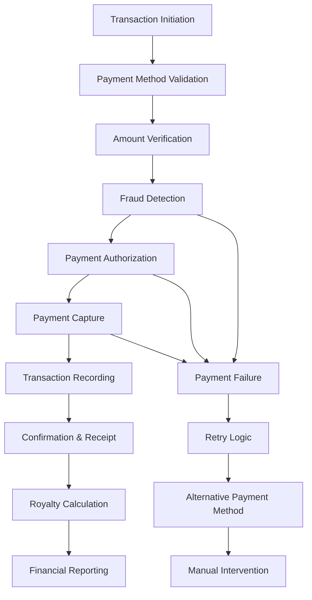

# 💰 Financial Transaction Rules - FranchiseHub

## Executive Summary

FranchiseHub's financial transaction framework governs all monetary operations within the platform, including payment processing, royalty calculations, invoice generation, and financial reporting. These rules ensure accurate, compliant, and transparent financial operations across all franchise networks.

---

## 💳 Payment Processing Framework

### Payment Processing Workflow



### Supported Payment Methods

**Credit/Debit Cards**:
- **Supported Types**: Visa, Mastercard, American Express, Discover
- **Processing**: Real-time authorization and capture
- **Security**: PCI DSS Level 1 compliance
- **Fees**: 2.9% + $0.30 per transaction
- **Settlement**: T+2 business days

**Bank Transfers (ACH)**:
- **Types**: Direct debit, wire transfer
- **Processing**: 1-3 business day processing
- **Security**: Bank-level encryption and verification
- **Fees**: $5 per transaction
- **Settlement**: T+3 business days

**Digital Wallets**:
- **Supported**: GCash, PayMaya, PayPal
- **Processing**: Real-time authorization
- **Security**: Tokenized transactions
- **Fees**: 3.4% + $0.30 per transaction
- **Settlement**: T+1 business day

### Payment Validation Rules

**Transaction Limits**:
- **Minimum Transaction**: $10.00
- **Maximum Transaction**: $50,000 per transaction
- **Daily Limit**: $100,000 per merchant
- **Monthly Limit**: $500,000 per merchant

**Fraud Detection**:
- **Velocity Checks**: Maximum 5 transactions per minute
- **Geographic Validation**: IP address and billing address verification
- **Pattern Analysis**: Unusual spending pattern detection
- **Blacklist Checking**: Known fraudulent account verification

**Payment Method Validation**:
- **Card Verification**: CVV and AVS validation required
- **Bank Account Verification**: Micro-deposit verification for ACH
- **Digital Wallet**: OAuth token validation
- **Expiration Checking**: Automatic payment method expiration alerts

---

## 👑 Royalty Calculation Framework

### Royalty Structure by Package

**Starter Package Royalties**:
- **Monthly Royalty Rate**: 5.0% of gross revenue
- **Marketing Fee Rate**: 1.0% of gross revenue
- **Minimum Monthly Royalty**: $500 per location
- **Maximum Monthly Royalty**: $5,000 per location

**Professional Package Royalties**:
- **Monthly Royalty Rate**: 7.5% of gross revenue
- **Marketing Fee Rate**: 1.5% of gross revenue
- **Minimum Monthly Royalty**: $750 per location
- **Maximum Monthly Royalty**: $12,500 per location

**Premium Package Royalties**:
- **Monthly Royalty Rate**: 12.5% of gross revenue
- **Marketing Fee Rate**: 2.5% of gross revenue
- **Minimum Monthly Royalty**: $1,250 per location
- **Maximum Monthly Royalty**: $25,000 per location

### Royalty Calculation Algorithm

**Gross Revenue Calculation**:
```
Gross Revenue = Total Sales - Returns - Discounts - Taxes
```

**Monthly Royalty Calculation**:
```
Base Royalty = Gross Revenue × Royalty Rate
Marketing Fee = Gross Revenue × Marketing Fee Rate
Minimum Check = MAX(Base Royalty, Minimum Monthly Royalty)
Final Royalty = MIN(Minimum Check, Maximum Monthly Royalty)
```

**Calculation Timeline**:
- **Data Collection**: 1st-31st of each month
- **Calculation Processing**: 1st-3rd of following month
- **Invoice Generation**: 5th of following month
- **Payment Due Date**: 30th of following month

### Revenue Recognition Rules

**Included in Gross Revenue**:
- Food and beverage sales
- Merchandise sales
- Delivery fees charged to customers
- Service charges and tips (where applicable)
- Gift card redemptions
- Promotional item sales

**Excluded from Gross Revenue**:
- Sales taxes and government fees
- Customer refunds and returns
- Employee discounts
- Promotional discounts and coupons
- Gift card sales (until redemption)
- Third-party delivery commission fees

**Revenue Timing**:
- **Cash Sales**: Recognized on transaction date
- **Credit Sales**: Recognized on transaction date
- **Gift Cards**: Recognized on redemption date
- **Subscriptions**: Recognized monthly over service period

---

## 🧾 Invoice Generation Rules

### Automatic Invoice Triggers

**Monthly Recurring Invoices**:
- **Royalty Invoices**: Generated 5th of each month for previous month
- **Marketing Fee Invoices**: Generated 5th of each month for previous month
- **Subscription Invoices**: Generated on subscription anniversary date
- **Minimum Fee Invoices**: Generated when royalty falls below minimum

**Transaction-Based Invoices**:
- **Order Completion**: Generated within 24 hours of delivery confirmation
- **Implementation Services**: Generated upon milestone completion
- **Professional Services**: Generated upon service delivery completion
- **Equipment Purchases**: Generated upon shipment confirmation

**Special Invoices**:
- **Late Payment Fees**: Generated 5 days after payment due date
- **Adjustment Invoices**: Generated for corrections or disputes
- **Credit Memos**: Generated for refunds or credits
- **Pro-rata Invoices**: Generated for partial month services

### Invoice Content Requirements

**Mandatory Invoice Elements**:
- Unique invoice number with sequential numbering
- Invoice date and payment due date
- Billing and shipping addresses
- Detailed line items with descriptions
- Unit prices, quantities, and extended amounts
- Applicable taxes and tax rates
- Total amount due
- Payment terms and methods
- Late payment penalty information

**Line Item Details**:
- Product or service description
- Quantity and unit of measure
- Unit price and extended price
- Discount amounts and percentages
- Tax amounts and rates
- Reference numbers (order, PO, etc.)

### Invoice Validation Rules

**Pre-Generation Validation**:
- Customer account status verification
- Credit limit checking
- Tax calculation validation
- Pricing accuracy verification
- Approval workflow completion

**Post-Generation Validation**:
- Mathematical accuracy checking
- Tax compliance verification
- Payment terms validation
- Delivery address confirmation
- Customer notification sending

---

## 💸 Payment Terms and Collections

### Standard Payment Terms

**Monthly Recurring Fees**:
- **Payment Terms**: Net 30 days from invoice date
- **Early Payment Discount**: 2% if paid within 10 days
- **Late Payment Penalty**: 1.5% per month on overdue amounts
- **Grace Period**: 5 days before late fees apply

**Order-Based Payments**:
- **Payment Terms**: Net 15 days from invoice date
- **Prepayment Discount**: 3% for payment before shipment
- **Late Payment Penalty**: 1.5% per month on overdue amounts
- **Collection Timeline**: 30 days before collection action

**Implementation Services**:
- **Payment Terms**: 50% upfront, 50% upon completion
- **Milestone Payments**: Available for large implementations
- **Late Payment Penalty**: 1.5% per month on overdue amounts
- **Project Hold**: Services suspended for overdue payments

### Collections Process

**Payment Reminder Timeline**:
- **Day 0**: Invoice generated and sent
- **Day 25**: Friendly payment reminder sent
- **Day 35**: First overdue notice sent
- **Day 45**: Second overdue notice with late fees
- **Day 60**: Final notice before collection action
- **Day 75**: Account referred to collections

**Collection Actions**:
- **Service Suspension**: Non-payment after 60 days
- **Account Hold**: New orders blocked for overdue accounts
- **Credit Reporting**: Delinquent accounts reported to credit bureaus
- **Legal Action**: Accounts over $5,000 and 90+ days overdue
- **Asset Recovery**: Equipment recovery for secured transactions

### Payment Processing Fees

**Transaction Fees by Method**:
- **Credit/Debit Cards**: 2.9% + $0.30 per transaction
- **ACH/Bank Transfer**: $5.00 flat fee per transaction
- **Wire Transfer**: $25.00 flat fee per transaction
- **Digital Wallets**: 3.4% + $0.30 per transaction
- **International Payments**: Additional 1.5% currency conversion fee

**Monthly Processing Fees**:
- **Account Maintenance**: $25.00 per month
- **Statement Fee**: $10.00 per month
- **Chargeback Fee**: $15.00 per chargeback
- **Failed Payment Fee**: $5.00 per failed transaction

---

## 📊 Financial Reporting Rules

### Automated Financial Reports

**Daily Reports**:
- **Transaction Summary**: All payments processed
- **Failed Payment Report**: Declined transactions and reasons
- **Cash Flow Summary**: Inflows and outflows by location
- **Reconciliation Report**: Bank deposits vs. system records

**Weekly Reports**:
- **Revenue Summary**: Gross revenue by location and category
- **Royalty Calculation**: Preliminary royalty calculations
- **Outstanding Invoices**: Aging report of unpaid invoices
- **Payment Method Performance**: Success rates by payment type

**Monthly Reports**:
- **Comprehensive P&L**: Profit and loss by location
- **Royalty Statement**: Final royalty calculations and payments
- **Tax Summary**: Sales tax collected and remitted
- **Financial Dashboard**: Key financial metrics and KPIs

### Financial Data Integration

**Accounting System Integration**:
- **Chart of Accounts**: Automatic mapping to franchise accounting
- **Journal Entries**: Real-time posting of transactions
- **Bank Reconciliation**: Automated bank statement matching
- **Tax Reporting**: Automated tax calculation and reporting

**Third-Party Integrations**:
- **QuickBooks**: Real-time transaction sync
- **Xero**: Automated invoice and payment posting
- **SAP**: Enterprise-level financial integration
- **Custom APIs**: Flexible integration for proprietary systems

---

## 🔒 Financial Security and Compliance

### Security Measures

**Data Encryption**:
- **At Rest**: AES-256 encryption for stored financial data
- **In Transit**: TLS 1.3 encryption for all communications
- **Key Management**: Hardware Security Modules (HSM)
- **Access Control**: Role-based access to financial data

**PCI DSS Compliance**:
- **Level 1 Merchant**: Highest level of PCI compliance
- **Annual Audits**: Third-party security assessments
- **Vulnerability Scanning**: Quarterly security scans
- **Penetration Testing**: Annual penetration testing

**Fraud Prevention**:
- **Machine Learning**: AI-powered fraud detection
- **Real-time Monitoring**: 24/7 transaction monitoring
- **Risk Scoring**: Dynamic risk assessment for transactions
- **Manual Review**: High-risk transaction review process

### Regulatory Compliance

**Financial Regulations**:
- **Anti-Money Laundering (AML)**: Customer due diligence and reporting
- **Know Your Customer (KYC)**: Identity verification requirements
- **Bank Secrecy Act (BSA)**: Suspicious activity reporting
- **Consumer Protection**: Fair billing and collection practices

**Tax Compliance**:
- **Sales Tax**: Automated calculation and remittance
- **Income Tax**: 1099 reporting for franchise payments
- **International Tax**: VAT and GST compliance for global operations
- **Audit Support**: Complete audit trail and documentation

**Data Privacy**:
- **GDPR Compliance**: European data protection requirements
- **CCPA Compliance**: California consumer privacy requirements
- **Financial Privacy**: Gramm-Leach-Bliley Act compliance
- **Data Retention**: Secure storage and timely deletion policies

---

## 📈 Financial Performance Metrics

### Key Financial KPIs

**Revenue Metrics**:
- **Gross Revenue**: Total sales across all locations
- **Net Revenue**: Revenue after returns and discounts
- **Revenue Growth**: Month-over-month and year-over-year growth
- **Revenue per Location**: Average revenue per franchise location

**Profitability Metrics**:
- **Gross Margin**: Revenue minus cost of goods sold
- **Operating Margin**: Operating income as percentage of revenue
- **EBITDA**: Earnings before interest, taxes, depreciation, amortization
- **Net Profit Margin**: Net income as percentage of revenue

**Cash Flow Metrics**:
- **Operating Cash Flow**: Cash generated from operations
- **Free Cash Flow**: Operating cash flow minus capital expenditures
- **Days Sales Outstanding**: Average collection period for receivables
- **Cash Conversion Cycle**: Time to convert investments to cash

**Efficiency Metrics**:
- **Payment Processing Time**: Average time to process payments
- **Collection Efficiency**: Percentage of invoices collected on time
- **Transaction Success Rate**: Percentage of successful payment transactions
- **Cost per Transaction**: Average cost to process each transaction

---

## 🔄 Transaction Reconciliation Process

### Daily Reconciliation Workflow


**Reconciliation Steps**:
1. **Data Collection**: Import transaction data from all payment processors
2. **Bank Statement Import**: Automated import of bank statements
3. **Automated Matching**: System matches transactions to bank deposits
4. **Exception Identification**: Flagged discrepancies for review
5. **Manual Review**: Finance team reviews and resolves exceptions
6. **Adjustment Processing**: Corrections and adjustments applied
7. **Final Reconciliation**: Balanced books and confirmed accuracy
8. **Reporting**: Daily reconciliation report generated

### Exception Handling Rules

**Common Exceptions**:
- **Timing Differences**: Transactions processed on different dates
- **Amount Discrepancies**: Differences in transaction amounts
- **Missing Transactions**: Transactions in system but not in bank
- **Duplicate Entries**: Same transaction recorded multiple times
- **Chargeback Processing**: Disputed transactions and reversals

**Resolution Procedures**:
- **Automatic Resolution**: System resolves simple timing differences
- **Manual Investigation**: Complex exceptions require human review
- **Adjustment Entries**: Corrections posted to appropriate accounts
- **Documentation**: All exceptions documented with resolution notes
- **Escalation**: Unresolved exceptions escalated to management

---

## 💼 Multi-Currency Support

### Supported Currencies

**Primary Currencies**:
- **USD**: United States Dollar (base currency)
- **PHP**: Philippine Peso
- **IDR**: Indonesian Rupiah
- **THB**: Thai Baht
- **VND**: Vietnamese Dong
- **SGD**: Singapore Dollar
- **MYR**: Malaysian Ringgit

**Currency Conversion Rules**:
- **Exchange Rates**: Updated hourly from multiple sources
- **Rate Sources**: Central bank rates, commercial bank rates, market rates
- **Conversion Timing**: Real-time for transactions, daily for reporting
- **Rate Locks**: Option to lock rates for large transactions
- **Hedging**: Currency hedging available for enterprise customers

### Multi-Currency Transaction Processing

**Transaction Flow**:
1. **Currency Detection**: System identifies transaction currency
2. **Rate Lookup**: Current exchange rate retrieved
3. **Conversion Calculation**: Amount converted to base currency
4. **Dual Recording**: Transaction recorded in both currencies
5. **Reporting**: Multi-currency reporting available

**Conversion Fees**:
- **Real-time Conversion**: 1.5% markup on interbank rates
- **Daily Batch Conversion**: 1.0% markup on interbank rates
- **Large Transactions**: Negotiated rates for transactions >$10,000
- **Enterprise Customers**: Preferred rates based on volume

---

## 📱 Mobile Payment Integration

### Mobile Payment Methods

**Supported Mobile Wallets**:
- **Apple Pay**: iOS device integration
- **Google Pay**: Android device integration
- **Samsung Pay**: Samsung device integration
- **Regional Wallets**: GCash, PayMaya, GrabPay, OVO

**Mobile Payment Features**:
- **Contactless Payments**: NFC-enabled transactions
- **QR Code Payments**: QR code scanning for payments
- **In-App Payments**: Direct payment within mobile app
- **Biometric Authentication**: Fingerprint and face recognition
- **Offline Capability**: Limited offline payment processing

### Mobile Security Measures

**Authentication**:
- **Device Authentication**: Device fingerprinting and registration
- **Biometric Verification**: Fingerprint, face, or voice recognition
- **PIN/Password**: Secondary authentication method
- **Two-Factor Authentication**: SMS or app-based verification

**Transaction Security**:
- **Tokenization**: Payment credentials replaced with tokens
- **Encryption**: End-to-end encryption for all communications
- **Fraud Detection**: Real-time fraud monitoring for mobile transactions
- **Geolocation**: Location-based fraud prevention

---

## 🔍 Audit and Compliance Monitoring

### Financial Audit Requirements

**Internal Audits**:
- **Monthly Reviews**: Internal audit of all financial processes
- **Quarterly Assessments**: Comprehensive financial control review
- **Annual Audits**: Full financial audit by certified public accountants
- **Continuous Monitoring**: Real-time monitoring of financial transactions

**External Audits**:
- **Annual Financial Audit**: Independent CPA firm audit
- **Regulatory Audits**: Government and regulatory body audits
- **Compliance Audits**: Industry-specific compliance reviews
- **Security Audits**: PCI DSS and security compliance audits

### Audit Trail Requirements

**Transaction Logging**:
- **Complete Transaction History**: All transaction details preserved
- **User Activity Logs**: Who performed what actions and when
- **System Changes**: All configuration and setting changes logged
- **Data Modifications**: Before and after values for all changes
- **Access Logs**: All system access attempts and results

**Retention Periods**:
- **Transaction Records**: 7 years minimum retention
- **Audit Logs**: 5 years minimum retention
- **Tax Records**: 7 years minimum retention
- **Compliance Records**: As required by regulation
- **Security Logs**: 3 years minimum retention

---

## 📊 Financial Analytics and Intelligence

### Real-Time Financial Dashboards

**Executive Dashboard**:
- **Revenue Metrics**: Real-time revenue across all locations
- **Cash Flow**: Current cash position and projections
- **Profitability**: Gross and net margins by location
- **Key Ratios**: Financial ratios and performance indicators
- **Alerts**: Critical financial alerts and notifications

**Operational Dashboard**:
- **Transaction Volume**: Number and value of transactions
- **Payment Methods**: Performance by payment type
- **Geographic Performance**: Revenue by region and location
- **Trend Analysis**: Historical trends and forecasting
- **Exception Monitoring**: Failed transactions and issues

### Predictive Financial Analytics

**Revenue Forecasting**:
- **Machine Learning Models**: AI-powered revenue predictions
- **Seasonal Adjustments**: Seasonal pattern recognition
- **Market Factors**: External market influence analysis
- **Scenario Planning**: Multiple forecast scenarios
- **Confidence Intervals**: Statistical confidence in predictions

**Cash Flow Forecasting**:
- **Inflow Predictions**: Expected payment receipts
- **Outflow Projections**: Scheduled payment obligations
- **Working Capital**: Optimal working capital management
- **Liquidity Planning**: Cash availability planning
- **Risk Assessment**: Cash flow risk identification

---

## 🎯 Performance Optimization

### Transaction Processing Optimization

**Speed Optimization**:
- **Real-Time Processing**: Sub-second transaction processing
- **Batch Processing**: Efficient batch processing for bulk operations
- **Caching**: Strategic caching of frequently accessed data
- **Load Balancing**: Distributed processing across multiple servers
- **Database Optimization**: Optimized database queries and indexing

**Cost Optimization**:
- **Payment Method Routing**: Route to lowest-cost payment processor
- **Volume Discounts**: Negotiate better rates based on volume
- **Failed Transaction Reduction**: Minimize failed transaction costs
- **Automated Reconciliation**: Reduce manual processing costs
- **Efficient Collections**: Automated collection processes

### Financial Process Automation

**Automated Workflows**:
- **Invoice Generation**: Automatic invoice creation and delivery
- **Payment Processing**: Automated payment capture and recording
- **Reconciliation**: Automated bank reconciliation processes
- **Collections**: Automated collection notices and follow-up
- **Reporting**: Automated financial report generation

**Exception Handling**:
- **Automated Resolution**: System resolves common exceptions
- **Escalation Rules**: Automatic escalation of complex issues
- **Notification System**: Real-time alerts for critical issues
- **Workflow Management**: Structured exception resolution workflows
- **Performance Monitoring**: Continuous process improvement

---

## 📈 Financial Growth Support

### Scalability Planning

**Volume Scaling**:
- **Transaction Capacity**: Support for millions of transactions monthly
- **Geographic Expansion**: Multi-region financial processing
- **Currency Support**: Additional currency support as needed
- **Payment Methods**: New payment method integration capability
- **Regulatory Compliance**: Scalable compliance framework

**Feature Enhancement**:
- **Advanced Analytics**: Enhanced financial intelligence capabilities
- **API Expansion**: Extended API functionality for integrations
- **Mobile Features**: Enhanced mobile payment capabilities
- **Automation**: Increased process automation and efficiency
- **Customization**: Flexible customization for enterprise clients

### Strategic Financial Planning

**Investment Planning**:
- **Capital Requirements**: Financial planning for growth investments
- **ROI Analysis**: Return on investment calculations for initiatives
- **Risk Assessment**: Financial risk evaluation and mitigation
- **Funding Strategy**: Optimal funding mix for growth plans
- **Performance Metrics**: Key performance indicators for success

**Market Expansion**:
- **New Market Entry**: Financial planning for geographic expansion
- **Product Development**: Financial support for new product launches
- **Partnership Opportunities**: Financial evaluation of partnerships
- **Acquisition Strategy**: Financial framework for acquisitions
- **Exit Planning**: Financial preparation for exit strategies

---

*These comprehensive financial transaction rules ensure that FranchiseHub maintains the highest standards of financial accuracy, security, and compliance while providing transparent and efficient financial operations that scale with business growth and support strategic objectives across all franchise stakeholders.*
