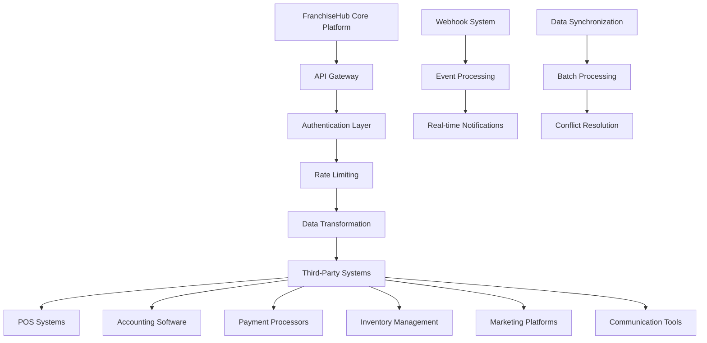
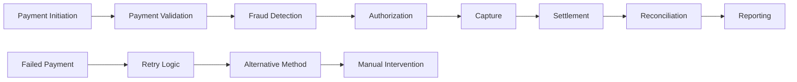

# 🔗 Integration Standards - FranchiseHub

## Executive Summary

FranchiseHub's integration standards define the technical specifications, protocols, and requirements for connecting third-party systems with our franchise management platform. These standards ensure secure, reliable, and scalable integrations that enhance functionality while maintaining system integrity.

---

## 🏗️ Integration Architecture

### Integration Framework



### Integration Types

**Real-Time Integrations**:
- **API-Based**: RESTful APIs for immediate data exchange
- **Webhook-Driven**: Event-driven notifications and updates
- **WebSocket Connections**: Persistent connections for live data
- **Message Queues**: Asynchronous message processing
- **Database Triggers**: Direct database integration triggers

**Batch Integrations**:
- **Scheduled Imports**: Regular data import processes
- **File-Based Exchange**: CSV, XML, JSON file transfers
- **ETL Processes**: Extract, Transform, Load operations
- **Data Warehousing**: Business intelligence data integration
- **Backup Synchronization**: Data backup and recovery integration

**Hybrid Integrations**:
- **Mixed Mode**: Combination of real-time and batch processing
- **Failover Systems**: Automatic fallback to batch if real-time fails
- **Priority Processing**: Critical data in real-time, bulk data in batches
- **Conditional Routing**: Route data based on business rules

---

## 🔐 API Specifications

### RESTful API Standards

**HTTP Methods**:
- **GET**: Retrieve data (idempotent, cacheable)
- **POST**: Create new resources (non-idempotent)
- **PUT**: Update/replace entire resource (idempotent)
- **PATCH**: Partial resource updates (non-idempotent)
- **DELETE**: Remove resources (idempotent)

**URL Structure**:
```
https://api.franchisehub.com/v1/{resource}/{id}/{sub-resource}
```

**Example Endpoints**:
- `GET /v1/franchises` - List all franchises
- `GET /v1/franchises/{id}` - Get specific franchise
- `POST /v1/orders` - Create new order
- `PUT /v1/inventory/{id}` - Update inventory item
- `DELETE /v1/users/{id}` - Delete user account

**Response Format**:
```json
{
  "status": "success|error",
  "data": {
    // Response data
  },
  "meta": {
    "timestamp": "2024-01-15T10:30:00Z",
    "version": "1.0",
    "pagination": {
      "page": 1,
      "per_page": 50,
      "total": 1250
    }
  },
  "errors": [
    {
      "code": "VALIDATION_ERROR",
      "message": "Invalid email format",
      "field": "email"
    }
  ]
}
```

### Authentication and Authorization

**OAuth 2.0 Implementation**:
- **Authorization Code Flow**: For web applications
- **Client Credentials Flow**: For server-to-server communication
- **Refresh Token Flow**: For token renewal
- **Scope-Based Access**: Granular permission control

**API Key Authentication**:
- **Header-Based**: `Authorization: Bearer {api_key}`
- **Query Parameter**: `?api_key={key}` (not recommended for production)
- **Key Rotation**: Regular API key rotation requirements
- **Environment-Specific**: Separate keys for development, staging, production

**JWT Token Structure**:
```json
{
  "header": {
    "alg": "RS256",
    "typ": "JWT"
  },
  "payload": {
    "sub": "user_id",
    "iss": "franchisehub.com",
    "aud": "api.franchisehub.com",
    "exp": 1640995200,
    "iat": 1640908800,
    "scope": "read:orders write:inventory"
  }
}
```

### Rate Limiting and Throttling

**Rate Limit Tiers**:
- **Free Tier**: 100 requests per hour
- **Basic Tier**: 1,000 requests per hour
- **Professional Tier**: 10,000 requests per hour
- **Enterprise Tier**: 100,000 requests per hour
- **Custom Tier**: Negotiated limits for high-volume clients

**Rate Limit Headers**:
```
X-RateLimit-Limit: 1000
X-RateLimit-Remaining: 999
X-RateLimit-Reset: 1640995200
X-RateLimit-Window: 3600
```

**Throttling Strategies**:
- **Token Bucket**: Allow burst traffic within limits
- **Fixed Window**: Reset limits at fixed intervals
- **Sliding Window**: Rolling time window for rate calculation
- **Adaptive Throttling**: Dynamic limits based on system load

---

## 🏪 POS System Integration

### Supported POS Systems

**Tier 1 Integrations** (Full Feature Support):
- **Square**: Complete transaction and inventory sync
- **Toast**: Restaurant-specific features and reporting
- **Lightspeed**: Retail and restaurant variants
- **Shopify POS**: E-commerce and retail integration
- **Clover**: Payment and business management integration

**Tier 2 Integrations** (Standard Features):
- **Revel Systems**: Cloud-based POS integration
- **TouchBistro**: Restaurant management features
- **Vend**: Retail-focused integration
- **ShopKeep**: Small business POS integration
- **NCR Silver**: Enterprise POS integration

**Custom Integrations**:
- **API-First Approach**: Custom integration development
- **Middleware Solutions**: Third-party integration platforms
- **Direct Database**: Direct database connection (limited cases)
- **File-Based**: CSV/XML file exchange systems

### POS Data Synchronization

**Real-Time Sync**:
- **Transaction Data**: Immediate transaction synchronization
- **Inventory Updates**: Real-time inventory level updates
- **Customer Information**: Customer data synchronization
- **Product Catalog**: Menu/product catalog synchronization
- **Pricing Updates**: Real-time pricing synchronization

**Sync Frequency**:
- **Transactions**: Immediate (within 30 seconds)
- **Inventory**: Every 5 minutes
- **Customer Data**: Every 15 minutes
- **Product Catalog**: Every hour
- **Historical Data**: Daily batch sync

**Conflict Resolution**:
- **Timestamp-Based**: Most recent update wins
- **Source Priority**: POS system takes precedence for operational data
- **Manual Resolution**: Complex conflicts require manual intervention
- **Audit Trail**: Complete history of all changes and conflicts

### POS Integration Security

**Data Encryption**:
- **TLS 1.3**: All communications encrypted in transit
- **AES-256**: Data encrypted at rest
- **Key Management**: Secure key storage and rotation
- **Certificate Validation**: SSL certificate validation required

**Access Control**:
- **API Keys**: Unique API keys per POS system
- **IP Whitelisting**: Restrict access to known IP addresses
- **Role-Based Access**: Granular permissions per integration
- **Audit Logging**: Complete audit trail of all API access

---

## 💼 Accounting Software Integration

### Supported Accounting Systems

**Cloud-Based Systems**:
- **QuickBooks Online**: Complete financial integration
- **Xero**: Multi-currency and international support
- **FreshBooks**: Small business accounting integration
- **Wave Accounting**: Free accounting software integration
- **Sage Business Cloud**: Enterprise accounting integration

**Desktop Systems**:
- **QuickBooks Desktop**: File-based integration
- **Sage 50**: Desktop accounting integration
- **Peachtree**: Legacy system support
- **Simply Accounting**: Canadian market integration

**Enterprise Systems**:
- **SAP**: Enterprise resource planning integration
- **Oracle Financials**: Large enterprise integration
- **Microsoft Dynamics**: Business management integration
- **NetSuite**: Cloud-based ERP integration

### Financial Data Mapping

**Chart of Accounts Mapping**:
```json
{
  "franchisehub_account": "revenue_food_sales",
  "quickbooks_account": "4000 - Food Sales",
  "xero_account": "200 - Sales",
  "mapping_rules": {
    "auto_create": true,
    "account_type": "Income",
    "tax_code": "GST"
  }
}
```

**Transaction Categories**:
- **Revenue**: Sales, service fees, royalties
- **Expenses**: Cost of goods sold, operating expenses
- **Assets**: Inventory, equipment, cash
- **Liabilities**: Accounts payable, loans
- **Equity**: Owner's equity, retained earnings

**Automated Journal Entries**:
- **Daily Sales**: Automatic posting of daily sales totals
- **Inventory Adjustments**: Inventory value adjustments
- **Royalty Calculations**: Automated royalty postings
- **Expense Allocations**: Automatic expense categorization
- **Tax Calculations**: Automated tax calculations and postings

### Financial Reporting Integration

**Standard Reports**:
- **Profit & Loss**: Automated P&L generation
- **Balance Sheet**: Real-time balance sheet updates
- **Cash Flow**: Cash flow statement integration
- **Trial Balance**: Trial balance synchronization
- **Tax Reports**: Tax reporting and compliance

**Custom Reports**:
- **Franchise Performance**: Multi-location performance reports
- **Royalty Reports**: Detailed royalty calculations
- **Inventory Valuation**: Inventory value reports
- **Budget vs. Actual**: Budget comparison reports
- **Trend Analysis**: Financial trend analysis

---

## 💳 Payment Processor Integration

### Supported Payment Processors

**Primary Processors**:
- **Stripe**: Global payment processing
- **PayPal**: Consumer and business payments
- **Square**: Integrated payment solutions
- **Authorize.Net**: Merchant payment gateway
- **Braintree**: PayPal-owned payment platform

**Regional Processors**:
- **GCash**: Philippines mobile payments
- **PayMaya**: Philippines digital wallet
- **OVO**: Indonesia digital payments
- **GrabPay**: Southeast Asia payments
- **Alipay**: China payment integration

**Enterprise Processors**:
- **Chase Paymentech**: Enterprise payment processing
- **First Data**: Global payment solutions
- **Worldpay**: International payment processing
- **Adyen**: Global payment platform
- **Cybersource**: Enterprise payment management

### Payment Processing Workflow



**Payment Methods**:
- **Credit/Debit Cards**: Visa, Mastercard, American Express, Discover
- **Digital Wallets**: Apple Pay, Google Pay, Samsung Pay
- **Bank Transfers**: ACH, wire transfers, SEPA
- **Alternative Payments**: Buy now, pay later, cryptocurrency
- **Regional Methods**: Local payment methods by country

### Payment Security Standards

**PCI DSS Compliance**:
- **Level 1 Merchant**: Highest security requirements
- **Tokenization**: Replace card data with secure tokens
- **Encryption**: End-to-end encryption for all transactions
- **Network Segmentation**: Isolate payment processing environment
- **Regular Testing**: Quarterly security scans and annual penetration testing

**Fraud Prevention**:
- **Machine Learning**: AI-powered fraud detection
- **Velocity Checking**: Transaction frequency monitoring
- **Geolocation**: Location-based fraud prevention
- **Device Fingerprinting**: Device identification and tracking
- **3D Secure**: Additional authentication for card transactions

---

## 📊 Data Synchronization Protocols

### Synchronization Methods

**Real-Time Synchronization**:
- **Webhooks**: Event-driven data updates
- **WebSockets**: Persistent connection for live updates
- **Server-Sent Events**: One-way real-time updates
- **Message Queues**: Asynchronous message processing
- **Database Triggers**: Immediate data change notifications

**Batch Synchronization**:
- **Scheduled Jobs**: Regular data synchronization jobs
- **File Transfer**: Bulk data transfer via files
- **ETL Processes**: Extract, transform, load operations
- **Delta Sync**: Synchronize only changed data
- **Full Refresh**: Complete data refresh processes

### Data Transformation Rules

**Field Mapping**:
```json
{
  "source_field": "customer_name",
  "target_field": "full_name",
  "transformation": "concatenate",
  "parameters": {
    "fields": ["first_name", "last_name"],
    "separator": " "
  }
}
```

**Data Validation**:
- **Format Validation**: Email, phone, date format validation
- **Range Validation**: Numeric range and boundary checks
- **Required Fields**: Mandatory field validation
- **Business Rules**: Custom business logic validation
- **Data Quality**: Duplicate detection and data cleansing

**Error Handling**:
- **Retry Logic**: Automatic retry for transient failures
- **Dead Letter Queue**: Failed messages for manual review
- **Error Notifications**: Immediate notification of critical errors
- **Fallback Procedures**: Alternative processing for failures
- **Recovery Procedures**: Data recovery and reconciliation

---

## 🔧 Integration Testing and Monitoring

### Testing Framework

**Unit Testing**:
- **API Endpoint Testing**: Individual endpoint functionality
- **Data Transformation Testing**: Transformation logic validation
- **Authentication Testing**: Security and access control testing
- **Error Handling Testing**: Error condition and recovery testing

**Integration Testing**:
- **End-to-End Testing**: Complete integration workflow testing
- **Performance Testing**: Load and stress testing
- **Security Testing**: Penetration and vulnerability testing
- **Compatibility Testing**: Cross-system compatibility validation

**Monitoring and Alerting**:
- **Real-Time Monitoring**: Continuous integration health monitoring
- **Performance Metrics**: Response time and throughput monitoring
- **Error Rate Monitoring**: Error frequency and pattern analysis
- **Availability Monitoring**: System uptime and availability tracking
- **Custom Alerts**: Business-specific alert configurations

### Integration Documentation

**API Documentation**:
- **OpenAPI Specification**: Complete API specification
- **Code Examples**: Sample code in multiple languages
- **Authentication Guide**: Step-by-step authentication setup
- **Error Codes**: Comprehensive error code documentation
- **Rate Limiting**: Rate limit information and best practices

**Integration Guides**:
- **Quick Start Guide**: Rapid integration setup
- **Best Practices**: Integration best practices and recommendations
- **Troubleshooting**: Common issues and solutions
- **FAQ**: Frequently asked questions and answers
- **Support Resources**: Support channels and resources

---

*These comprehensive integration standards ensure secure, reliable, and scalable connections between FranchiseHub and third-party systems, enabling seamless data flow and enhanced functionality while maintaining the highest standards of security and performance.*
