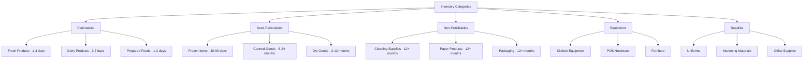
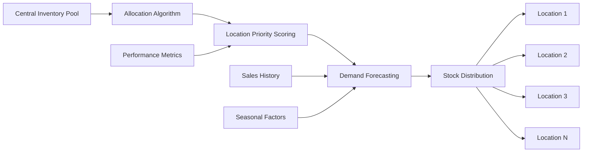

# 📦 Inventory Management Rules - FranchiseHub

## Executive Summary

FranchiseHub's inventory management system provides comprehensive rules and algorithms for stock tracking, automated reordering, supplier management, and inventory optimization across all franchise locations. These rules ensure optimal inventory levels while minimizing waste and maximizing profitability.

---

## 📊 Inventory Classification System

### Product Categories



### ABC Analysis Classification

**A-Items (High Value, 20% of items, 80% of value)**:
- **Monitoring**: Daily stock level checks
- **Reorder Frequency**: Weekly or bi-weekly
- **Safety Stock**: 3-5 days supply
- **Approval Required**: Manager approval for orders >$1,000
- **Supplier Management**: Primary and backup suppliers required

**B-Items (Medium Value, 30% of items, 15% of value)**:
- **Monitoring**: Weekly stock level checks
- **Reorder Frequency**: Bi-weekly or monthly
- **Safety Stock**: 7-14 days supply
- **Approval Required**: Manager approval for orders >$2,500
- **Supplier Management**: Primary supplier with backup option

**C-Items (Low Value, 50% of items, 5% of value)**:
- **Monitoring**: Monthly stock level checks
- **Reorder Frequency**: Monthly or quarterly
- **Safety Stock**: 30-60 days supply
- **Approval Required**: Automatic ordering up to $500
- **Supplier Management**: Single supplier acceptable

---

## 🔄 Reorder Point Algorithms

### Dynamic Reorder Point Calculation

**Base Formula**:
```
Reorder Point = (Average Daily Usage × Lead Time) + Safety Stock
```

**Advanced Formula with Variability**:
```
Reorder Point = (Average Daily Usage × Average Lead Time) + 
                (Z-Score × √((Average Lead Time × Usage Variance) + 
                (Average Daily Usage² × Lead Time Variance)))
```

**Service Level Targets**:
- **A-Items**: 99% service level (Z-Score = 2.33)
- **B-Items**: 95% service level (Z-Score = 1.65)
- **C-Items**: 90% service level (Z-Score = 1.28)

### Category-Specific Reorder Rules

**Perishables (1-7 day shelf life)**:
- **Reorder Frequency**: Daily evaluation
- **Lead Time**: 1-2 days
- **Safety Stock**: 1-2 days supply
- **Waste Tolerance**: <5% acceptable waste
- **Special Rules**: Weather-adjusted ordering, event-based adjustments

**Semi-Perishables (1-12 month shelf life)**:
- **Reorder Frequency**: Weekly evaluation
- **Lead Time**: 3-7 days
- **Safety Stock**: 7-14 days supply
- **Waste Tolerance**: <2% acceptable waste
- **Special Rules**: Seasonal demand adjustments, bulk discount optimization

**Non-Perishables (12+ month shelf life)**:
- **Reorder Frequency**: Monthly evaluation
- **Lead Time**: 7-30 days
- **Safety Stock**: 30-90 days supply
- **Waste Tolerance**: <1% acceptable waste
- **Special Rules**: Economic order quantity optimization, storage capacity limits

### Seasonal Adjustment Factors

**High Season Multipliers**:
- **Peak Season**: 1.5x normal reorder points
- **Holiday Periods**: 2.0x normal reorder points
- **Special Events**: Custom multipliers based on event type
- **Weather Events**: Dynamic adjustments based on weather forecasts

**Low Season Adjustments**:
- **Off-Peak Season**: 0.7x normal reorder points
- **Post-Holiday**: 0.5x normal reorder points for 2 weeks
- **Maintenance Periods**: Reduced ordering during closures
- **Economic Downturns**: Conservative ordering adjustments

---

## 🎯 Approval Threshold Matrix

### Order Value Approval Levels

| Order Value Range | Approval Authority | Response Time | Escalation Rules |
|------------------|-------------------|---------------|------------------|
| **$0 - $500** | Automatic Approval | Immediate | None |
| **$500 - $1,500** | Location Manager | 4 hours | Regional Manager after 8 hours |
| **$1,500 - $5,000** | Regional Manager | 8 hours | Corporate after 24 hours |
| **$5,000 - $15,000** | Corporate Manager | 24 hours | VP Operations after 48 hours |
| **$15,000 - $50,000** | VP Operations | 48 hours | CFO after 72 hours |
| **$50,000+** | CFO Approval | 72 hours | Board approval required |

### Emergency Order Procedures

**Emergency Criteria**:
- Stock-out situation affecting customer service
- Equipment failure requiring immediate replacement
- Health and safety compliance requirements
- Supplier delivery failure requiring alternative sourcing

**Emergency Approval Process**:
- **Immediate Approval**: Up to $2,500 for genuine emergencies
- **Expedited Review**: 2-hour approval for orders up to $10,000
- **Emergency Contact**: 24/7 emergency approval hotline
- **Post-Emergency Review**: All emergency orders reviewed within 24 hours

### Bulk Order Discounts

**Volume Discount Thresholds**:
- **5% Discount**: Orders >$5,000
- **10% Discount**: Orders >$15,000
- **15% Discount**: Orders >$50,000
- **20% Discount**: Orders >$100,000
- **Negotiated Rates**: Orders >$250,000

**Bulk Order Approval Rules**:
- **Cost-Benefit Analysis**: Required for all bulk orders
- **Storage Capacity**: Verification of adequate storage space
- **Cash Flow Impact**: Assessment of working capital requirements
- **Expiration Risk**: Analysis of spoilage risk for perishables

---

## 📈 Stock Allocation Algorithms

### Multi-Location Allocation Framework



### Allocation Priority Factors

**Sales Performance Weight (40%)**:
- **Revenue Generation**: Historical sales performance
- **Growth Rate**: Month-over-month growth trends
- **Market Share**: Local market position and potential
- **Customer Traffic**: Foot traffic and transaction volume

**Operational Efficiency Weight (30%)**:
- **Inventory Turnover**: Historical inventory turnover rates
- **Waste Percentage**: Inventory waste and spoilage rates
- **Order Accuracy**: Ordering accuracy and planning effectiveness
- **Compliance Score**: Adherence to inventory management procedures

**Strategic Importance Weight (20%)**:
- **New Location Priority**: Higher allocation for new locations
- **Market Development**: Locations in developing markets
- **Flagship Status**: Premium locations with brand visibility
- **Training Locations**: Locations used for staff training

**Risk Factors Weight (10%)**:
- **Supply Chain Risk**: Locations with supply chain vulnerabilities
- **Storage Capacity**: Available storage space and conditions
- **Staff Capability**: Inventory management skill level
- **Historical Performance**: Past inventory management performance

### Cross-Location Inventory Sharing

**Sharing Triggers**:
- **Stock-Out Prevention**: Transfer inventory to prevent stock-outs
- **Excess Inventory**: Redistribute excess inventory to high-demand locations
- **Emergency Situations**: Crisis response inventory sharing
- **Seasonal Balancing**: Redistribute seasonal inventory based on demand

**Transfer Rules**:
- **Distance Limits**: Maximum 50km for perishables, 200km for non-perishables
- **Cost Threshold**: Transfer only if cost <20% of item value
- **Quality Standards**: Items must meet quality standards for transfer
- **Documentation**: Complete transfer documentation required

---

## 🏪 Supplier Management Rules

### Supplier Classification System

**Preferred Suppliers (Tier 1)**:
- **Quality Score**: >95% quality rating
- **Delivery Performance**: >98% on-time delivery
- **Pricing**: Competitive pricing with volume discounts
- **Payment Terms**: Net 30 payment terms
- **Relationship**: Long-term partnership agreements

**Approved Suppliers (Tier 2)**:
- **Quality Score**: 90-95% quality rating
- **Delivery Performance**: 95-98% on-time delivery
- **Pricing**: Market-competitive pricing
- **Payment Terms**: Net 15-30 payment terms
- **Relationship**: Standard supplier agreements

**Conditional Suppliers (Tier 3)**:
- **Quality Score**: 85-90% quality rating
- **Delivery Performance**: 90-95% on-time delivery
- **Pricing**: Higher pricing, limited volume discounts
- **Payment Terms**: Net 15 or prepayment required
- **Relationship**: Limited use, probationary status

### Supplier Performance Monitoring

**Key Performance Indicators**:
- **On-Time Delivery Rate**: Percentage of orders delivered on time
- **Quality Score**: Product quality rating based on inspections
- **Order Accuracy**: Percentage of orders delivered correctly
- **Response Time**: Time to respond to inquiries and issues
- **Cost Competitiveness**: Pricing compared to market rates

**Performance Review Process**:
- **Monthly Scorecards**: Automated performance scorecards
- **Quarterly Reviews**: Formal performance review meetings
- **Annual Evaluations**: Comprehensive supplier evaluations
- **Continuous Monitoring**: Real-time performance tracking
- **Improvement Plans**: Performance improvement requirements

### Supplier Diversification Rules

**Single Source Limitations**:
- **Maximum Dependency**: No single supplier >60% of category spend
- **Critical Items**: Minimum 2 suppliers for critical items
- **Geographic Diversity**: Suppliers in different geographic regions
- **Risk Assessment**: Regular supplier risk assessments
- **Contingency Planning**: Backup supplier activation procedures

**New Supplier Onboarding**:
- **Qualification Process**: Comprehensive supplier qualification
- **Trial Orders**: Small trial orders before full approval
- **Quality Audits**: On-site quality and capability audits
- **Financial Assessment**: Supplier financial stability review
- **Contract Negotiation**: Standard terms and conditions

---

## 📊 Inventory Optimization Techniques

### Economic Order Quantity (EOQ) Optimization

**EOQ Formula**:
```
EOQ = √((2 × Annual Demand × Ordering Cost) / Holding Cost per Unit)
```

**EOQ Adjustments**:
- **Volume Discounts**: Adjust EOQ for quantity discounts
- **Storage Constraints**: Modify EOQ based on storage limitations
- **Perishability**: Reduce EOQ for items with short shelf life
- **Seasonal Demand**: Adjust EOQ for seasonal demand patterns

### Just-In-Time (JIT) Implementation

**JIT Criteria**:
- **Reliable Suppliers**: Suppliers with >98% on-time delivery
- **Short Lead Times**: Lead times <3 days for implementation
- **Stable Demand**: Products with <20% demand variability
- **Quality Assurance**: Suppliers with >99% quality ratings

**JIT Benefits**:
- **Reduced Inventory Costs**: 30-50% reduction in inventory investment
- **Improved Cash Flow**: Faster inventory turnover
- **Reduced Waste**: Minimized spoilage and obsolescence
- **Space Efficiency**: Reduced storage space requirements

### ABC-XYZ Analysis

**XYZ Classification (Demand Variability)**:
- **X-Items**: <20% coefficient of variation (stable demand)
- **Y-Items**: 20-50% coefficient of variation (moderate variability)
- **Z-Items**: >50% coefficient of variation (high variability)

**Combined ABC-XYZ Strategy**:
- **AX Items**: Tight control, frequent monitoring, JIT possible
- **AY Items**: Regular monitoring, safety stock required
- **AZ Items**: Flexible approach, higher safety stock
- **CX Items**: Periodic review, bulk ordering
- **CZ Items**: Simple control, large safety stock

---

## 🔍 Inventory Monitoring and Control

### Real-Time Inventory Tracking

**Tracking Methods**:
- **Barcode Scanning**: Standard barcode tracking for all items
- **RFID Technology**: Radio frequency identification for high-value items
- **IoT Sensors**: Internet of Things sensors for automated tracking
- **Manual Counts**: Regular manual inventory counts for verification

**Tracking Frequency**:
- **A-Items**: Real-time tracking with immediate updates
- **B-Items**: Daily tracking with end-of-day updates
- **C-Items**: Weekly tracking with batch updates
- **Equipment**: Monthly tracking with annual audits

### Inventory Accuracy Standards

**Accuracy Targets**:
- **A-Items**: 99.5% inventory accuracy required
- **B-Items**: 98.0% inventory accuracy required
- **C-Items**: 95.0% inventory accuracy required
- **Overall Target**: 98.0% overall inventory accuracy

**Accuracy Measurement**:
- **Cycle Counting**: Regular cycle counts throughout the year
- **Physical Inventories**: Annual comprehensive physical counts
- **Variance Analysis**: Investigation of inventory variances >2%
- **Root Cause Analysis**: Analysis of recurring accuracy issues

### Loss Prevention and Shrinkage Control

**Shrinkage Categories**:
- **Theft**: Employee and customer theft prevention
- **Spoilage**: Perishable item waste and spoilage
- **Damage**: Product damage during handling and storage
- **Administrative**: Paperwork errors and system issues

**Shrinkage Targets**:
- **Total Shrinkage**: <2% of total inventory value
- **Theft**: <0.5% of inventory value
- **Spoilage**: <1% of perishable inventory
- **Damage**: <0.3% of inventory value
- **Administrative**: <0.2% of inventory value

---

*These comprehensive inventory management rules ensure optimal stock levels, minimize waste, maximize profitability, and provide the foundation for efficient franchise operations across all locations while maintaining the highest standards of inventory control and optimization.*
