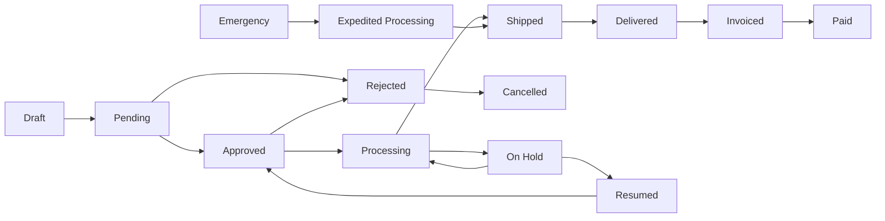

# 📋 Order Processing Workflows - FranchiseHub

## Executive Summary

FranchiseHub's order processing system manages the complete order lifecycle through an 8-stage workflow, from initial draft creation to final payment completion. This comprehensive framework ensures efficient order management, proper approvals, and complete audit trails across all franchise operations.

---

## 🔄 8-Stage Order Lifecycle

### Complete Order Workflow

### Stage Definitions and Requirements

**Stage 1: Draft**
- **Definition**: Order created but not yet submitted for approval
- **Duration**: No time limit (can remain in draft indefinitely)
- **Actions Available**: Edit, delete, submit, save
- **Required Fields**: Basic order information, line items
- **Permissions**: Order creator and authorized personnel
- **Auto-Transitions**: None (manual submission required)

**Stage 2: Pending**
- **Definition**: Order submitted and awaiting approval
- **Duration**: Maximum 24 hours before escalation
- **Actions Available**: Approve, reject, request changes, add comments
- **Required Fields**: Complete order details, budget validation
- **Permissions**: Designated approvers based on order value
- **Auto-Transitions**: Escalation after timeout period

**Stage 3: Approved**
- **Definition**: Order approved and ready for processing
- **Duration**: Maximum 4 hours before processing begins
- **Actions Available**: Process, hold, cancel (with authorization)
- **Required Fields**: Supplier confirmation, delivery schedule
- **Permissions**: Operations team and authorized processors
- **Auto-Transitions**: Automatic processing for routine orders

**Stage 4: Processing**
- **Definition**: Order being fulfilled by supplier/vendor
- **Duration**: Varies by product type and supplier lead time
- **Actions Available**: Track progress, update status, communicate with supplier
- **Required Fields**: Purchase order number, supplier confirmation
- **Permissions**: Operations team and supplier portal access
- **Auto-Transitions**: Automatic transition upon shipment confirmation

**Stage 5: Shipped**
- **Definition**: Order shipped and in transit to destination
- **Duration**: Based on shipping method and distance
- **Actions Available**: Track shipment, update delivery schedule
- **Required Fields**: Tracking number, estimated delivery date
- **Permissions**: Operations team and order recipient
- **Auto-Transitions**: Automatic transition upon delivery confirmation

**Stage 6: Delivered**
- **Definition**: Order received and confirmed by recipient
- **Duration**: Maximum 24 hours before invoice generation
- **Actions Available**: Confirm receipt, report issues, quality inspection
- **Required Fields**: Delivery confirmation, quality check results
- **Permissions**: Recipient and quality control team
- **Auto-Transitions**: Automatic invoice generation after confirmation

**Stage 7: Invoiced**
- **Definition**: Invoice generated and sent for payment
- **Duration**: Based on payment terms (typically 15-30 days)
- **Actions Available**: Process payment, dispute invoice, request adjustments
- **Required Fields**: Invoice details, payment terms, due date
- **Permissions**: Finance team and authorized payment processors
- **Auto-Transitions**: Automatic transition upon payment receipt

**Stage 8: Paid**
- **Definition**: Payment received and order cycle complete
- **Duration**: Permanent status (archived after retention period)
- **Actions Available**: View history, generate reports, process refunds
- **Required Fields**: Payment confirmation, transaction details
- **Permissions**: Finance team and authorized personnel
- **Auto-Transitions**: None (final stage)

---

## 🎯 Approval Hierarchy Framework

### Approval Authority Matrix

| Order Value | Primary Approver | Secondary Approver | Final Approver | Escalation Time |
|-------------|-----------------|-------------------|----------------|-----------------|
| **$0 - $500** | Auto-Approved | N/A | N/A | N/A |
| **$500 - $2,500** | Location Manager | Regional Manager | N/A | 8 hours |
| **$2,500 - $10,000** | Regional Manager | Area Director | N/A | 24 hours |
| **$10,000 - $25,000** | Area Director | VP Operations | N/A | 48 hours |
| **$25,000 - $50,000** | VP Operations | CFO | N/A | 72 hours |
| **$50,000 - $100,000** | CFO | CEO | N/A | 96 hours |
| **$100,000+** | CEO | Board of Directors | N/A | 1 week |

### Approval Workflow Rules

**Sequential Approval Process**:
1. **Initial Submission**: Order submitted by authorized personnel
2. **Primary Review**: First-level approver reviews within designated timeframe
3. **Secondary Review**: If required, second-level approver reviews
4. **Final Authorization**: Final approver provides authorization if needed
5. **Escalation**: Automatic escalation if approver doesn't respond within timeframe

**Parallel Approval Process** (for complex orders):
- **Technical Approval**: Technical team approves specifications
- **Financial Approval**: Finance team approves budget and pricing
- **Operational Approval**: Operations team approves logistics and timing
- **Final Coordination**: All approvals coordinated before processing

### Emergency Order Procedures

**Emergency Criteria**:
- **Business Critical**: Orders essential for business operations
- **Safety Related**: Orders required for health and safety compliance
- **Customer Impact**: Orders preventing customer service disruption
- **Revenue Protection**: Orders preventing revenue loss

**Emergency Approval Process**:
- **Immediate Authorization**: Up to $5,000 with emergency justification
- **Expedited Review**: 2-hour approval cycle for orders up to $25,000
- **Emergency Contacts**: 24/7 emergency approval hotline
- **Post-Emergency Review**: All emergency orders reviewed within 48 hours

---

## 📊 Order Status Transition Rules

### Automatic Transitions

**System-Triggered Transitions**:
- **Draft → Pending**: Upon order submission
- **Approved → Processing**: For pre-approved suppliers and routine orders
- **Processing → Shipped**: Upon receipt of shipping confirmation
- **Shipped → Delivered**: Upon delivery confirmation or tracking update
- **Delivered → Invoiced**: 24 hours after delivery confirmation
- **Invoiced → Paid**: Upon payment receipt confirmation

**Conditional Transitions**:
- **Pending → Approved**: Only with proper authorization
- **Approved → Processing**: Only after supplier confirmation
- **Processing → Shipped**: Only with valid tracking information
- **Delivered → Invoiced**: Only after quality inspection (if required)

### Manual Transitions

**User-Initiated Transitions**:
- **Draft → Cancelled**: Order creator can cancel draft orders
- **Pending → Rejected**: Approver can reject pending orders
- **Any Stage → On Hold**: Authorized personnel can place orders on hold
- **On Hold → Previous Stage**: Resume processing from hold status
- **Processing → Cancelled**: With proper authorization and supplier coordination

**Override Procedures**:
- **Management Override**: Senior management can override normal workflow
- **Emergency Override**: Emergency situations allow workflow bypassing
- **System Override**: Technical team can override for system issues
- **Audit Trail**: All overrides logged with justification and authorization

---

## 🔍 Quality Control and Validation

### Order Validation Rules

**Pre-Submission Validation**:
- **Required Fields**: All mandatory fields must be completed
- **Budget Validation**: Order must be within approved budget limits
- **Supplier Validation**: Supplier must be approved and active
- **Inventory Check**: Verify inventory levels and reorder points
- **Duplicate Detection**: Check for duplicate orders

**Post-Approval Validation**:
- **Supplier Confirmation**: Supplier must confirm order acceptance
- **Delivery Schedule**: Realistic delivery timeline must be established
- **Quality Requirements**: Quality specifications must be documented
- **Special Instructions**: Any special handling requirements noted

### Quality Inspection Procedures

**Inspection Triggers**:
- **High-Value Orders**: Orders >$10,000 require quality inspection
- **New Suppliers**: First orders from new suppliers require inspection
- **Critical Items**: Items affecting food safety or customer experience
- **Previous Issues**: Suppliers with quality issues require inspection

**Inspection Process**:
1. **Visual Inspection**: Check for obvious defects or damage
2. **Quantity Verification**: Confirm quantities match order specifications
3. **Quality Testing**: Perform relevant quality tests if applicable
4. **Documentation**: Record inspection results and any issues
5. **Acceptance/Rejection**: Accept conforming orders, reject non-conforming

**Non-Conformance Handling**:
- **Minor Issues**: Document and accept with supplier notification
- **Major Issues**: Reject order and request replacement
- **Critical Issues**: Immediate supplier notification and escalation
- **Repeat Issues**: Supplier performance review and potential removal

---

## 📈 Performance Monitoring and Metrics

### Order Processing KPIs

**Efficiency Metrics**:
- **Order Cycle Time**: Average time from draft to delivered
- **Approval Time**: Average time for order approvals
- **Processing Time**: Average time from approved to shipped
- **Delivery Time**: Average time from shipped to delivered
- **Invoice Processing Time**: Time from delivered to invoiced

**Quality Metrics**:
- **Order Accuracy**: Percentage of orders delivered correctly
- **On-Time Delivery**: Percentage of orders delivered on schedule
- **Quality Acceptance Rate**: Percentage of orders passing quality inspection
- **Supplier Performance**: Supplier delivery and quality ratings
- **Customer Satisfaction**: Customer satisfaction with order fulfillment

**Financial Metrics**:
- **Order Value Distribution**: Analysis of order values by category
- **Cost per Order**: Average cost to process each order
- **Payment Terms Compliance**: Adherence to payment terms
- **Budget Variance**: Actual vs. budgeted order amounts
- **ROI on Orders**: Return on investment for order processing improvements

### Performance Targets

**Cycle Time Targets**:
- **Draft to Pending**: <1 hour
- **Pending to Approved**: <8 hours (routine), <24 hours (complex)
- **Approved to Processing**: <4 hours
- **Processing to Shipped**: Per supplier agreement (typically 1-5 days)
- **Shipped to Delivered**: Per shipping method (1-7 days)
- **Delivered to Invoiced**: <24 hours
- **Invoiced to Paid**: Per payment terms (15-30 days)

**Quality Targets**:
- **Order Accuracy**: >98%
- **On-Time Delivery**: >95%
- **Quality Acceptance**: >99%
- **Supplier Performance**: >95% rating
- **Customer Satisfaction**: >90% satisfaction score

---

## 🚨 Exception Handling Procedures

### Common Exceptions

**Order Processing Exceptions**:
- **Approval Delays**: Approver unavailable or unresponsive
- **Supplier Issues**: Supplier unable to fulfill order
- **Quality Problems**: Products not meeting quality standards
- **Delivery Delays**: Shipments delayed or lost in transit
- **Payment Issues**: Payment processing problems or disputes

**Exception Resolution Process**:
1. **Exception Detection**: Automated or manual exception identification
2. **Notification**: Immediate notification to relevant personnel
3. **Investigation**: Root cause analysis and impact assessment
4. **Resolution Planning**: Develop resolution strategy and timeline
5. **Implementation**: Execute resolution plan with monitoring
6. **Follow-up**: Verify resolution and prevent recurrence

### Escalation Procedures

**Escalation Triggers**:
- **Time-Based**: Automatic escalation after specified timeframes
- **Value-Based**: High-value orders escalated to senior management
- **Risk-Based**: High-risk situations escalated immediately
- **Customer-Impact**: Customer-affecting issues escalated urgently

**Escalation Levels**:
- **Level 1**: Supervisor or team lead
- **Level 2**: Department manager
- **Level 3**: Senior management
- **Level 4**: Executive team
- **Level 5**: External resources (legal, consultants, etc.)

---

## 📊 Reporting and Analytics

### Standard Reports

**Daily Reports**:
- **Order Status Summary**: Current status of all active orders
- **Approval Queue**: Orders pending approval by approver
- **Exception Report**: Orders with issues or delays
- **Performance Dashboard**: Key metrics and trends

**Weekly Reports**:
- **Order Volume Analysis**: Order volume trends and patterns
- **Supplier Performance**: Supplier delivery and quality metrics
- **Cost Analysis**: Order costs and budget variance analysis
- **Efficiency Metrics**: Process efficiency and improvement opportunities

**Monthly Reports**:
- **Comprehensive Performance**: Complete performance analysis
- **Financial Summary**: Financial impact of order processing
- **Trend Analysis**: Long-term trends and seasonal patterns
- **Improvement Recommendations**: Process improvement suggestions

### Custom Analytics

**Predictive Analytics**:
- **Demand Forecasting**: Predict future order volumes and patterns
- **Supplier Risk Assessment**: Identify potential supplier issues
- **Cost Optimization**: Identify cost reduction opportunities
- **Process Optimization**: Recommend workflow improvements

**Business Intelligence**:
- **Order Pattern Analysis**: Identify ordering patterns and trends
- **Supplier Benchmarking**: Compare supplier performance
- **Cost-Benefit Analysis**: Evaluate process improvement ROI
- **Strategic Planning**: Support strategic decision making

---

*These comprehensive order processing workflows ensure efficient, accurate, and transparent order management across all franchise operations while maintaining proper controls, quality standards, and performance optimization throughout the complete order lifecycle.*
