# ☕ Coffee Chain Startup - Business Scenario

## Executive Summary

**Scenario**: A new coffee franchise with 5 initial locations using FranchiseHub to establish operational foundation, process franchise applications, and manage initial inventory fulfillment.

**Business Impact**: 85% reduction in application processing time, 73% improvement in operational consistency, and $125,000 annual savings across 5 locations with 8-month payback period.

**Key Features Demonstrated**: Package selection, application processing, initial fulfillment workflows, inventory management, and real-time analytics.

---

## 👤 Stakeholder Profile

### Primary Stakeholder: Maria Santos, Founder & CEO

**Demographics**:
- **Age**: 35 years old
- **Background**: Former coffee shop manager with 10 years industry experience
- **Education**: Business degree with entrepreneurship focus
- **Location**: Manila, Philippines
- **Investment**: $500,000 initial capital

**Business Profile**:
- **Company**: Santos Coffee Co.
- **Concept**: Premium coffee with local Filipino flavors
- **Current Size**: 5 locations (3 company-owned, 2 franchised)
- **Target Market**: Office workers, students, coffee enthusiasts
- **Revenue**: $1.2M annually across all locations
- **Growth Goal**: Expand to 20 locations within 3 years

**Pain Points**:
- Manual franchise application processing taking 4-6 weeks
- Inconsistent operations across locations (30% performance variance)
- Inventory waste of 15% due to manual tracking
- 2-week delay in financial reporting and visibility
- Lack of standardized training and operational procedures

**Technology Experience**:
- Basic computer skills with smartphone proficiency
- Uses Excel for basic financial tracking
- Limited experience with business software
- Prefers intuitive, easy-to-use interfaces
- Values mobile accessibility for on-the-go management

---

## 🎯 Business Challenges

### Challenge 1: Manual Application Processing

**Current State**:
- Paper-based application forms
- Manual review and approval process
- Email-based communication with applicants
- Physical document storage and filing
- 4-6 week processing timeline

**Business Impact**:
- Lost potential franchisees due to slow process
- Administrative overhead consuming 20 hours/week
- Inconsistent application evaluation criteria
- Poor applicant experience and communication
- Delayed franchise expansion and revenue growth

**Quantified Impact**:
- **Processing Time**: 4-6 weeks per application
- **Administrative Cost**: $2,000 per application in staff time
- **Lost Opportunities**: 30% applicant dropout rate
- **Revenue Impact**: $150,000 delayed revenue per lost franchisee

### Challenge 2: Operational Inconsistency

**Current State**:
- Different procedures at each location
- Inconsistent product quality and service
- Varying inventory management practices
- No standardized training program
- Limited performance monitoring

**Business Impact**:
- Brand reputation risk from inconsistent experience
- Customer complaints about service variations
- Inefficient resource utilization
- Difficulty scaling operations
- Reduced customer loyalty and retention

**Quantified Impact**:
- **Performance Variance**: 30% difference between best and worst locations
- **Customer Complaints**: 15% increase in negative reviews
- **Revenue Impact**: $25,000 annual loss per underperforming location
- **Training Costs**: $5,000 per location for remedial training

### Challenge 3: Inventory Management Issues

**Current State**:
- Manual stock counting and ordering
- No real-time inventory visibility
- Inconsistent supplier relationships
- Frequent stock-outs and overstock situations
- Paper-based ordering process

**Business Impact**:
- 15% inventory waste from spoilage and overordering
- Lost sales from stock-outs
- Inefficient cash flow management
- Time-consuming manual processes
- Supplier relationship management challenges

**Quantified Impact**:
- **Inventory Waste**: 15% of total inventory ($18,000 annually)
- **Lost Sales**: $12,000 annually from stock-outs
- **Administrative Time**: 10 hours/week across all locations
- **Cash Flow Impact**: $30,000 in excess working capital

---

## 💡 FranchiseHub Solution Implementation

### Phase 1: System Setup and Configuration (Week 1-2)

**Franchise Package Configuration**:

```mermaid
graph TD
    A[Franchise Packages] --> B[Starter Package - ₱150,000]
    A --> C[Professional Package - ₱250,000]
    A --> D[Premium Package - ₱400,000]
    
    B --> B1[Basic Equipment]
    B --> B2[2-week Training]
    B --> B3[Marketing Kit]
    
    C --> C1[Premium Equipment]
    C --> C2[4-week Training]
    C --> C3[Marketing Campaign]
    
    D --> D1[Luxury Equipment]
    D --> D2[6-week Training]
    D --> D3[Premium Marketing]
```

**Package Details**:
- **Starter Package (₱150,000)**: Basic coffee equipment, 2-week training, marketing materials
- **Professional Package (₱250,000)**: Premium equipment, extended training, digital marketing
- **Premium Package (₱400,000)**: Luxury equipment, comprehensive training, full marketing support

**User Setup**:
- Maria Santos: Franchisor role with full system access
- Location Managers: Franchisee role with location-specific access
- Staff Members: User role with limited operational access
- Support Team: Admin role for system maintenance

### Phase 2: Application Processing Automation (Week 3-4)

**Digital Application Workflow**:

**Workflow Implementation**:
1. **Online Application Form**: Comprehensive digital form with document upload
2. **Automated Screening**: Initial qualification based on financial criteria
3. **Document Verification**: Automated document processing and validation
4. **Review Dashboard**: Centralized review interface for Maria
5. **Communication Automation**: Automated status updates and notifications
6. **Approval Workflow**: Digital approval process with electronic signatures

**Application Tracking Features**:
- Real-time status updates for applicants
- Automated email notifications at each stage
- Document management and storage
- Interview scheduling integration
- Approval workflow with digital signatures

### Phase 3: Inventory Management System (Week 5-6)

**Inventory Architecture**:

**Inventory Features**:
- **Real-time Stock Tracking**: Live inventory levels across all locations
- **Automated Reordering**: Smart reorder points based on consumption patterns
- **Supplier Integration**: Direct ordering from approved suppliers
- **Waste Tracking**: Monitor and reduce inventory waste
- **Cost Analysis**: Track inventory costs and margins

**Reorder Rules Configuration**:
- Coffee beans: Reorder when stock drops below 7-day supply
- Milk products: Daily delivery based on consumption patterns
- Pastries: Fresh daily orders with waste minimization
- Supplies: Monthly bulk orders with quantity discounts

### Phase 4: Analytics and Reporting (Week 7-8)

**Dashboard Configuration**:
- **Executive Dashboard**: High-level KPIs for Maria
- **Location Dashboards**: Performance metrics for each location
- **Inventory Dashboard**: Stock levels and reorder alerts
- **Financial Dashboard**: Revenue, costs, and profitability analysis

**Key Performance Indicators**:
- Daily sales by location and product category
- Inventory turnover and waste percentages
- Customer satisfaction scores and feedback
- Staff productivity and training completion
- Application pipeline and conversion rates

---

## 📊 Implementation Results

### Application Processing Improvements

**Before FranchiseHub**:
- **Processing Time**: 4-6 weeks per application
- **Administrative Hours**: 20 hours/week
- **Applicant Dropout Rate**: 30%
- **Document Management**: Paper-based filing system

**After FranchiseHub**:
- **Processing Time**: 5 days per application
- **Administrative Hours**: 3 hours/week
- **Applicant Dropout Rate**: 8%
- **Document Management**: Digital storage with search

**Improvement Metrics**:
- **85% reduction** in processing time
- **85% reduction** in administrative overhead
- **73% reduction** in applicant dropout rate
- **100% improvement** in document accessibility

### Operational Consistency Improvements

**Before FranchiseHub**:
- **Performance Variance**: 30% between locations
- **Training Consistency**: Ad-hoc, location-specific training
- **Standard Operating Procedures**: Informal, inconsistent
- **Quality Control**: Manual, infrequent monitoring

**After FranchiseHub**:
- **Performance Variance**: 8% between locations
- **Training Consistency**: Standardized digital training modules
- **Standard Operating Procedures**: Centralized, accessible procedures
- **Quality Control**: Real-time monitoring and alerts

**Improvement Metrics**:
- **73% improvement** in operational consistency
- **100% standardization** of training procedures
- **90% reduction** in customer complaints
- **40% improvement** in staff productivity

### Inventory Management Improvements

**Before FranchiseHub**:
- **Inventory Waste**: 15% of total inventory
- **Stock-out Frequency**: 2-3 times per week per location
- **Ordering Process**: Manual, time-consuming
- **Inventory Visibility**: Limited, delayed reporting

**After FranchiseHub**:
- **Inventory Waste**: 3% of total inventory
- **Stock-out Frequency**: Once per month per location
- **Ordering Process**: Automated, efficient
- **Inventory Visibility**: Real-time, comprehensive

**Improvement Metrics**:
- **80% reduction** in inventory waste
- **85% reduction** in stock-out frequency
- **75% reduction** in ordering time
- **100% improvement** in inventory visibility

---

## 💰 Financial Impact Analysis

### Cost Savings Breakdown

**Application Processing Savings**:
- Administrative time reduction: 17 hours/week × $25/hour × 52 weeks = $22,100
- Faster processing leading to reduced applicant dropout: 3 additional franchisees/year × $150,000 revenue = $450,000
- Document management efficiency: $5,000 annually

**Operational Efficiency Savings**:
- Reduced training costs: $5,000 × 5 locations = $25,000
- Improved performance consistency: $25,000 × 2 underperforming locations = $50,000
- Staff productivity improvements: $15,000 annually

**Inventory Optimization Savings**:
- Reduced waste: 12% × $120,000 annual inventory = $14,400
- Reduced stock-outs: $12,000 annually
- Improved cash flow: $30,000 working capital optimization

**Total Annual Savings**: $578,500
**FranchiseHub Annual Cost**: $15,000 (5 locations × $250/month × 12 months)
**Net Annual Benefit**: $563,500
**ROI**: 3,757%
**Payback Period**: 8 months

### Revenue Growth Impact

**Franchise Expansion Acceleration**:
- Faster application processing enables 50% faster expansion
- Target: 20 locations by Year 3 instead of Year 4
- Additional revenue: $3M annually from accelerated expansion

**Operational Excellence Premium**:
- Consistent brand experience increases customer loyalty
- 15% improvement in customer retention
- 10% premium pricing capability
- Additional revenue: $180,000 annually

**Total Revenue Impact**: $3.18M annually by Year 3

---

## 🎯 Success Metrics and KPIs

### Operational Metrics

| Metric | Baseline | Target | Achieved | Improvement |
|--------|----------|--------|----------|-------------|
| **Application Processing Time** | 4-6 weeks | 1 week | 5 days | 85% |
| **Operational Consistency** | 30% variance | 10% variance | 8% variance | 73% |
| **Inventory Waste** | 15% | 5% | 3% | 80% |
| **Stock-out Frequency** | 2-3/week | 1/month | 1/month | 85% |
| **Customer Satisfaction** | 3.2/5 | 4.5/5 | 4.6/5 | 44% |

### Financial Metrics

| Metric | Baseline | Target | Achieved | Improvement |
|--------|----------|--------|----------|-------------|
| **Revenue per Location** | $240K | $300K | $315K | 31% |
| **Gross Margin** | 65% | 70% | 72% | 11% |
| **Administrative Costs** | $50K | $30K | $25K | 50% |
| **Working Capital** | $80K | $60K | $50K | 38% |
| **ROI on Technology** | N/A | 500% | 3,757% | Exceeded |

### Growth Metrics

| Metric | Baseline | Target | Achieved | Improvement |
|--------|----------|--------|----------|-------------|
| **Franchise Applications** | 2/month | 5/month | 6/month | 200% |
| **Application Conversion** | 70% | 85% | 92% | 31% |
| **Time to Open New Location** | 6 months | 3 months | 2.5 months | 58% |
| **Brand Consistency Score** | 60% | 85% | 90% | 50% |
| **Franchisee Satisfaction** | 3.5/5 | 4.5/5 | 4.7/5 | 34% |

---

## 🚀 Next Steps and Expansion Plan

### Phase 5: Advanced Analytics (Month 3-4)
- Implement predictive analytics for demand forecasting
- Customer behavior analysis and segmentation
- Competitive analysis and market intelligence
- Advanced financial modeling and projections

### Phase 6: Mobile Optimization (Month 5-6)
- Mobile app for location managers and staff
- Real-time notifications and alerts
- Mobile inventory management
- Customer loyalty program integration

### Phase 7: Integration Expansion (Month 7-8)
- POS system integration for real-time sales data
- Accounting software integration for financial automation
- Marketing automation platform integration
- Customer feedback and review management integration

### Phase 8: Franchise Network Growth (Month 9-12)
- Scale to 10 locations by end of Year 1
- Implement master franchise agreements for regional expansion
- Develop franchise broker partnerships
- Launch franchise discovery and lead generation campaigns

---

*This Coffee Chain Startup scenario demonstrates how FranchiseHub enables new franchisors to establish professional operations, accelerate growth, and achieve operational excellence from day one, providing a strong foundation for sustainable franchise expansion.*
