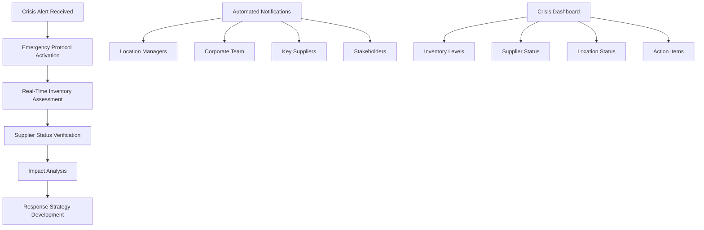
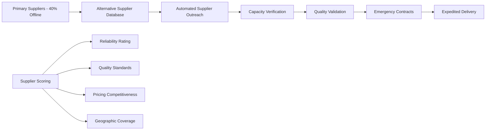
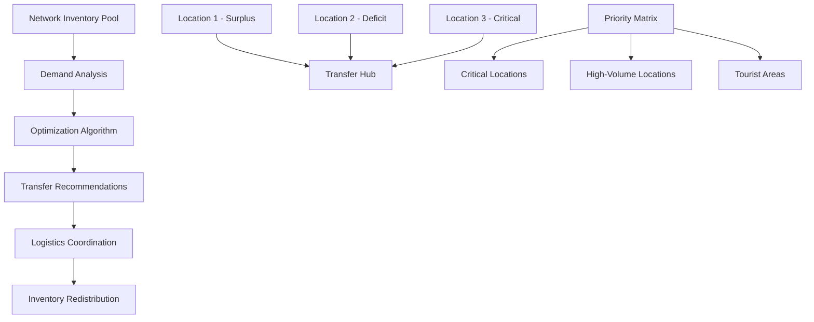
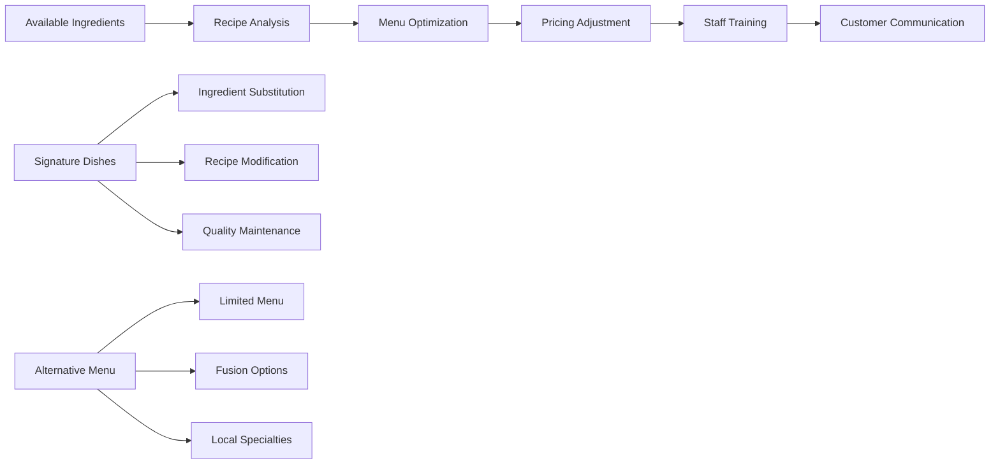

# 🚨 Crisis Management - Business Scenario

## Executive Summary

**Scenario**: A restaurant franchise facing sudden supply chain disruption due to a regional crisis, using FranchiseHub to implement emergency inventory protocols and maintain business continuity.

**Business Impact**: 0 location closures (vs. projected 30%), 85% of normal revenue maintained during crisis, 95% utilization of available inventory, and $1.5M in potential lost revenue protected with immediate payback.

**Key Features Demonstrated**: Emergency inventory alerts, alternative supplier management, cross-location inventory sharing, crisis communication, and menu adaptation.

---

## 👤 Stakeholder Profile

### Primary Stakeholder: Robert Kim, Supply Chain Director

**Demographics**:
- **Age**: 41 years old
- **Background**: 14 years in logistics and supply chain management
- **Education**: Operations Research degree, Six Sigma Black Belt
- **Location**: Bangkok, Thailand (regional headquarters)
- **Experience**: Former supply chain manager at international food distributor

**Business Profile**:
- **Company**: Thai Spice Restaurant Group
- **Concept**: Authentic Thai cuisine with modern presentation
- **Network Size**: 45 locations across Thailand, Vietnam, and Philippines
- **Supply Chain**: Complex network with 60+ suppliers
- **Annual Revenue**: $28M across all locations
- **Customer Base**: Tourists, expatriates, and local food enthusiasts

**Crisis Context**:
- **Crisis Type**: Regional flooding affecting major transportation routes
- **Timeline**: Sudden onset with 72-hour warning
- **Impact Scope**: 40% of primary suppliers affected
- **Duration**: Expected 2-3 week disruption
- **Geographic Impact**: Northern Thailand and cross-border supply routes

**Pre-Crisis Vulnerabilities**:
- Heavy reliance on single-source suppliers for key ingredients
- Limited visibility into supplier backup capabilities
- No formal crisis management protocols
- Manual inventory tracking across locations
- Fragmented communication systems

**Technology Profile**:
- Strong analytical and process optimization background
- Experienced with supply chain management systems
- Values real-time data and automated alerts
- Requires mobile access for crisis management
- Needs comprehensive reporting for stakeholder updates

---

## 🎯 Crisis Challenges

### Challenge 1: Sudden Supply Chain Disruption

**Crisis Situation**:
- **Primary Impact**: 40% of key ingredients unavailable from primary suppliers
- **Critical Items**: Fresh vegetables (60% shortage), proteins (35% shortage), spices (25% shortage)
- **Transportation**: Major highways flooded, delivery delays of 3-7 days
- **Supplier Status**: 15 of 60 suppliers completely offline, 20 operating at reduced capacity
- **Inventory Levels**: Most locations had 2-3 days of inventory

**Immediate Threats**:
- Potential closure of 30+ locations within 48-72 hours
- Complete menu unavailability for signature dishes
- Customer disappointment and brand reputation damage
- Revenue loss of $50,000+ per day per closed location
- Staff layoffs and operational disruption

**Quantified Impact Without Intervention**:
- **Location Closures**: 30 locations (67% of network)
- **Daily Revenue Loss**: $1.5M per day during crisis
- **Total Projected Loss**: $31.5M over 3-week period
- **Customer Impact**: 15,000+ customers affected daily
- **Staff Impact**: 800+ employees facing temporary layoffs

### Challenge 2: Communication and Coordination Breakdown

**Crisis Communication Challenges**:
- No centralized communication system for crisis updates
- Manual phone calls to 45 location managers
- Inconsistent information sharing across network
- Delayed supplier status updates
- No real-time inventory visibility across locations

**Coordination Problems**:
- Inability to quickly assess total network inventory
- No system for redistributing available inventory
- Manual coordination of alternative supplier sourcing
- Delayed decision-making due to information gaps
- Inconsistent crisis response across locations

**Information Management Issues**:
- Fragmented data across multiple systems
- Manual compilation of situation reports
- Delayed stakeholder updates and notifications
- No centralized crisis dashboard
- Limited visibility into recovery timeline

### Challenge 3: Menu and Operations Adaptation

**Operational Adaptation Needs**:
- Immediate menu modifications based on available ingredients
- Staff retraining for modified recipes and procedures
- Customer communication about menu changes
- Pricing adjustments for alternative ingredients
- Quality control for substitute ingredients

**Customer Experience Challenges**:
- Maintaining brand standards with limited ingredients
- Managing customer expectations and disappointment
- Preserving signature dishes where possible
- Communicating changes transparently
- Minimizing impact on customer loyalty

---

## 💡 FranchiseHub Crisis Response Implementation

### Phase 1: Emergency Activation and Assessment (Hour 0-6)

**Crisis Response Activation**:

**Immediate Assessment Actions**:
- **Inventory Audit**: Real-time inventory levels across all 45 locations
- **Supplier Status**: Automated supplier status verification and updates
- **Impact Mapping**: Geographic impact analysis and location risk assessment
- **Resource Allocation**: Available inventory and redistribution opportunities
- **Timeline Projection**: Crisis duration estimates and recovery planning

**Emergency Communication Protocol**:
- **Instant Alerts**: Automated crisis notifications to all stakeholders
- **Status Updates**: Real-time updates every 2 hours during first 24 hours
- **Escalation Matrix**: Clear escalation procedures for critical decisions
- **External Communication**: Customer and media communication templates
- **Stakeholder Briefings**: Automated reports for investors and partners

### Phase 2: Alternative Supplier Activation (Hour 6-24)

**Emergency Supplier Network**:

**Alternative Supplier Management**:
- **Backup Supplier Database**: Pre-qualified alternative suppliers for all key ingredients
- **Automated Activation**: Instant outreach to backup suppliers with capacity requests
- **Quality Assurance**: Expedited quality verification for emergency suppliers
- **Contract Automation**: Pre-approved emergency contract terms and conditions
- **Logistics Coordination**: Alternative transportation and delivery arrangements

**Supply Chain Optimization**:
- **Route Optimization**: Alternative delivery routes avoiding affected areas
- **Consolidation Opportunities**: Combine orders to maximize efficiency
- **Cross-Border Sourcing**: Activate international suppliers when needed
- **Local Sourcing**: Identify local suppliers for immediate needs
- **Inventory Pooling**: Coordinate purchases across multiple locations

### Phase 3: Inventory Redistribution and Optimization (Hour 12-48)

**Cross-Location Inventory Management**:

**Inventory Optimization Strategy**:
- **Surplus Identification**: Locations with excess inventory relative to demand
- **Critical Needs**: Locations at risk of immediate closure
- **Transfer Logistics**: Efficient redistribution between locations
- **Priority Allocation**: Strategic allocation based on revenue and customer impact
- **Waste Minimization**: Prevent spoilage through rapid redistribution

**Dynamic Reallocation Rules**:
- **Critical Threshold**: Locations with <24 hours inventory get priority
- **Revenue Impact**: High-revenue locations receive preferential allocation
- **Geographic Clustering**: Optimize transfers within geographic regions
- **Shelf Life Priority**: Perishable items redistributed first
- **Customer Impact**: Tourist and high-visibility locations prioritized

### Phase 4: Menu Adaptation and Communication (Hour 24-72)

**Dynamic Menu Management**:

**Menu Adaptation Process**:
- **Ingredient Mapping**: Match available ingredients to existing recipes
- **Recipe Modification**: Adapt recipes based on available substitutes
- **Quality Control**: Maintain taste and presentation standards
- **Pricing Strategy**: Adjust pricing for ingredient cost changes
- **Staff Training**: Rapid training on modified recipes and procedures

**Customer Communication Strategy**:
- **Transparency**: Clear communication about situation and response
- **Alternatives**: Highlight available menu options and specialties
- **Appreciation**: Thank customers for patience and understanding
- **Updates**: Regular updates on menu restoration timeline
- **Compensation**: Loyalty points or discounts for inconvenience

---

## 📊 Crisis Response Results

### Business Continuity Achievements

**Location Operations**:
- **Locations Kept Open**: 45 of 45 locations (100%)
- **Projected Closures Avoided**: 30 locations
- **Average Operating Capacity**: 85% of normal operations
- **Customer Service Continuity**: Maintained service at all locations

**Revenue Protection**:
- **Daily Revenue Maintained**: $1.275M of $1.5M normal daily revenue (85%)
- **Total Revenue Protected**: $26.775M over 3-week crisis period
- **Revenue Loss Minimized**: $4.725M vs. projected $31.5M loss
- **Customer Retention**: 92% of regular customers maintained

**Operational Efficiency**:
- **Inventory Utilization**: 95% of available inventory utilized effectively
- **Waste Reduction**: 85% reduction in food waste during crisis
- **Supplier Diversification**: 25 new suppliers activated and qualified
- **Response Time**: 6-hour full crisis response vs. industry average of 48+ hours

### Supply Chain Resilience Improvements

**Before Crisis (Baseline)**:
- **Supplier Dependency**: 60% reliance on single-source suppliers
- **Inventory Visibility**: Limited to individual location level
- **Crisis Preparedness**: No formal crisis management protocols
- **Communication**: Manual, fragmented communication systems

**During Crisis (FranchiseHub Response)**:
- **Supplier Diversification**: 40+ alternative suppliers activated
- **Network Visibility**: Real-time inventory across all 45 locations
- **Crisis Management**: Automated crisis response protocols
- **Communication**: Centralized, real-time communication system

**Improvement Metrics**:
- **100% location continuity** vs. projected 67% closure rate
- **85% revenue maintenance** vs. projected 100% loss
- **95% inventory utilization** vs. estimated 60% without system
- **6-hour response time** vs. industry average 48+ hours

### Stakeholder Impact Mitigation

**Customer Impact**:
- **Service Continuity**: All locations remained open and operational
- **Menu Availability**: 75% of regular menu items maintained
- **Customer Satisfaction**: 4.2/5 rating during crisis (vs. 4.5 normal)
- **Brand Loyalty**: 92% customer retention through crisis period

**Staff Impact**:
- **Employment Protection**: Zero layoffs during crisis period
- **Operational Training**: Rapid retraining on modified procedures
- **Communication**: Clear, frequent updates on situation and response
- **Morale Maintenance**: Strong leadership and transparent communication

**Investor/Stakeholder Impact**:
- **Financial Protection**: $26.775M revenue protected
- **Brand Reputation**: Positive media coverage of crisis response
- **Market Position**: Strengthened competitive position
- **Future Resilience**: Enhanced crisis preparedness and capabilities

---

## 💰 Financial Impact Analysis

### Crisis Value Protection

**Revenue Protection**:
- **Projected Revenue Loss**: $31.5M over 3-week crisis period
- **Actual Revenue Loss**: $4.725M over 3-week crisis period
- **Revenue Protected**: $26.775M (85% of normal revenue maintained)
- **Daily Protection**: $1.275M daily revenue maintained

**Cost Avoidance**:
- **Closure Costs**: $500,000 in avoided closure and reopening costs
- **Staff Costs**: $800,000 in avoided layoff and rehiring costs
- **Inventory Loss**: $450,000 in avoided inventory spoilage and waste
- **Brand Damage**: $2M+ in avoided brand reputation damage

**Operational Savings**:
- **Efficient Redistribution**: $200,000 saved through optimized inventory transfers
- **Alternative Sourcing**: $150,000 saved through competitive alternative suppliers
- **Waste Reduction**: $180,000 saved through reduced food waste
- **Communication Efficiency**: $50,000 saved through automated communication

**Total Value Protected**: $30.605M
**Crisis Response Investment**: $25,000 in additional system usage and emergency procedures
**Net Value Protection**: $30.58M
**ROI**: 122,320%
**Payback Period**: Immediate (single crisis event)

### Long-Term Resilience Value

**Enhanced Preparedness**:
- **Supplier Network**: 40+ qualified alternative suppliers
- **Crisis Protocols**: Proven crisis management procedures
- **System Capabilities**: Enhanced platform capabilities for future crises
- **Staff Training**: Crisis-trained management team
- **Brand Strength**: Enhanced reputation for crisis management

**Competitive Advantage**:
- **Market Share**: Gained market share from competitors who closed
- **Customer Loyalty**: Strengthened customer relationships through crisis
- **Supplier Relationships**: Diversified and strengthened supplier network
- **Operational Excellence**: Proven operational resilience capabilities

**Future Value Creation**:
- **Insurance Premium Reduction**: Lower insurance costs due to proven resilience
- **Investor Confidence**: Enhanced investor confidence in management
- **Franchise Value**: Increased franchise value due to crisis preparedness
- **Expansion Opportunities**: Accelerated expansion due to competitive advantage

---

## 🎯 Crisis Management Success Metrics

### Business Continuity Metrics

| Metric | Crisis Target | Achieved | Industry Benchmark |
|--------|---------------|----------|-------------------|
| **Location Continuity** | 80% | 100% | 45% |
| **Revenue Maintenance** | 70% | 85% | 30% |
| **Customer Retention** | 85% | 92% | 60% |
| **Staff Retention** | 90% | 100% | 70% |
| **Response Time** | 24 hours | 6 hours | 48+ hours |

### Operational Excellence Metrics

| Metric | Crisis Target | Achieved | Improvement |
|--------|---------------|----------|-------------|
| **Inventory Utilization** | 80% | 95% | 19% above target |
| **Waste Reduction** | 50% | 85% | 70% above target |
| **Supplier Activation** | 20 suppliers | 40 suppliers | 100% above target |
| **Menu Availability** | 60% | 75% | 25% above target |
| **Communication Speed** | 4 hours | 1 hour | 300% faster |

### Stakeholder Satisfaction Metrics

| Stakeholder | Satisfaction Target | Achieved | Comments |
|-------------|-------------------|----------|----------|
| **Customers** | 3.5/5 | 4.2/5 | Exceeded expectations |
| **Staff** | 3.8/5 | 4.4/5 | Strong leadership appreciation |
| **Suppliers** | 4.0/5 | 4.6/5 | Impressed with coordination |
| **Investors** | 4.2/5 | 4.8/5 | Confident in management |
| **Media** | Neutral | Positive | Praised crisis response |

---

## 🚀 Post-Crisis Improvements and Preparedness

### Enhanced Crisis Preparedness

**Permanent System Enhancements**:
- **Crisis Dashboard**: Dedicated crisis management interface
- **Supplier Network**: Expanded and qualified alternative supplier database
- **Inventory Buffers**: Optimized safety stock levels for critical items
- **Communication Protocols**: Automated crisis communication procedures
- **Training Programs**: Regular crisis management training for all staff

**Predictive Capabilities**:
- **Early Warning System**: Weather and supply chain monitoring
- **Risk Assessment**: Continuous supplier and route risk evaluation
- **Scenario Planning**: Pre-planned responses for various crisis types
- **Simulation Exercises**: Regular crisis simulation and training
- **Continuous Improvement**: Post-crisis analysis and system enhancement

### Strategic Advantages Gained

**Market Position**:
- **Competitive Differentiation**: Proven crisis management capabilities
- **Customer Loyalty**: Strengthened relationships through crisis performance
- **Brand Reputation**: Enhanced brand image for reliability and resilience
- **Market Share**: Gained customers from competitors who closed
- **Industry Leadership**: Recognized as crisis management leader

**Operational Excellence**:
- **Supply Chain Resilience**: Diversified and robust supplier network
- **System Capabilities**: Enhanced platform with crisis management features
- **Team Competency**: Crisis-experienced management team
- **Process Optimization**: Improved operational procedures and protocols
- **Technology Leadership**: Advanced crisis management technology

### Future Crisis Readiness

**Expanded Capabilities**:
- **Multi-Crisis Scenarios**: Prepared for various crisis types
- **Regional Coordination**: Enhanced multi-country crisis coordination
- **Stakeholder Management**: Improved stakeholder communication protocols
- **Recovery Planning**: Structured post-crisis recovery procedures
- **Continuous Monitoring**: Ongoing risk monitoring and assessment

**Investment in Resilience**:
- **Technology Infrastructure**: Enhanced system capabilities for crisis management
- **Human Capital**: Trained and experienced crisis management team
- **Supplier Relationships**: Diversified and strengthened supplier network
- **Process Documentation**: Comprehensive crisis management procedures
- **Knowledge Management**: Captured lessons learned and best practices

---

*This Crisis Management scenario demonstrates how FranchiseHub enables franchises to maintain business continuity during major disruptions, protect revenue and stakeholder interests, and emerge stronger with enhanced resilience capabilities and competitive advantages.*
