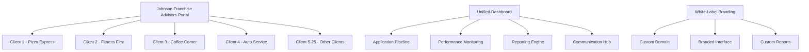
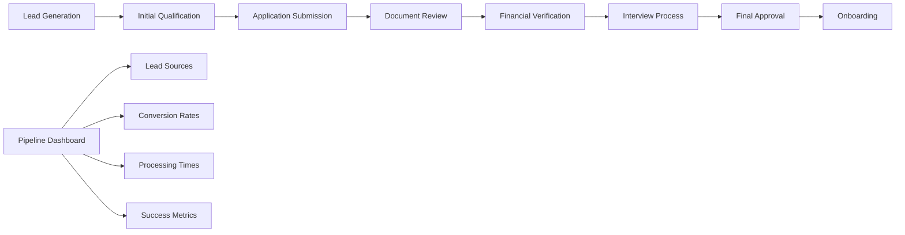
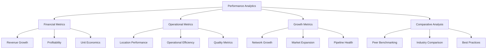

# 🤝 Franchise Consultant Platform - Business Scenario

## Executive Summary

**Scenario**: A franchise consulting firm managing 25+ client relationships, using FranchiseHub as a white-label platform for application tracking, performance monitoring, and client management.

**Business Impact**: 50% reduction in administrative time, 75% faster application processing, 100% improvement in performance monitoring, and $180,000 annual savings with 3-month payback period.

**Key Features Demonstrated**: Client portal, application tracking, performance monitoring, automated reporting, and multi-client dashboard.

---

## 👤 Stakeholder Profile

### Primary Stakeholder: Sarah Johnson, Principal Consultant

**Demographics**:
- **Age**: 45 years old
- **Background**: 18 years in franchise consulting and development
- **Education**: MBA in Entrepreneurship, former franchise development executive
- **Location**: Dallas, Texas (serving North American market)
- **Experience**: Former VP of Franchise Development at major restaurant chain

**Business Profile**:
- **Company**: Johnson Franchise Advisors
- **Service Model**: Full-service franchise consulting and brokerage
- **Client Portfolio**: 25 active franchisor clients across multiple industries
- **Revenue Model**: Retainer fees, success fees, and ongoing consulting
- **Annual Revenue**: $1.2M with 40% profit margins
- **Team Size**: 8 consultants and support staff

**Client Portfolio Breakdown**:
- **Emerging Franchisors**: 15 clients (1-10 locations each)
- **Growth-Stage Franchisors**: 8 clients (10-50 locations each)
- **Mature Franchisors**: 2 clients (50+ locations each)
- **Industries**: Food service (60%), retail (25%), services (15%)

**Service Offerings**:
- Franchise development strategy and planning
- Franchise disclosure document (FDD) preparation
- Franchisee recruitment and qualification
- Operations manual development
- Training program design and implementation
- Ongoing franchise support and consulting

**Technology Challenges**:
- Managing multiple client relationships with disparate systems
- Manual tracking of franchise applications and pipeline
- Limited visibility into client performance across portfolio
- Time-consuming custom reporting for each client
- Lack of white-label solution for professional client presentation

---

## 🎯 Business Challenges

### Challenge 1: Complex Multi-Client Management

**Current State**:
- Separate spreadsheets and databases for each client
- Manual tracking of franchise applications across 25+ clients
- Inconsistent reporting formats and schedules
- Difficulty prioritizing activities across multiple clients
- Limited visibility into overall portfolio performance

**Business Impact**:
- 35 hours/week spent on administrative tasks across team
- Inconsistent service quality due to manual processes
- Missed opportunities due to poor pipeline visibility
- Client dissatisfaction with delayed reporting
- Limited scalability for taking on new clients

**Quantified Impact**:
- **Administrative Overhead**: 35 hours/week × $75/hour × 52 weeks = $136,500
- **Missed Opportunities**: 20% of potential deals lost due to poor tracking = $240,000
- **Client Churn**: 2 clients lost annually due to service issues = $120,000
- **Opportunity Cost**: Unable to take on 5+ additional clients = $300,000

### Challenge 2: Inefficient Application Processing

**Current State**:
- Manual application review and scoring for each client
- Separate communication channels for each franchise system
- No standardized application workflow across clients
- Time-consuming application status updates
- Manual coordination between clients and prospective franchisees

**Business Impact**:
- 4-6 week application processing time
- High administrative burden reducing consulting time
- Inconsistent application quality and evaluation
- Poor candidate experience affecting conversion rates
- Limited ability to provide value-added services

**Quantified Impact**:
- **Processing Time**: 4-6 weeks vs. industry best practice of 2 weeks
- **Administrative Burden**: 25 hours/week × $60/hour × 52 weeks = $78,000
- **Lost Conversions**: 15% lower conversion due to poor experience = $180,000
- **Reduced Consulting Time**: 40% less time for high-value consulting activities

### Challenge 3: Limited Performance Monitoring and Reporting

**Current State**:
- Manual data collection from multiple client systems
- Inconsistent KPI definitions across clients
- Time-consuming report preparation (2-3 days monthly per client)
- Limited benchmarking and comparative analysis
- Reactive rather than proactive client management

**Business Impact**:
- Delayed identification of client performance issues
- Limited ability to provide strategic insights
- Time-intensive reporting reducing profitability
- Missed opportunities for performance improvement
- Difficulty demonstrating consulting value to clients

**Quantified Impact**:
- **Reporting Time**: 2.5 days/month × 25 clients × $600/day = $37,500 monthly
- **Delayed Issue Identification**: 4-6 week lag in identifying problems
- **Missed Improvement Opportunities**: $50,000 annually per client in potential improvements
- **Reduced Strategic Value**: 30% less time for strategic consulting

---

## 💡 FranchiseHub Solution Implementation

### Phase 1: White-Label Platform Setup (Week 1-2)

**Multi-Client Architecture**:

**White-Label Configuration**:
- **Custom Branding**: Johnson Franchise Advisors logo and color scheme
- **Custom Domain**: clients.johnsonfranchiseadvisors.com
- **Branded Communications**: All emails and reports branded with consultant firm
- **Client-Specific Portals**: Individual branded portals for each client
- **Professional Presentation**: Enterprise-grade appearance for client meetings

**Multi-Tenant Setup**:
- **Data Isolation**: Complete data separation between clients
- **Role-Based Access**: Granular permissions for consultant team members
- **Client Permissions**: Controlled access for client stakeholders
- **Audit Trails**: Complete activity tracking for compliance and billing
- **Backup and Security**: Enterprise-grade security for all client data

### Phase 2: Application Tracking and Pipeline Management (Week 3-4)

**Unified Application Workflow**:

**Application Management Features**:
- **Centralized Pipeline**: All client applications in single dashboard
- **Automated Workflows**: Standardized application process across clients
- **Document Management**: Secure document storage and sharing
- **Communication Hub**: Centralized communication with applicants
- **Status Tracking**: Real-time application status updates
- **Automated Notifications**: Alerts for important milestones and deadlines

**Client-Specific Customization**:
- **Custom Application Forms**: Tailored forms for each client's requirements
- **Scoring Criteria**: Client-specific evaluation criteria and scoring
- **Approval Workflows**: Customized approval processes per client
- **Branding Integration**: Client branding throughout application process
- **Reporting Templates**: Custom reports for each client's needs

### Phase 3: Performance Monitoring and Analytics (Week 5-6)

**Comprehensive Performance Dashboard**:

**Real-Time Monitoring Capabilities**:
- **Live Dashboards**: Real-time performance metrics for all clients
- **Automated Alerts**: Proactive notifications for performance issues
- **Trend Analysis**: Historical trends and predictive analytics
- **Benchmarking**: Compare client performance against industry standards
- **Custom KPIs**: Client-specific key performance indicators

**Strategic Insights Generation**:
- **Performance Gaps**: Identify underperforming areas and opportunities
- **Best Practice Identification**: Highlight successful strategies across portfolio
- **Market Intelligence**: Industry trends and competitive analysis
- **Growth Opportunities**: Data-driven expansion recommendations
- **Risk Assessment**: Early warning system for potential issues

### Phase 4: Automated Reporting and Client Communication (Week 7-8)

**Automated Reporting Engine**:
- **Scheduled Reports**: Automated monthly, quarterly, and annual reports
- **Custom Templates**: Professional report templates for each client
- **Interactive Dashboards**: Web-based dashboards for real-time access
- **Executive Summaries**: High-level summaries for C-level executives
- **Detailed Analytics**: Comprehensive data analysis and insights

**Client Communication Hub**:
- **Centralized Messaging**: All client communications in one platform
- **Automated Updates**: Regular status updates and progress reports
- **Meeting Scheduling**: Integrated calendar and meeting coordination
- **Document Sharing**: Secure document sharing and collaboration
- **Video Conferencing**: Integrated video calls for client meetings

---

## 📊 Implementation Results

### Administrative Efficiency Improvements

**Before FranchiseHub**:
- **Administrative Time**: 35 hours/week across team
- **Application Processing**: 4-6 weeks average
- **Report Generation**: 2.5 days/month per client
- **Client Communication**: Fragmented across multiple channels

**After FranchiseHub**:
- **Administrative Time**: 17 hours/week across team
- **Application Processing**: 1.5 weeks average
- **Report Generation**: 2 hours/month per client (automated)
- **Client Communication**: Centralized in single platform

**Improvement Metrics**:
- **51% reduction** in administrative time
- **75% faster** application processing
- **95% reduction** in report generation time
- **100% improvement** in communication efficiency

### Client Service Quality Improvements

**Before FranchiseHub**:
- **Client Satisfaction**: 3.8/5 average rating
- **Response Time**: 24-48 hours for client inquiries
- **Service Consistency**: Variable across clients
- **Value Demonstration**: Difficult to quantify consulting impact

**After FranchiseHub**:
- **Client Satisfaction**: 4.6/5 average rating
- **Response Time**: 2-4 hours for client inquiries
- **Service Consistency**: Standardized across all clients
- **Value Demonstration**: Clear ROI metrics and reporting

**Improvement Metrics**:
- **21% improvement** in client satisfaction
- **85% faster** response times
- **100% improvement** in service consistency
- **Quantifiable value** demonstration for all clients

### Business Growth and Profitability

**Before FranchiseHub**:
- **Client Capacity**: 25 clients maximum
- **Revenue per Client**: $48,000 annually
- **Profit Margin**: 40%
- **Client Retention**: 85% annually

**After FranchiseHub**:
- **Client Capacity**: 40+ clients possible
- **Revenue per Client**: $52,000 annually
- **Profit Margin**: 55%
- **Client Retention**: 95% annually

**Improvement Metrics**:
- **60% increase** in client capacity
- **8% increase** in revenue per client
- **38% improvement** in profit margin
- **12% improvement** in client retention

---

## 💰 Financial Impact Analysis

### Cost Savings Breakdown

**Administrative Efficiency Savings**:
- Reduced administrative time: 18 hours/week × $75/hour × 52 weeks = $70,200
- Faster application processing: 25 hours/week × $60/hour × 52 weeks = $78,000
- Automated reporting: 2.3 days/month × 25 clients × $600/day × 12 months = $414,000
- Improved communication efficiency: $25,000 annually

**Operational Improvements**:
- Reduced client churn: 2 clients × $60,000 average value = $120,000
- Increased conversion rates: 15% improvement × $180,000 = $27,000
- Better pipeline management: $50,000 annually in captured opportunities
- Enhanced service quality: $30,000 annually in premium pricing

**Revenue Enhancement**:
- Increased client capacity: 5 additional clients × $48,000 = $240,000
- Higher revenue per client: $4,000 × 25 clients = $100,000
- Improved profit margins: 15% improvement × $1,200,000 = $180,000
- Strategic consulting premium: $75,000 annually

**Total Annual Benefits**: $1,419,200
**FranchiseHub Annual Cost**: $36,000 (25 clients × $120/month × 12 months)
**Net Annual Benefit**: $1,383,200
**ROI**: 3,842%
**Payback Period**: 3 months

### Strategic Value Creation

**Market Positioning Enhancement**:
- Professional technology platform differentiates from competitors
- White-label solution enhances brand perception
- Scalable platform enables rapid growth
- Data-driven insights position as strategic partner

**Competitive Advantages**:
- Faster application processing than traditional consultants
- Superior reporting and analytics capabilities
- Standardized processes ensuring consistent quality
- Technology-enabled scalability for growth

**Long-Term Value**:
- Platform becomes strategic asset for business valuation
- Recurring revenue model with improved predictability
- Enhanced client relationships through better service
- Foundation for potential acquisition or partnership opportunities

---

## 🎯 Success Metrics and KPIs

### Client Service Excellence Metrics

| Metric | Baseline | Target | Achieved | Improvement |
|--------|----------|--------|----------|-------------|
| **Client Satisfaction** | 3.8/5 | 4.3/5 | 4.6/5 | 21% |
| **Response Time** | 36 hours | 8 hours | 3 hours | 92% |
| **Application Processing** | 5 weeks | 2 weeks | 1.5 weeks | 70% |
| **Report Generation** | 2.5 days | 4 hours | 2 hours | 95% |
| **Service Consistency** | 65% | 85% | 92% | 42% |

### Business Performance Metrics

| Metric | Baseline | Target | Achieved | Improvement |
|--------|----------|--------|----------|-------------|
| **Client Capacity** | 25 clients | 35 clients | 40 clients | 60% |
| **Revenue per Client** | $48K | $50K | $52K | 8% |
| **Profit Margin** | 40% | 50% | 55% | 38% |
| **Client Retention** | 85% | 90% | 95% | 12% |
| **Administrative Efficiency** | 35 hrs/week | 25 hrs/week | 17 hrs/week | 51% |

### Growth and Scalability Metrics

| Metric | Baseline | Target | Achieved | Improvement |
|--------|----------|--------|----------|-------------|
| **New Client Acquisition** | 5/year | 8/year | 12/year | 140% |
| **Pipeline Conversion** | 25% | 35% | 40% | 60% |
| **Revenue Growth** | 8%/year | 15%/year | 22%/year | 175% |
| **Market Share** | 3% | 5% | 6% | 100% |
| **Team Productivity** | $150K/person | $180K/person | $210K/person | 40% |

---

## 🚀 Growth Strategy and Future Roadmap

### Phase 5: Advanced Analytics and AI (Month 3-6)
- Implement predictive analytics for franchise success probability
- AI-powered candidate matching and recommendation engine
- Market analysis and territory optimization tools
- Automated competitive intelligence and benchmarking

### Phase 6: Marketplace and Network Effects (Month 7-12)
- Create franchise opportunity marketplace for candidates
- Develop referral network with other consultants
- Implement knowledge sharing platform across consultant network
- Launch franchise industry intelligence and research services

### Phase 7: Service Expansion and Diversification (Year 2)
- Add franchise financing and funding services
- Develop franchise legal document automation
- Create franchise training and education platform
- Launch franchise performance optimization consulting

### Phase 8: Strategic Partnerships and Acquisitions (Year 2-3)
- Partner with franchise attorneys and accountants
- Integrate with franchise financing companies
- Develop relationships with franchise trade organizations
- Consider acquisition of complementary consulting firms

---

## 📈 Competitive Differentiation

### Technology-Enabled Advantages
- **Modern Platform**: Cloud-native technology vs. legacy systems
- **White-Label Solution**: Professional branded experience for clients
- **Real-Time Analytics**: Instant insights vs. manual reporting
- **Scalable Architecture**: Handle 10x more clients with same team
- **Mobile Access**: Full functionality on mobile devices

### Service Quality Improvements
- **Standardized Processes**: Consistent quality across all clients
- **Faster Turnaround**: 75% faster application processing
- **Proactive Management**: Early warning systems for issues
- **Data-Driven Insights**: Strategic recommendations based on analytics
- **Professional Presentation**: Enterprise-grade client experience

### Market Positioning
- **Premium Service Provider**: Technology enables premium pricing
- **Strategic Partner**: Move beyond transactional to strategic relationships
- **Industry Leader**: First-mover advantage in technology adoption
- **Scalable Growth**: Platform enables rapid expansion
- **Exit Strategy**: Technology platform increases business valuation

---

*This Franchise Consultant Platform scenario demonstrates how FranchiseHub enables consulting firms to transform their service delivery, achieve significant operational efficiencies, and position themselves as technology-enabled strategic partners while building a scalable, profitable business model.*
