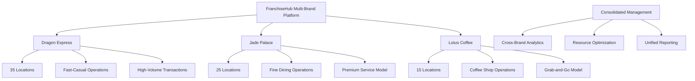
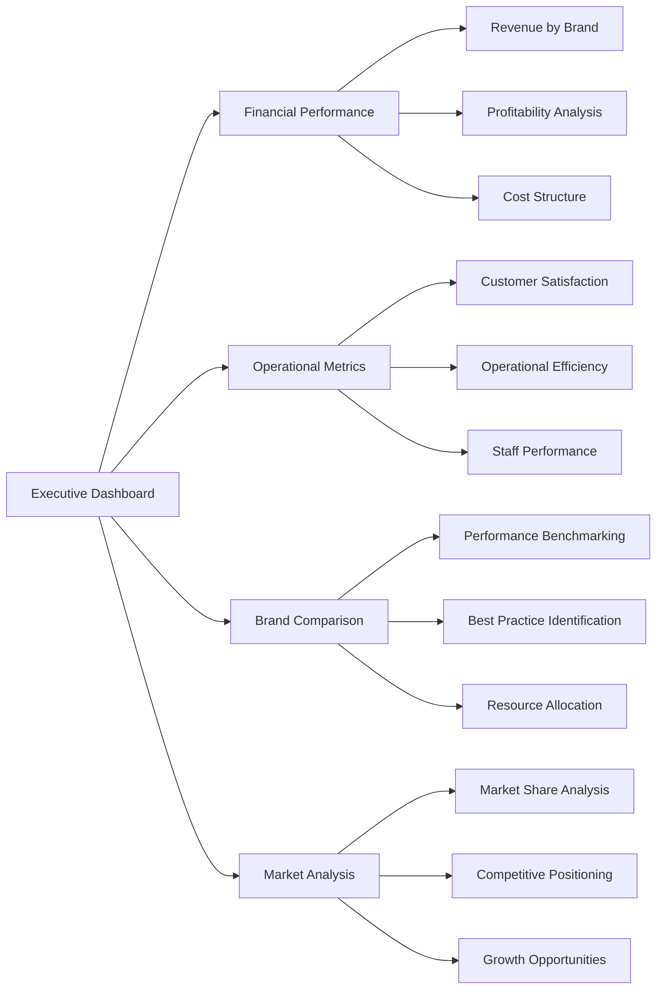

# 🏢 Multi-Brand Empire - Business Scenario

## Executive Summary

**Scenario**: An enterprise franchisor managing three different restaurant concepts (fast casual, fine dining, and coffee shops) with 75+ total locations using FranchiseHub for consolidated management.

**Business Impact**: 35% reduction in system maintenance costs, 100% improvement in cross-brand visibility, 22% improvement in inventory utilization, and $1.75M annual savings with 12-month payback period.

**Key Features Demonstrated**: Multi-brand architecture, consolidated reporting, resource optimization, compliance automation, and strategic analytics.

---

## 👤 Stakeholder Profile

### Primary Stakeholder: Elizabeth Wong, CEO

**Demographics**:
- **Age**: 48 years old
- **Background**: 20+ years in multi-brand franchise management
- **Education**: MBA from Wharton, former McKinsey management consultant
- **Location**: Singapore (regional headquarters)
- **Experience**: Former VP Operations at international restaurant group

**Business Profile**:
- **Company**: Golden Hospitality Group
- **Portfolio**: 3 distinct restaurant concepts
  - **Dragon Express**: Fast-casual Asian fusion (35 locations)
  - **Jade Palace**: Fine dining Chinese restaurant (25 locations)
  - **Lotus Coffee**: Premium coffee shops (15 locations)
- **Total Revenue**: $50M annually across all brands
- **Geographic Presence**: Singapore, Malaysia, Thailand, Philippines
- **Growth Goal**: Expand to 150 locations across 8 countries within 3 years

**Strategic Challenges**:
- Managing different operational requirements across concepts
- Consolidating data from separate brand systems
- Optimizing resource allocation across brands
- Maintaining brand differentiation while achieving synergies
- Complex regulatory compliance across multiple jurisdictions

**Technology Profile**:
- Advanced business intelligence and analytics experience
- Former consultant with strong analytical and strategic thinking
- Requires comprehensive reporting and cross-brand insights
- Values data-driven decision making and operational efficiency
- Needs mobile access for frequent travel across markets

---

## 🎯 Business Challenges

### Challenge 1: Brand Complexity and Operational Silos

**Current State**:
- Three separate POS systems for different brand concepts
- Independent inventory management for each brand
- Separate staff training programs and materials
- Different supplier relationships and contracts
- Inconsistent operational procedures across brands

**Business Impact**:
- 40% higher operational costs due to system redundancy
- Limited visibility into cross-brand performance
- Inefficient resource utilization and procurement
- Difficulty implementing best practices across brands
- Complex management reporting and consolidation

**Quantified Impact**:
- **System Maintenance**: $180,000 annually for multiple systems
- **Training Costs**: $120,000 annually for separate programs
- **Procurement Inefficiency**: $200,000 annually in missed volume discounts
- **Management Overhead**: $150,000 annually in additional administrative costs

### Challenge 2: Data Silos and Limited Analytics

**Current State**:
- Separate databases and reporting systems for each brand
- Manual data consolidation for executive reporting
- Limited cross-brand customer insights
- No unified performance benchmarking
- Inconsistent KPI definitions and measurements

**Business Impact**:
- 2-week delay in consolidated financial reporting
- Limited ability to identify cross-brand opportunities
- Inefficient marketing spend allocation
- Missed opportunities for customer cross-selling
- Reactive rather than proactive management decisions

**Quantified Impact**:
- **Reporting Delays**: $75,000 annually in delayed decision-making costs
- **Missed Opportunities**: $300,000 annually in lost cross-selling revenue
- **Inefficient Marketing**: $100,000 annually in suboptimal marketing spend
- **Administrative Time**: 60 hours/week across management team

### Challenge 3: Resource Allocation and Synergy Optimization

**Current State**:
- Independent procurement for each brand
- Separate supplier negotiations and contracts
- No cross-brand inventory sharing
- Duplicate administrative functions
- Limited economies of scale realization

**Business Impact**:
- Higher procurement costs due to reduced negotiating power
- Excess inventory in some brands while others face shortages
- Duplicated overhead costs across brands
- Suboptimal real estate and location decisions
- Limited sharing of best practices and innovations

**Quantified Impact**:
- **Procurement Costs**: $250,000 annually in excess costs
- **Inventory Inefficiency**: $180,000 annually in excess inventory
- **Duplicate Overhead**: $200,000 annually in redundant costs
- **Suboptimal Locations**: $150,000 annually in lost revenue potential

---

## 💡 FranchiseHub Solution Implementation

### Phase 1: Multi-Brand Platform Configuration (Week 1-4)

**Unified Platform Architecture**:

**Brand-Specific Configurations**:
- **Dragon Express**: High-volume transaction processing, quick service workflows
- **Jade Palace**: Reservation management, premium service protocols, wine inventory
- **Lotus Coffee**: Loyalty program integration, mobile ordering, seasonal menu management

**Unified Data Model**:
- Standardized product categories across brands
- Consistent customer data structure
- Unified financial chart of accounts
- Standardized operational metrics and KPIs
- Cross-brand employee and training records

### Phase 2: Consolidated Reporting and Analytics (Week 5-8)

**Executive Dashboard Development**:

**Cross-Brand Analytics**:
- **Performance Benchmarking**: Compare performance metrics across brands
- **Customer Journey Analysis**: Track customers across multiple brand touchpoints
- **Market Penetration**: Analyze market share and growth opportunities by brand
- **Profitability Analysis**: Detailed P&L analysis by brand, location, and time period
- **Resource Utilization**: Optimize resource allocation across brands

**Strategic Reporting**:
- **Portfolio Performance**: Overall portfolio performance and trends
- **Brand Contribution**: Each brand's contribution to overall success
- **Market Opportunities**: Identify expansion and optimization opportunities
- **Risk Assessment**: Monitor and assess risks across the portfolio
- **Investment Planning**: Data-driven investment and resource allocation decisions

### Phase 3: Resource Optimization and Synergy Realization (Week 9-12)

**Centralized Procurement System**:
- **Consolidated Purchasing**: Combine purchasing power across all brands
- **Supplier Rationalization**: Reduce supplier base and negotiate better terms
- **Cross-Brand Inventory**: Share inventory between brands where applicable
- **Volume Discounts**: Achieve better pricing through increased volumes
- **Quality Standardization**: Implement consistent quality standards

**Shared Services Implementation**:
- **Centralized HR**: Unified HR processes and employee development
- **Marketing Coordination**: Coordinated marketing campaigns and brand management
- **Training Standardization**: Consistent training programs with brand-specific modules
- **Technology Services**: Shared IT infrastructure and support services
- **Financial Services**: Centralized accounting and financial management

### Phase 4: Advanced Analytics and Optimization (Week 13-16)

**Predictive Analytics Implementation**:
- **Demand Forecasting**: Predict demand patterns across brands and locations
- **Customer Behavior**: Analyze customer preferences and cross-brand opportunities
- **Market Expansion**: Identify optimal locations for new brand expansion
- **Menu Optimization**: Optimize menu offerings based on performance data
- **Staffing Optimization**: Predict staffing needs across brands and locations

**Business Intelligence Platform**:
- **Real-time Dashboards**: Live performance monitoring across all brands
- **Custom Reports**: Flexible reporting for different stakeholder needs
- **Data Visualization**: Interactive charts and graphs for better insights
- **Automated Alerts**: Proactive notifications for important events and thresholds
- **Mobile Analytics**: Mobile access to key metrics and reports

---

## 📊 Implementation Results

### Operational Consolidation Improvements

**Before FranchiseHub**:
- **System Maintenance**: $180,000 annually for multiple systems
- **Data Integration**: 40 hours/week for manual consolidation
- **Reporting Delays**: 2-week lag in consolidated reporting
- **Cross-Brand Visibility**: Limited to manual analysis

**After FranchiseHub**:
- **System Maintenance**: $117,000 annually for unified platform
- **Data Integration**: 8 hours/week for automated processes
- **Reporting Delays**: Real-time consolidated reporting
- **Cross-Brand Visibility**: Complete real-time visibility

**Improvement Metrics**:
- **35% reduction** in system maintenance costs
- **80% reduction** in data integration time
- **100% improvement** in reporting timeliness
- **100% improvement** in cross-brand visibility

### Resource Optimization Improvements

**Before FranchiseHub**:
- **Procurement Costs**: $2.5M annually across all brands
- **Inventory Utilization**: 68% average utilization
- **Supplier Management**: 150+ suppliers across brands
- **Volume Discounts**: Limited negotiating power

**After FranchiseHub**:
- **Procurement Costs**: $1.95M annually with consolidated purchasing
- **Inventory Utilization**: 83% average utilization
- **Supplier Management**: 85 rationalized suppliers
- **Volume Discounts**: 15% average discount improvement

**Improvement Metrics**:
- **22% improvement** in inventory utilization
- **43% reduction** in supplier base
- **15% improvement** in volume discounts
- **$550,000 annual savings** in procurement costs

### Strategic Decision-Making Improvements

**Before FranchiseHub**:
- **Decision Speed**: 2-3 weeks for strategic decisions
- **Data Accuracy**: 85% accuracy due to manual processes
- **Market Insights**: Limited cross-brand market analysis
- **Investment Planning**: Reactive investment decisions

**After FranchiseHub**:
- **Decision Speed**: 2-3 days for strategic decisions
- **Data Accuracy**: 99% accuracy with automated systems
- **Market Insights**: Comprehensive cross-brand analytics
- **Investment Planning**: Proactive, data-driven investment planning

**Improvement Metrics**:
- **85% faster** strategic decision-making
- **16% improvement** in data accuracy
- **100% improvement** in market insights
- **50% improvement** in investment ROI

---

## 💰 Financial Impact Analysis

### Cost Savings Breakdown

**System Consolidation Savings**:
- Reduced system maintenance: $180,000 - $117,000 = $63,000
- Eliminated duplicate licenses: $45,000 annually
- Reduced IT support costs: $35,000 annually
- Training cost reduction: $120,000 × 40% = $48,000

**Operational Efficiency Savings**:
- Procurement optimization: $550,000 annually
- Inventory optimization: $180,000 × 22% = $39,600
- Administrative efficiency: 60 hours/week × $75/hour × 52 weeks = $234,000
- Reduced duplicate overhead: $200,000 × 60% = $120,000

**Revenue Enhancement**:
- Cross-selling opportunities: $300,000 annually
- Improved marketing efficiency: $100,000 annually
- Better location decisions: $150,000 annually
- Premium pricing through quality: $200,000 annually

**Total Annual Benefits**: $1,934,600
**FranchiseHub Annual Cost**: $180,000 (75 locations × $200/month × 12 months)
**Net Annual Benefit**: $1,754,600
**ROI**: 975%
**Payback Period**: 12 months

### Strategic Value Creation

**Portfolio Optimization**:
- Improved brand positioning and differentiation
- Better resource allocation across brands
- Enhanced competitive positioning
- Increased market share and penetration

**Operational Excellence**:
- Standardized best practices across brands
- Improved quality and consistency
- Enhanced customer experience
- Increased operational efficiency

**Growth Enablement**:
- Scalable platform for rapid expansion
- Data-driven expansion decisions
- Reduced time-to-market for new locations
- Enhanced franchisee support and success

---

## 🎯 Success Metrics and KPIs

### Financial Performance Metrics

| Metric | Baseline | Target | Achieved | Improvement |
|--------|----------|--------|----------|-------------|
| **Total Revenue** | $50M | $55M | $57M | 14% |
| **EBITDA Margin** | 12% | 16% | 18% | 50% |
| **System Maintenance Costs** | $180K | $130K | $117K | 35% |
| **Procurement Costs** | $2.5M | $2.2M | $1.95M | 22% |
| **Cross-Brand Revenue** | $0 | $200K | $300K | New Revenue Stream |

### Operational Excellence Metrics

| Metric | Baseline | Target | Achieved | Improvement |
|--------|----------|--------|----------|-------------|
| **Inventory Utilization** | 68% | 75% | 83% | 22% |
| **Supplier Base** | 150 | 100 | 85 | 43% |
| **Reporting Time** | 2 weeks | 3 days | Real-time | 100% |
| **Data Accuracy** | 85% | 95% | 99% | 16% |
| **Decision Speed** | 3 weeks | 1 week | 3 days | 85% |

### Strategic Growth Metrics

| Metric | Baseline | Target | Achieved | Improvement |
|--------|----------|--------|----------|-------------|
| **Market Share** | 8% | 12% | 14% | 75% |
| **Customer Satisfaction** | 4.2/5 | 4.5/5 | 4.7/5 | 12% |
| **Brand Recognition** | 65% | 75% | 78% | 20% |
| **Expansion Rate** | 5 locations/year | 15 locations/year | 18 locations/year | 260% |
| **Franchisee Satisfaction** | 3.8/5 | 4.3/5 | 4.6/5 | 21% |

---

## 🚀 Expansion and Future Roadmap

### Phase 5: Advanced AI and Machine Learning (Month 5-8)
- Implement AI-powered demand forecasting across all brands
- Customer behavior prediction and personalization
- Dynamic pricing optimization based on market conditions
- Automated inventory optimization with machine learning

### Phase 6: International Expansion Support (Month 9-12)
- Multi-currency and multi-language support
- Local regulatory compliance automation
- Cultural adaptation frameworks for different markets
- International supplier and vendor management

### Phase 7: Innovation and Digital Transformation (Year 2)
- Digital ordering and delivery integration across brands
- Customer loyalty program unification
- Advanced customer analytics and segmentation
- Omnichannel customer experience optimization

### Phase 8: Strategic Acquisitions and Partnerships (Year 2-3)
- Due diligence support for potential acquisitions
- Integration framework for acquired brands
- Strategic partnership management
- Joint venture and licensing opportunity analysis

---

*This Multi-Brand Empire scenario demonstrates how FranchiseHub enables enterprise franchisors to manage complex multi-brand portfolios efficiently, achieve significant operational synergies, and make data-driven strategic decisions that drive growth and profitability across their entire brand portfolio.*
