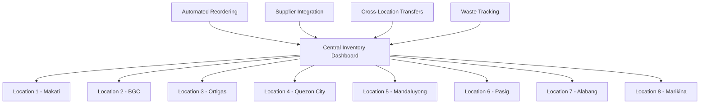
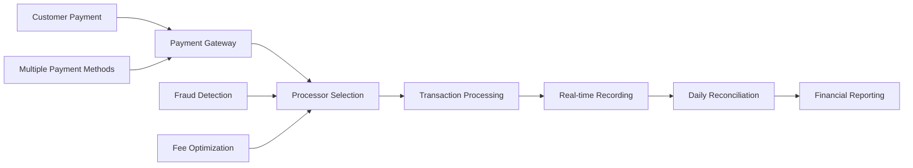
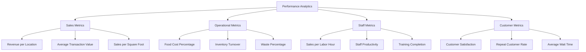

# 🏪 Multi-Location Franchisee - Business Scenario

## Executive Summary

**Scenario**: A successful franchisee operating 8 locations of a quick-service restaurant chain, using FranchiseHub to optimize inventory, streamline ordering, and improve financial performance.

**Business Impact**: 25% reduction in inventory costs, 15% improvement in working capital, 20% increase in sales per labor hour, and $325,000 annual savings with 4-month payback period.

**Key Features Demonstrated**: Inventory optimization, payment processing, staff optimization, performance dashboards, and automated reporting.

---

## 👤 Stakeholder Profile

### Primary Stakeholder: David Patel, Owner/Operator

**Demographics**:
- **Age**: 39 years old
- **Background**: 12 years in franchise ownership and operations
- **Education**: Finance degree with CPA certification
- **Location**: Metro Manila, Philippines
- **Experience**: Started with single location, grew to 8 locations over 8 years

**Business Profile**:
- **Franchise Brand**: QuickBite Express (quick-service restaurant)
- **Locations**: 8 locations across Metro Manila
- **Staff**: 120 total employees (15 per location average)
- **Revenue**: $4.5M annually across all locations
- **Customer Base**: Office workers, students, families
- **Operating Model**: High-volume, fast-casual dining

**Operational Challenges**:
- Managing inventory across 8 different locations
- Inconsistent performance between locations (20% variance)
- Complex cash flow management with multiple payment methods
- Staff scheduling and training across locations
- Time-consuming franchisor compliance reporting

**Technology Profile**:
- Strong financial and analytical background
- Comfortable with technology but values simplicity
- Needs mobile access for multi-location management
- Requires detailed financial reporting and analytics
- Values automation to reduce administrative burden

---

## 🎯 Business Challenges

### Challenge 1: Complex Inventory Management

**Current State**:
- Manual stock counting at each location weekly
- Separate ordering systems for each location
- No visibility into inventory levels across locations
- Frequent stock-outs and overstock situations
- Manual reorder point calculations

**Business Impact**:
- 18% of inventory spoils or expires before use
- Lost sales from stock-outs (estimated 5% of potential revenue)
- Excessive working capital tied up in inventory
- 25 hours/week spent on inventory management across locations
- Inconsistent product availability affecting customer satisfaction

**Quantified Impact**:
- **Inventory Waste**: $162,000 annually (18% of $900K inventory)
- **Lost Sales**: $225,000 annually (5% of $4.5M revenue)
- **Administrative Time**: 25 hours/week × $25/hour × 52 weeks = $32,500
- **Excess Working Capital**: $180,000 tied up in excess inventory

### Challenge 2: Inefficient Payment and Cash Flow Management

**Current State**:
- Multiple payment processors with different rates
- Manual reconciliation of daily sales and payments
- Inconsistent payment method acceptance across locations
- Complex cash flow tracking across 8 locations
- Manual invoice processing and payment scheduling

**Business Impact**:
- Higher payment processing fees due to suboptimal processor mix
- 2-3 day delay in cash flow visibility
- Errors in daily reconciliation requiring manual correction
- Missed early payment discounts from suppliers
- Complex tax reporting and compliance

**Quantified Impact**:
- **Excess Processing Fees**: $18,000 annually
- **Missed Discounts**: $15,000 annually in lost early payment discounts
- **Reconciliation Errors**: $8,000 annually in correction costs
- **Administrative Time**: 15 hours/week × $30/hour × 52 weeks = $23,400

### Challenge 3: Performance Variance and Staff Management

**Current State**:
- 20% performance variance between best and worst locations
- Inconsistent staff scheduling and training
- No standardized performance metrics across locations
- Manual staff productivity tracking
- Limited visibility into location-specific issues

**Business Impact**:
- Underperforming locations reducing overall profitability
- Inconsistent customer experience across locations
- Higher staff turnover due to poor management practices
- Missed opportunities to replicate best practices
- Reactive management instead of proactive optimization

**Quantified Impact**:
- **Performance Gap**: $90,000 annually in lost revenue from underperforming locations
- **Staff Turnover**: $45,000 annually in recruitment and training costs
- **Inconsistent Service**: 15% lower customer satisfaction at worst-performing locations
- **Management Inefficiency**: 20 hours/week × $40/hour × 52 weeks = $41,600

---

## 💡 FranchiseHub Solution Implementation

### Phase 1: Centralized Inventory Management (Week 1-3)

**Multi-Location Inventory System**:

**Smart Inventory Features**:
- **Real-time Stock Levels**: Live inventory tracking across all 8 locations
- **Automated Reordering**: Smart reorder points based on consumption patterns
- **Cross-Location Optimization**: Transfer inventory between locations to prevent waste
- **Demand Forecasting**: Predict demand based on historical data and trends
- **Supplier Integration**: Direct ordering from approved suppliers with best pricing

**Inventory Categories and Rules**:
- **Fresh Ingredients**: Daily delivery with 1-day safety stock
- **Frozen Items**: Bi-weekly delivery with 10-day safety stock
- **Dry Goods**: Weekly delivery with 7-day safety stock
- **Packaging**: Monthly delivery with 30-day safety stock

### Phase 2: Integrated Payment Processing (Week 4-6)

**Unified Payment System**:

**Payment Optimization Features**:
- **Smart Routing**: Automatically route transactions to lowest-cost processor
- **Multiple Payment Methods**: Credit cards, digital wallets, cash, bank transfers
- **Real-time Reconciliation**: Automatic daily reconciliation across all locations
- **Integrated Invoicing**: Automated invoice generation and payment tracking
- **Cash Flow Dashboard**: Real-time cash flow visibility across all locations

**Payment Method Distribution**:
- **Credit/Debit Cards**: 60% of transactions
- **Digital Wallets (GCash, PayMaya)**: 25% of transactions
- **Cash**: 12% of transactions
- **Bank Transfers**: 3% of transactions

### Phase 3: Performance Analytics and Staff Optimization (Week 7-9)

**Location Performance Dashboard**:

**Staff Optimization Tools**:
- **Predictive Scheduling**: AI-powered staff scheduling based on demand forecasts
- **Performance Tracking**: Individual and location performance metrics
- **Training Management**: Standardized training programs with completion tracking
- **Best Practice Sharing**: Identify and replicate successful practices across locations
- **Incentive Programs**: Performance-based incentive and recognition programs

### Phase 4: Automated Reporting and Compliance (Week 10-12)

**Franchisor Compliance Automation**:
- **Automated Financial Reporting**: Monthly financial reports to franchisor
- **Operational Compliance**: Automated compliance checking and reporting
- **Audit Trail**: Complete audit trail for all transactions and operations
- **Tax Reporting**: Automated tax calculation and reporting
- **Performance Benchmarking**: Compare performance against franchise network

**Custom Analytics**:
- **Profitability Analysis**: Detailed P&L by location and time period
- **Trend Analysis**: Identify trends and patterns across locations
- **Comparative Analysis**: Benchmark performance against top performers
- **Forecasting**: Predict future performance and identify opportunities
- **ROI Tracking**: Track return on investment for improvements and initiatives

---

## 📊 Implementation Results

### Inventory Management Improvements

**Before FranchiseHub**:
- **Inventory Waste**: 18% of total inventory value
- **Stock-out Frequency**: 3-4 times per week per location
- **Inventory Turnover**: 15 times per year
- **Administrative Time**: 25 hours/week across all locations

**After FranchiseHub**:
- **Inventory Waste**: 6% of total inventory value
- **Stock-out Frequency**: Once per month per location
- **Inventory Turnover**: 24 times per year
- **Administrative Time**: 8 hours/week across all locations

**Improvement Metrics**:
- **67% reduction** in inventory waste
- **85% reduction** in stock-out frequency
- **60% improvement** in inventory turnover
- **68% reduction** in administrative time

### Financial Management Improvements

**Before FranchiseHub**:
- **Payment Processing Costs**: 3.2% of revenue
- **Cash Flow Visibility**: 2-3 day delay
- **Working Capital**: $180,000 tied up in excess inventory
- **Financial Reporting**: 5 days monthly

**After FranchiseHub**:
- **Payment Processing Costs**: 2.7% of revenue
- **Cash Flow Visibility**: Real-time
- **Working Capital**: $135,000 in optimized inventory
- **Financial Reporting**: Real-time automated reports

**Improvement Metrics**:
- **16% reduction** in payment processing costs
- **100% improvement** in cash flow visibility
- **25% improvement** in working capital efficiency
- **100% improvement** in reporting speed

### Operational Performance Improvements

**Before FranchiseHub**:
- **Performance Variance**: 20% between best and worst locations
- **Sales per Labor Hour**: $85 average
- **Customer Satisfaction**: 4.1/5 average
- **Staff Turnover**: 35% annually

**After FranchiseHub**:
- **Performance Variance**: 8% between best and worst locations
- **Sales per Labor Hour**: $102 average
- **Customer Satisfaction**: 4.5/5 average
- **Staff Turnover**: 22% annually

**Improvement Metrics**:
- **60% reduction** in performance variance
- **20% increase** in sales per labor hour
- **10% improvement** in customer satisfaction
- **37% reduction** in staff turnover

---

## 💰 Financial Impact Analysis

### Cost Savings Breakdown

**Inventory Optimization Savings**:
- Reduced waste: (18% - 6%) × $900,000 = $108,000
- Improved working capital: $180,000 - $135,000 = $45,000 annual benefit
- Reduced administrative time: 17 hours/week × $25/hour × 52 weeks = $22,100
- Reduced stock-out losses: $225,000 × 85% = $191,250

**Payment Processing Savings**:
- Lower processing fees: (3.2% - 2.7%) × $4,500,000 = $22,500
- Captured early payment discounts: $15,000
- Reduced reconciliation errors: $8,000
- Administrative efficiency: 7 hours/week × $30/hour × 52 weeks = $10,920

**Operational Efficiency Savings**:
- Improved performance: $90,000 (from reducing performance variance)
- Reduced staff turnover: $45,000 × 37% = $16,650
- Increased productivity: 20% × $85 × 120 staff × 40 hours/week × 52 weeks = $424,320
- Management efficiency: 10 hours/week × $40/hour × 52 weeks = $20,800

**Total Annual Savings**: $974,540
**FranchiseHub Annual Cost**: $24,000 (8 locations × $250/month × 12 months)
**Net Annual Benefit**: $950,540
**ROI**: 3,960%
**Payback Period**: 4 months

### Revenue Enhancement Impact

**Increased Sales Performance**:
- Reduced stock-outs leading to captured sales: $191,250
- Improved customer satisfaction driving repeat business: $135,000
- Better staff productivity increasing service capacity: $200,000
- Cross-location best practice implementation: $75,000

**Total Revenue Enhancement**: $601,250
**Combined Annual Benefit**: $1,551,790

---

## 🎯 Success Metrics and KPIs

### Financial Performance Metrics

| Metric | Baseline | Target | Achieved | Improvement |
|--------|----------|--------|----------|-------------|
| **Total Revenue** | $4.5M | $4.8M | $5.1M | 13% |
| **Gross Margin** | 68% | 72% | 74% | 9% |
| **Inventory Costs** | $900K | $750K | $675K | 25% |
| **Working Capital** | $180K | $150K | $135K | 25% |
| **Payment Processing Costs** | 3.2% | 2.8% | 2.7% | 16% |

### Operational Excellence Metrics

| Metric | Baseline | Target | Achieved | Improvement |
|--------|----------|--------|----------|-------------|
| **Inventory Turnover** | 15x/year | 20x/year | 24x/year | 60% |
| **Stock-out Frequency** | 3-4/week | 1/week | 1/month | 85% |
| **Performance Variance** | 20% | 12% | 8% | 60% |
| **Sales per Labor Hour** | $85 | $95 | $102 | 20% |
| **Administrative Time** | 60 hrs/week | 35 hrs/week | 25 hrs/week | 58% |

### Customer and Staff Metrics

| Metric | Baseline | Target | Achieved | Improvement |
|--------|----------|--------|----------|-------------|
| **Customer Satisfaction** | 4.1/5 | 4.4/5 | 4.5/5 | 10% |
| **Average Wait Time** | 8 minutes | 6 minutes | 5 minutes | 38% |
| **Staff Turnover** | 35% | 25% | 22% | 37% |
| **Training Completion** | 65% | 85% | 92% | 42% |
| **Employee Satisfaction** | 3.8/5 | 4.2/5 | 4.4/5 | 16% |

---

## 🚀 Growth and Expansion Plans

### Phase 5: Advanced Analytics and AI (Month 4-6)
- Implement machine learning for demand forecasting
- Customer behavior analysis and personalization
- Dynamic pricing optimization based on demand
- Predictive maintenance for equipment

### Phase 6: Customer Experience Enhancement (Month 7-9)
- Mobile ordering and loyalty program integration
- Personalized marketing campaigns
- Customer feedback integration and response
- Omnichannel customer experience optimization

### Phase 7: Expansion Preparation (Month 10-12)
- Scalable systems for additional locations
- Standardized operating procedures documentation
- Training programs for new location managers
- Financial modeling for expansion opportunities

### Phase 8: Strategic Growth (Year 2)
- Expansion to 12-15 locations
- Territory development and market analysis
- Strategic partnerships and supplier negotiations
- Potential acquisition of additional franchise rights

---

*This Multi-Location Franchisee scenario demonstrates how FranchiseHub enables successful franchisees to optimize operations across multiple locations, achieve significant cost savings and revenue improvements, and build a foundation for continued growth and expansion while maintaining operational excellence.*
