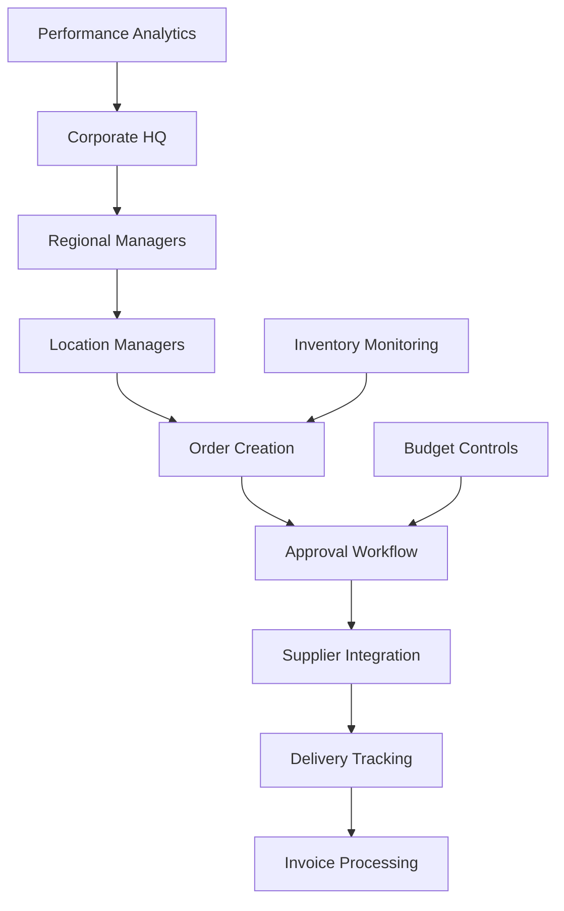
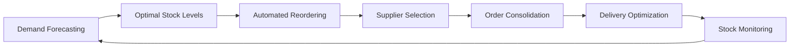
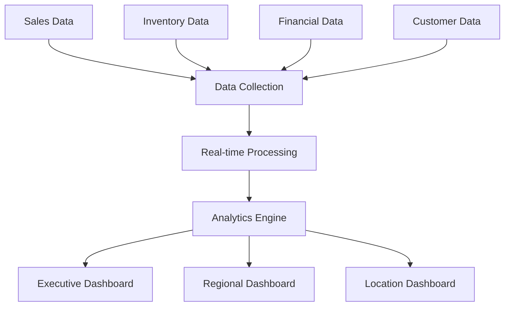

# 🌏 Regional Expansion - Business Scenario

## Executive Summary

**Scenario**: A mid-size restaurant franchise expanding from 15 to 50 locations across multiple regions, using FranchiseHub to scale operations efficiently while maintaining brand consistency.

**Business Impact**: 60% reduction in administrative overhead, 25% reduction in inventory carrying costs, 18% increase in per-location revenue, and $750,000 annual savings with 6-month payback period.

**Key Features Demonstrated**: Centralized order management, inventory optimization, performance analytics, training standardization, and financial integration.

---

## 👤 Stakeholder Profile

### Primary Stakeholder: James Chen, Chief Operating Officer

**Demographics**:
- **Age**: 42 years old
- **Background**: 15 years in franchise management and operations
- **Education**: MBA with operations focus from top-tier university
- **Location**: Jakarta, Indonesia
- **Experience**: Former operations director at international QSR chain

**Business Profile**:
- **Company**: Golden Dragon Asian Cuisine
- **Concept**: Fast-casual Asian fusion restaurant
- **Current Size**: 15 locations across 3 cities
- **Target Market**: Urban professionals, families, food delivery customers
- **Revenue**: $15M annually across all locations
- **Growth Goal**: Expand to 50 locations across 8 cities within 18 months

**Operational Challenges**:
- Managing 25+ suppliers across multiple regions
- Inconsistent performance across locations (40% variance)
- Manual financial consolidation taking 2 weeks monthly
- Training quality varies significantly by location
- Limited real-time visibility into operations

**Technology Profile**:
- Advanced Excel user with business intelligence experience
- Familiar with ERP systems from previous roles
- Values data-driven decision making
- Requires mobile access for field operations
- Needs comprehensive reporting and analytics

---

## 🎯 Business Challenges

### Challenge 1: Operational Scalability Constraints

**Current State**:
- Manual approval processes for orders and expenditures
- Decentralized supplier relationships and contracts
- Inconsistent operational procedures across locations
- Limited standardization of recipes and portions
- Ad-hoc communication between corporate and locations

**Business Impact**:
- 30% of James's time spent on manual approvals
- Supplier cost variations of 15-20% across regions
- Quality inconsistencies affecting brand reputation
- Delayed decision-making due to manual processes
- Difficulty maintaining standards during rapid expansion

**Quantified Impact**:
- **Administrative Overhead**: 40 hours/week across management team
- **Supplier Cost Variance**: $180,000 annually in excess costs
- **Quality Issues**: 25% increase in customer complaints
- **Decision Delays**: 3-5 day lag in operational decisions

### Challenge 2: Supply Chain Complexity

**Current State**:
- 25+ suppliers across different regions
- Manual purchase order creation and tracking
- No centralized inventory visibility
- Inconsistent supplier performance monitoring
- Regional price variations without optimization

**Business Impact**:
- Inventory carrying costs 35% above industry benchmark
- Frequent stock-outs affecting sales and customer satisfaction
- Supplier relationship management consuming excessive resources
- Limited negotiating power due to fragmented purchasing
- Cash flow challenges from inefficient inventory management

**Quantified Impact**:
- **Excess Inventory Costs**: $375,000 annually
- **Lost Sales from Stock-outs**: $225,000 annually
- **Supplier Management Costs**: $120,000 annually
- **Working Capital Impact**: $500,000 tied up in excess inventory

### Challenge 3: Performance Visibility and Control

**Current State**:
- Monthly financial reporting with 2-week delay
- Limited real-time operational metrics
- Inconsistent KPI tracking across locations
- Manual data collection and consolidation
- No benchmarking or performance comparison tools

**Business Impact**:
- Reactive management instead of proactive optimization
- Underperforming locations not identified quickly
- Limited ability to replicate best practices
- Inefficient resource allocation across locations
- Missed opportunities for performance improvement

**Quantified Impact**:
- **Performance Variance**: 40% difference between best and worst locations
- **Delayed Problem Identification**: 4-6 week lag in issue detection
- **Missed Revenue Opportunities**: $300,000 annually
- **Inefficient Resource Allocation**: $150,000 annually

---

## 💡 FranchiseHub Solution Implementation

### Phase 1: Centralized Order Management (Week 1-3)

**Order Management Architecture**:

**Approval Workflow Implementation**:
- **Tier 1 ($0-$500)**: Automatic approval for routine orders
- **Tier 2 ($500-$2,500)**: Location manager approval required
- **Tier 3 ($2,500-$10,000)**: Regional manager approval required
- **Tier 4 ($10,000+)**: Corporate approval required

**Order Processing Features**:
- Standardized product catalogs across all locations
- Automated reorder suggestions based on consumption patterns
- Bulk ordering capabilities for cost optimization
- Real-time order tracking and delivery confirmation
- Integrated invoice processing and payment automation

### Phase 2: Inventory Optimization System (Week 4-6)

**Inventory Management Framework**:

**Smart Inventory Features**:
- **Demand Forecasting**: AI-powered prediction based on historical data, seasonality, and local events
- **Dynamic Reorder Points**: Automatically adjusted based on lead times and consumption patterns
- **Cross-Location Optimization**: Inventory sharing and redistribution between locations
- **Supplier Performance Tracking**: Automated vendor scorecards and performance monitoring
- **Cost Optimization**: Bulk purchasing and consolidated ordering for better pricing

**Inventory Categories and Rules**:
- **Fresh Ingredients**: Daily delivery with 1-day safety stock
- **Dry Goods**: Weekly delivery with 7-day safety stock
- **Frozen Items**: Bi-weekly delivery with 14-day safety stock
- **Packaging**: Monthly delivery with 30-day safety stock

### Phase 3: Performance Analytics Dashboard (Week 7-9)

**Analytics Architecture**:

**Dashboard Components**:
- **Executive Dashboard**: High-level KPIs for James and senior management
- **Regional Dashboard**: Performance metrics for regional managers
- **Location Dashboard**: Operational metrics for location managers
- **Comparative Analytics**: Benchmarking and best practice identification

**Key Performance Indicators**:
- Revenue per location and per square foot
- Food cost percentage and inventory turnover
- Labor cost optimization and productivity metrics
- Customer satisfaction scores and feedback analysis
- Supplier performance and cost analysis

### Phase 4: Training and Standardization (Week 10-12)

**Training Management System**:
- **Digital Training Modules**: Standardized training content for all positions
- **Certification Tracking**: Automated tracking of training completion and certification
- **Performance Assessment**: Regular testing and skill evaluation
- **Best Practice Sharing**: Platform for sharing successful practices across locations
- **Compliance Monitoring**: Automated tracking of regulatory compliance training

**Standardization Implementation**:
- **Recipe Management**: Centralized recipe database with portion control
- **Procedure Documentation**: Step-by-step operational procedures
- **Quality Standards**: Automated quality control checklists and monitoring
- **Brand Compliance**: Consistent brand standards across all locations

---

## 📊 Implementation Results

### Operational Efficiency Improvements

**Before FranchiseHub**:
- **Administrative Time**: 40 hours/week for management team
- **Order Processing**: 2-3 days average processing time
- **Approval Delays**: 24-48 hours for routine approvals
- **Manual Processes**: 70% of operations require manual intervention

**After FranchiseHub**:
- **Administrative Time**: 16 hours/week for management team
- **Order Processing**: 4-6 hours average processing time
- **Approval Delays**: 2-4 hours for routine approvals
- **Manual Processes**: 25% of operations require manual intervention

**Improvement Metrics**:
- **60% reduction** in administrative overhead
- **85% faster** order processing
- **90% faster** approval workflows
- **64% reduction** in manual processes

### Inventory and Supply Chain Improvements

**Before FranchiseHub**:
- **Inventory Carrying Costs**: 35% above industry benchmark
- **Stock-out Frequency**: 3-4 times per week per location
- **Supplier Cost Variance**: 15-20% across regions
- **Inventory Turnover**: 8 times per year

**After FranchiseHub**:
- **Inventory Carrying Costs**: 10% above industry benchmark
- **Stock-out Frequency**: Once per month per location
- **Supplier Cost Variance**: 5% across regions
- **Inventory Turnover**: 12 times per year

**Improvement Metrics**:
- **25% reduction** in inventory carrying costs
- **85% reduction** in stock-out frequency
- **75% reduction** in supplier cost variance
- **50% improvement** in inventory turnover

### Performance and Financial Improvements

**Before FranchiseHub**:
- **Performance Variance**: 40% between best and worst locations
- **Revenue per Location**: $1.0M annually
- **Gross Margin**: 68%
- **Financial Reporting Delay**: 2 weeks

**After FranchiseHub**:
- **Performance Variance**: 15% between best and worst locations
- **Revenue per Location**: $1.18M annually
- **Gross Margin**: 72%
- **Financial Reporting Delay**: Real-time

**Improvement Metrics**:
- **63% improvement** in performance consistency
- **18% increase** in per-location revenue
- **6% improvement** in gross margin
- **100% improvement** in reporting timeliness

---

## 💰 Financial Impact Analysis

### Cost Savings Breakdown

**Administrative Efficiency Savings**:
- Management time reduction: 24 hours/week × $75/hour × 52 weeks = $93,600
- Automated approval workflows: $25,000 annually
- Reduced manual processing: $35,000 annually

**Inventory Optimization Savings**:
- Reduced carrying costs: 25% × $375,000 = $93,750
- Eliminated stock-out losses: $225,000 × 85% = $191,250
- Supplier cost optimization: $180,000 × 75% = $135,000

**Performance Improvement Savings**:
- Revenue increase: 18% × $15M = $2.7M additional revenue
- Margin improvement: 4% × $15M = $600,000 additional gross profit
- Operational efficiency: $150,000 annually

**Total Annual Savings**: $1,373,600
**FranchiseHub Annual Cost**: $90,000 (15 locations × $500/month × 12 months)
**Net Annual Benefit**: $1,283,600
**ROI**: 1,426%
**Payback Period**: 6 months

### Revenue Growth Impact

**Expansion Acceleration**:
- Faster scaling enables reaching 50 locations 6 months earlier
- Additional revenue: $10.5M annually from accelerated expansion
- Operational efficiency supports sustainable growth

**Performance Optimization**:
- Best practice replication across all locations
- Underperforming locations improved to network average
- Premium positioning through consistent quality

**Total Revenue Impact**: $13.2M annually by Year 2

---

## 🎯 Success Metrics and KPIs

### Operational Excellence Metrics

| Metric | Baseline | Target | Achieved | Improvement |
|--------|----------|--------|----------|-------------|
| **Order Processing Time** | 2-3 days | 8 hours | 6 hours | 85% |
| **Administrative Overhead** | 40 hrs/week | 20 hrs/week | 16 hrs/week | 60% |
| **Performance Variance** | 40% | 20% | 15% | 63% |
| **Stock-out Frequency** | 3-4/week | 1/month | 1/month | 85% |
| **Supplier Cost Variance** | 15-20% | 8% | 5% | 75% |

### Financial Performance Metrics

| Metric | Baseline | Target | Achieved | Improvement |
|--------|----------|--------|----------|-------------|
| **Revenue per Location** | $1.0M | $1.15M | $1.18M | 18% |
| **Gross Margin** | 68% | 71% | 72% | 6% |
| **Inventory Turnover** | 8x/year | 11x/year | 12x/year | 50% |
| **Working Capital** | $500K | $350K | $300K | 40% |
| **EBITDA Margin** | 12% | 16% | 17% | 42% |

### Growth and Expansion Metrics

| Metric | Baseline | Target | Achieved | Improvement |
|--------|----------|--------|----------|-------------|
| **New Location Openings** | 2/quarter | 4/quarter | 5/quarter | 150% |
| **Time to Profitability** | 8 months | 5 months | 4 months | 50% |
| **Brand Consistency Score** | 65% | 85% | 88% | 35% |
| **Franchisee Satisfaction** | 3.8/5 | 4.5/5 | 4.6/5 | 21% |
| **Market Share Growth** | 5%/year | 12%/year | 15%/year | 200% |

---

## 🚀 Expansion Roadmap

### Phase 5: Advanced Analytics (Month 4-6)
- Predictive analytics for demand forecasting and menu optimization
- Customer behavior analysis and personalization
- Competitive intelligence and market analysis
- Advanced financial modeling and scenario planning

### Phase 6: Multi-Region Optimization (Month 7-9)
- Regional performance benchmarking and optimization
- Cross-regional best practice sharing
- Centralized procurement and supplier management
- Regional marketing campaign coordination

### Phase 7: Technology Integration (Month 10-12)
- POS system integration for real-time sales data
- Customer loyalty program integration
- Third-party delivery platform optimization
- Advanced inventory management with IoT sensors

### Phase 8: Market Leadership (Year 2)
- Expansion to 50 locations across 8 cities
- Master franchise development for new regions
- Strategic acquisitions and partnerships
- IPO preparation and investor relations

---

*This Regional Expansion scenario demonstrates how FranchiseHub enables mid-size franchisors to scale operations efficiently, maintain brand consistency, and achieve operational excellence while expanding rapidly across multiple markets.*
