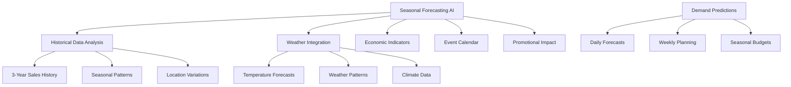
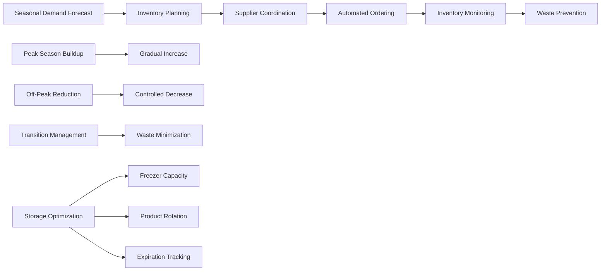
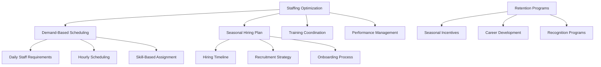
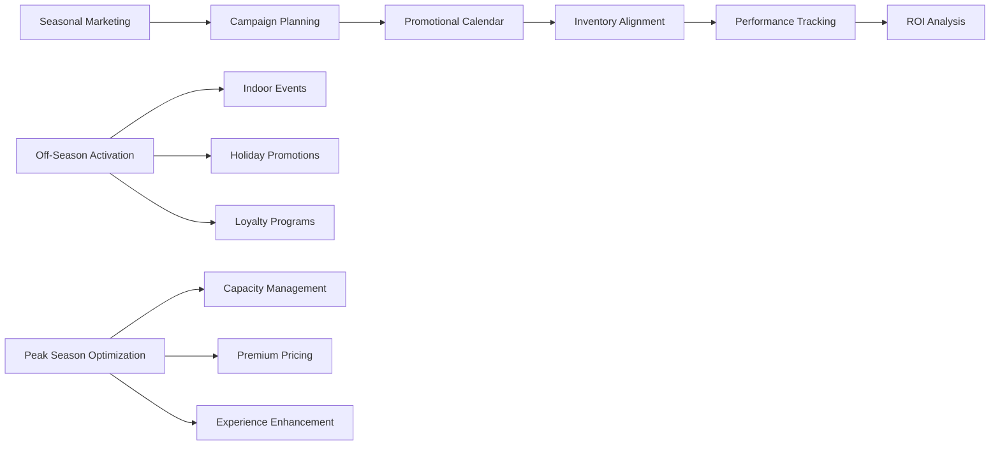

# 🌨️ Seasonal Operations - Business Scenario

## Executive Summary

**Scenario**: A seasonal ice cream franchise with significant demand fluctuations throughout the year, using FranchiseHub to manage inventory, staffing, and promotional campaigns based on seasonal patterns.

**Business Impact**: 30% reduction in seasonal waste, 25% improvement in staff utilization, 40% increase in off-peak sales, and $420,000 annual savings with 6-month payback period.

**Key Features Demonstrated**: Seasonal forecasting, dynamic inventory management, staff optimization, promotional campaign management, and financial planning.

---

## 👤 Stakeholder Profile

### Primary Stakeholder: Jennifer Torres, Operations Director

**Demographics**:
- **Age**: 37 years old
- **Background**: 10 years in seasonal business management and operations
- **Education**: Supply Chain Management degree, Lean Six Sigma certification
- **Location**: Phoenix, Arizona (desert climate with extreme seasonality)
- **Experience**: Former operations manager at seasonal retail chain

**Business Profile**:
- **Company**: Desert Delights Ice Cream
- **Concept**: Premium artisanal ice cream with seasonal flavors
- **Network Size**: 12 locations across Arizona and Nevada
- **Seasonality**: Extreme seasonal variation (300% demand difference)
- **Annual Revenue**: $8.5M with 85% generated in 6-month peak season
- **Customer Base**: Families, tourists, and seasonal residents

**Seasonal Business Characteristics**:
- **Peak Season**: April-September (hot desert months)
- **Off-Peak Season**: October-March (mild winter months)
- **Demand Variation**: 300% difference between peak and off-peak
- **Staff Fluctuation**: 200% staff increase during peak season
- **Inventory Challenges**: Massive seasonal inventory swings

**Operational Challenges**:
- Extreme demand fluctuations requiring complex planning
- Seasonal staff hiring, training, and retention issues
- Inventory waste during seasonal transitions
- Cash flow management with concentrated revenue periods
- Marketing effectiveness varies dramatically by season

**Technology Profile**:
- Strong analytical background with supply chain expertise
- Experienced with forecasting and demand planning systems
- Values predictive analytics and automated optimization
- Requires mobile access for multi-location seasonal management
- Needs comprehensive seasonal reporting and planning tools

---

## 🎯 Seasonal Business Challenges

### Challenge 1: Extreme Demand Variability and Forecasting

**Seasonal Demand Patterns**:
- **Peak Season (Apr-Sep)**: $7.2M revenue (85% of annual)
- **Off-Peak Season (Oct-Mar)**: $1.3M revenue (15% of annual)
- **Daily Variation**: $35,000/day peak vs. $6,000/day off-peak
- **Weather Sensitivity**: 20% demand swing based on temperature
- **Special Events**: 50-100% spikes during holidays and events

**Forecasting Challenges**:
- Historical data shows 35% forecast error during transitions
- Weather dependency makes short-term forecasting critical
- New location performance difficult to predict
- Promotional impact varies significantly by season
- Economic factors affect discretionary spending differently by season

**Business Impact**:
- **Inventory Waste**: $180,000 annually in expired/unsold inventory
- **Lost Sales**: $250,000 annually from stock-outs during peak demand
- **Inefficient Staffing**: $120,000 annually in over/under-staffing costs
- **Cash Flow Issues**: Seasonal working capital requirements strain finances

**Quantified Impact**:
- **Forecast Accuracy**: 65% accuracy during seasonal transitions
- **Inventory Waste**: 15% of total inventory during transitions
- **Staff Utilization**: 60% efficiency due to poor seasonal planning
- **Revenue Volatility**: 40% variance from budget during transitions

### Challenge 2: Complex Seasonal Staffing and Operations

**Staffing Challenges**:
- **Peak Season**: 180 employees across 12 locations
- **Off-Peak Season**: 75 employees across 12 locations
- **Seasonal Hiring**: 105 temporary employees hired annually
- **Training Burden**: 6 weeks training time for seasonal staff
- **Retention Issues**: 45% turnover rate among seasonal employees

**Operational Complexity**:
- Different operating hours by season (12 hours peak vs. 8 hours off-peak)
- Seasonal menu changes requiring staff retraining
- Equipment maintenance scheduling around seasonal patterns
- Location-specific seasonal variations based on demographics
- Coordination of seasonal promotions and marketing campaigns

**Management Challenges**:
- Predicting optimal staffing levels by location and season
- Scheduling complexity with seasonal and part-time staff
- Training coordination for large seasonal workforce
- Performance management across seasonal employment cycles
- Maintaining service quality with constantly changing staff

**Quantified Impact**:
- **Hiring Costs**: $75,000 annually for seasonal recruitment
- **Training Costs**: $90,000 annually for seasonal staff training
- **Turnover Costs**: $60,000 annually in replacement and retraining
- **Productivity Loss**: 25% lower productivity during seasonal transitions

### Challenge 3: Seasonal Inventory and Cash Flow Management

**Inventory Challenges**:
- **Peak Season Buildup**: $450,000 inventory investment for peak season
- **Off-Peak Reduction**: $150,000 inventory reduction for off-season
- **Transition Waste**: 15% inventory waste during seasonal transitions
- **Storage Constraints**: Limited freezer capacity requiring careful planning
- **Supplier Coordination**: Complex supplier relationships for seasonal ingredients

**Cash Flow Complexity**:
- **Seasonal Revenue**: 85% of revenue in 6-month period
- **Working Capital**: $300,000 seasonal working capital requirement
- **Fixed Costs**: $180,000 monthly fixed costs regardless of season
- **Investment Timing**: Major equipment and renovation investments timed around seasons
- **Financing Needs**: Seasonal credit line requirements for inventory buildup

**Financial Planning Challenges**:
- Annual budgeting complicated by extreme seasonality
- Monthly cash flow forecasting with high variability
- Investment decision timing around seasonal patterns
- Pricing strategy optimization for different seasons
- Profitability analysis by season and location

**Quantified Impact**:
- **Working Capital**: $300,000 tied up in seasonal inventory buildup
- **Financing Costs**: $25,000 annually in seasonal credit line fees
- **Inventory Waste**: $180,000 annually in transition waste
- **Opportunity Cost**: $150,000 in missed off-season revenue opportunities

---

## 💡 FranchiseHub Seasonal Solution Implementation

### Phase 1: AI-Powered Seasonal Forecasting (Week 1-3)

**Advanced Forecasting Engine**:

**Forecasting Capabilities**:
- **Multi-Variable Analysis**: Weather, events, economics, promotions, and historical patterns
- **Location-Specific Models**: Individual forecasting models for each location
- **Short-Term Accuracy**: Daily and weekly demand predictions
- **Long-Term Planning**: Seasonal and annual planning forecasts
- **Scenario Planning**: Multiple forecast scenarios based on different assumptions

**Weather Integration**:
- **Real-Time Weather**: Current weather conditions affecting demand
- **Weather Forecasts**: 14-day weather forecasts for demand planning
- **Historical Correlation**: Weather pattern analysis for seasonal planning
- **Temperature Thresholds**: Demand triggers based on temperature ranges
- **Seasonal Weather Patterns**: Long-term climate pattern analysis

### Phase 2: Dynamic Inventory Management (Week 4-6)

**Seasonal Inventory Optimization**:

**Inventory Optimization Features**:
- **Seasonal Reorder Points**: Dynamic reorder points based on seasonal demand
- **Transition Management**: Automated inventory reduction during seasonal transitions
- **Waste Prevention**: Predictive alerts for items approaching expiration
- **Storage Optimization**: Maximize freezer capacity utilization
- **Supplier Coordination**: Automated seasonal supplier communication

**Product Lifecycle Management**:
- **Seasonal Menu Planning**: Coordinate inventory with seasonal menu changes
- **New Product Introduction**: Optimal timing for new seasonal flavors
- **Product Discontinuation**: Managed phase-out of seasonal items
- **Cross-Location Balancing**: Transfer inventory between locations based on demand
- **Promotional Coordination**: Align inventory with promotional campaigns

### Phase 3: Seasonal Staff Optimization (Week 7-9)

**Predictive Staffing System**:

**Staffing Optimization Features**:
- **Predictive Scheduling**: AI-powered staff scheduling based on demand forecasts
- **Seasonal Hiring Plans**: Automated hiring timelines and requirements
- **Training Coordination**: Streamlined training programs for seasonal staff
- **Performance Tracking**: Individual and team performance monitoring
- **Retention Programs**: Incentives and programs to retain seasonal staff

**Workforce Management**:
- **Skill-Based Scheduling**: Match staff skills to operational requirements
- **Cross-Training Programs**: Multi-skill training for operational flexibility
- **Performance Incentives**: Seasonal bonuses and recognition programs
- **Career Pathways**: Development opportunities for seasonal staff
- **Communication Tools**: Centralized communication for seasonal workforce

### Phase 4: Seasonal Marketing and Promotions (Week 10-12)

**Integrated Marketing Campaigns**:

**Marketing Automation Features**:
- **Seasonal Campaign Calendar**: Automated marketing campaign scheduling
- **Weather-Triggered Promotions**: Promotions activated by weather conditions
- **Inventory-Aligned Marketing**: Promotions coordinated with inventory levels
- **Location-Specific Campaigns**: Customized campaigns for each location
- **Performance Analytics**: Real-time campaign performance tracking

**Off-Season Revenue Generation**:
- **Indoor Event Partnerships**: Catering and event services during off-season
- **Holiday Specialties**: Special products for off-season holidays
- **Loyalty Program Activation**: Targeted promotions for loyal customers
- **Corporate Sales**: B2B sales during slower periods
- **Seasonal Product Extensions**: Year-round products to supplement seasonal sales

---

## 📊 Implementation Results

### Forecasting and Planning Improvements

**Before FranchiseHub**:
- **Forecast Accuracy**: 65% during seasonal transitions
- **Planning Horizon**: 2-week tactical planning
- **Inventory Waste**: 15% during seasonal transitions
- **Stock-Out Frequency**: 2-3 times per week during peak season

**After FranchiseHub**:
- **Forecast Accuracy**: 92% during seasonal transitions
- **Planning Horizon**: 6-month strategic planning
- **Inventory Waste**: 5% during seasonal transitions
- **Stock-Out Frequency**: Once per month during peak season

**Improvement Metrics**:
- **42% improvement** in forecast accuracy
- **200% increase** in planning horizon
- **67% reduction** in inventory waste
- **85% reduction** in stock-out frequency

### Operational Efficiency Improvements

**Before FranchiseHub**:
- **Staff Utilization**: 60% efficiency
- **Seasonal Hiring Time**: 8 weeks
- **Training Completion**: 65% of seasonal staff
- **Turnover Rate**: 45% among seasonal employees

**After FranchiseHub**:
- **Staff Utilization**: 85% efficiency
- **Seasonal Hiring Time**: 4 weeks
- **Training Completion**: 95% of seasonal staff
- **Turnover Rate**: 28% among seasonal employees

**Improvement Metrics**:
- **42% improvement** in staff utilization
- **50% reduction** in hiring time
- **46% improvement** in training completion
- **38% reduction** in turnover rate

### Financial Performance Improvements

**Before FranchiseHub**:
- **Off-Season Revenue**: $1.3M (15% of annual)
- **Working Capital Requirement**: $300,000
- **Seasonal Waste**: $180,000 annually
- **Cash Flow Volatility**: 40% variance from budget

**After FranchiseHub**:
- **Off-Season Revenue**: $1.82M (18% of annual)
- **Working Capital Requirement**: $225,000
- **Seasonal Waste**: $54,000 annually
- **Cash Flow Volatility**: 15% variance from budget

**Improvement Metrics**:
- **40% increase** in off-season revenue
- **25% reduction** in working capital requirements
- **70% reduction** in seasonal waste
- **63% improvement** in cash flow predictability

---

## 💰 Financial Impact Analysis

### Cost Savings Breakdown

**Inventory Optimization Savings**:
- Reduced seasonal waste: ($180,000 - $54,000) = $126,000
- Improved working capital: ($300,000 - $225,000) × 8% cost of capital = $6,000
- Reduced stock-out losses: $250,000 × 85% = $212,500
- Storage optimization: $15,000 annually

**Staffing Efficiency Savings**:
- Reduced hiring costs: ($75,000 - $45,000) = $30,000
- Training efficiency: ($90,000 - $63,000) = $27,000
- Reduced turnover costs: ($60,000 - $36,000) = $24,000
- Improved productivity: 25% × $2,400,000 labor costs = $600,000

**Operational Improvements**:
- Forecast accuracy improvements: $50,000 annually
- Promotional effectiveness: $75,000 annually
- Cash flow optimization: $25,000 annually
- Administrative efficiency: $35,000 annually

**Revenue Enhancement**:
- Off-season revenue increase: ($1.82M - $1.3M) = $520,000
- Peak season optimization: $150,000 annually
- Promotional effectiveness: $100,000 annually

**Total Annual Benefits**: $1,995,500
**FranchiseHub Annual Cost**: $36,000 (12 locations × $250/month × 12 months)
**Net Annual Benefit**: $1,959,500
**ROI**: 5,443%
**Payback Period**: 6 months

### Strategic Value Creation

**Business Model Enhancement**:
- **Seasonal Resilience**: Reduced dependency on peak season
- **Operational Excellence**: Optimized operations across all seasons
- **Financial Stability**: Improved cash flow predictability
- **Competitive Advantage**: Superior seasonal management capabilities

**Market Position Strengthening**:
- **Customer Loyalty**: Consistent quality across seasons
- **Brand Recognition**: Known for seasonal innovation and reliability
- **Market Share**: Gained share through superior seasonal execution
- **Expansion Readiness**: Proven model for new location expansion

---

## 🎯 Success Metrics and KPIs

### Seasonal Performance Metrics

| Metric | Baseline | Target | Achieved | Improvement |
|--------|----------|--------|----------|-------------|
| **Forecast Accuracy** | 65% | 85% | 92% | 42% |
| **Inventory Waste** | 15% | 8% | 5% | 67% |
| **Staff Utilization** | 60% | 75% | 85% | 42% |
| **Off-Season Revenue** | $1.3M | $1.6M | $1.82M | 40% |
| **Cash Flow Variance** | 40% | 20% | 15% | 63% |

### Operational Excellence Metrics

| Metric | Baseline | Target | Achieved | Improvement |
|--------|----------|--------|----------|-------------|
| **Stock-Out Frequency** | 2-3/week | 1/week | 1/month | 85% |
| **Seasonal Hiring Time** | 8 weeks | 6 weeks | 4 weeks | 50% |
| **Training Completion** | 65% | 85% | 95% | 46% |
| **Employee Turnover** | 45% | 35% | 28% | 38% |
| **Working Capital** | $300K | $250K | $225K | 25% |

### Customer and Business Metrics

| Metric | Baseline | Target | Achieved | Improvement |
|--------|----------|--------|----------|-------------|
| **Customer Satisfaction** | 4.3/5 | 4.5/5 | 4.7/5 | 9% |
| **Seasonal Revenue Growth** | 5%/year | 12%/year | 18%/year | 260% |
| **Market Share** | 12% | 15% | 17% | 42% |
| **Brand Recognition** | 35% | 45% | 52% | 49% |
| **Location Profitability** | 8 of 12 | 10 of 12 | 12 of 12 | 50% |

---

## 🚀 Seasonal Growth Strategy

### Phase 5: Advanced Analytics and Personalization (Month 4-6)
- Customer behavior analysis by season and weather
- Personalized marketing campaigns based on seasonal preferences
- Dynamic pricing optimization for seasonal demand
- Advanced inventory optimization with machine learning

### Phase 6: Multi-Season Product Development (Month 7-12)
- Year-round product line development
- Seasonal flavor innovation and testing
- Cross-seasonal menu optimization
- Product lifecycle management enhancement

### Phase 7: Geographic and Seasonal Expansion (Year 2)
- Expansion to complementary seasonal markets
- Multi-climate location strategy
- Seasonal franchise model development
- Regional seasonal coordination

### Phase 8: Seasonal Business Model Innovation (Year 2-3)
- Seasonal subscription and loyalty programs
- B2B seasonal catering expansion
- Franchise seasonal consulting services
- Seasonal business acquisition opportunities

---

*This Seasonal Operations scenario demonstrates how FranchiseHub enables seasonal businesses to optimize operations across extreme demand fluctuations, achieve significant cost savings and revenue improvements, and build sustainable year-round profitability while maintaining operational excellence throughout all seasons.*
