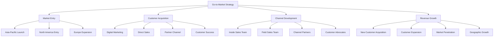

# 🚀 Go-to-Market Strategy - FranchiseHub

## Executive Summary

FranchiseHub's go-to-market strategy employs a multi-channel approach targeting growing franchisors in the Asia-Pacific region first, followed by North American expansion. Our 18-month launch timeline focuses on rapid customer acquisition through digital marketing, strategic partnerships, and direct sales, with a target of $10M ARR by month 20.

---

## 🎯 Go-to-Market Framework

### Strategic Approach
- **Market Entry**: Asia-Pacific first (Philippines → Regional expansion)
- **Customer Focus**: Growing franchisors (5-50 locations) as primary segment
- **Channel Strategy**: Multi-channel approach with digital-first methodology
- **Revenue Target**: $2.4M ARR in Year 1, $24M ARR by Year 3
- **Geographic Expansion**: 3 new markets annually starting Year 2



---

## 📅 18-Month Launch Timeline

### Phase 1: Foundation & Launch (Months 1-6)

**Objectives**:
- Establish market presence in Philippines
- Build core sales and marketing team
- Achieve $500K ARR
- Onboard first 50 customers

**Key Activities**:

**Month 1-2: Team Building & Infrastructure**
- ✅ Hire VP of Sales and Marketing Director
- ✅ Establish sales and marketing infrastructure
- ✅ Develop sales collateral and marketing materials
- ✅ Set up CRM and marketing automation systems
- ✅ Create customer onboarding processes

**Month 3-4: Market Entry & Brand Building**
- 🎯 Launch digital marketing campaigns (SEO, SEM, content)
- 🎯 Establish partnerships with local franchise associations
- 🎯 Begin direct outreach to target customer list
- 🎯 Launch thought leadership content program
- 🎯 Participate in first industry trade show

**Month 5-6: Customer Acquisition & Optimization**
- 📈 Scale digital marketing based on performance data
- 📈 Optimize sales processes and conversion rates
- 📈 Launch customer referral program
- 📈 Establish customer success processes
- 📈 Begin planning for regional expansion

**Phase 1 Targets**:
- **Customers**: 50 customers (average 4 locations each = 200 locations)
- **Revenue**: $500K ARR ($2,500 average monthly revenue per customer)
- **Team Size**: 12 employees (4 sales, 3 marketing, 5 operations)
- **Market Presence**: Established brand in Philippines market

### Phase 2: Scale & Expand (Months 7-12)

**Objectives**:
- Expand to 3 additional Asia-Pacific markets
- Scale customer acquisition to 100+ new customers
- Achieve $2.4M ARR
- Build partner channel program

**Key Activities**:

**Month 7-8: Regional Expansion**
- 🌏 Launch in Indonesia and Thailand markets
- 🌏 Hire regional sales managers
- 🌏 Localize marketing materials and website
- 🌏 Establish local partnerships and distribution
- 🌏 Adapt product for local market requirements

**Month 9-10: Channel Development**
- 🤝 Launch formal partner program
- 🤝 Recruit and onboard 10 channel partners
- 🤝 Develop partner training and certification
- 🤝 Create partner portal and resources
- 🤝 Implement partner incentive programs

**Month 11-12: Optimization & Preparation**
- ⚡ Optimize customer acquisition costs and processes
- ⚡ Implement advanced analytics and reporting
- ⚡ Prepare for North American market entry
- ⚡ Scale customer success and support teams
- ⚡ Develop enterprise sales capabilities

**Phase 2 Targets**:
- **Customers**: 200 total customers (800 locations)
- **Revenue**: $2.4M ARR ($1,000 average monthly revenue per customer)
- **Team Size**: 25 employees (8 sales, 6 marketing, 11 operations)
- **Market Presence**: Leading position in 4 Asia-Pacific markets

### Phase 3: Growth & Diversification (Months 13-18)

**Objectives**:
- Enter North American market
- Launch enterprise sales program
- Achieve $10M ARR
- Establish market leadership position

**Key Activities**:

**Month 13-14: North American Entry**
- 🇺🇸 Establish North American headquarters
- 🇺🇸 Hire North American sales and marketing team
- 🇺🇸 Adapt product for North American market
- 🇺🇸 Launch targeted marketing campaigns
- 🇺🇸 Begin enterprise customer acquisition

**Month 15-16: Enterprise Program Launch**
- 🏢 Launch dedicated enterprise sales program
- 🏢 Develop enterprise-specific features and services
- 🏢 Hire enterprise sales specialists
- 🏢 Create enterprise customer success program
- 🏢 Target first enterprise customers

**Month 17-18: Market Leadership**
- 👑 Establish thought leadership position
- 👑 Launch customer advocacy program
- 👑 Expand product capabilities based on market feedback
- 👑 Prepare for Series A funding round
- 👑 Plan for European market entry

**Phase 3 Targets**:
- **Customers**: 500 total customers (2,000 locations)
- **Revenue**: $10M ARR ($1,667 average monthly revenue per customer)
- **Team Size**: 50 employees (15 sales, 10 marketing, 25 operations)
- **Market Presence**: Recognized leader in Asia-Pacific, emerging player in North America

---

## 📊 Customer Acquisition Strategy

### Digital Marketing (40% of leads)

**Search Engine Optimization (SEO)**:
- **Target Keywords**: "franchise management software", "franchise operations platform"
- **Content Strategy**: 50+ high-quality blog posts, case studies, whitepapers
- **Technical SEO**: Optimized website architecture and page speed
- **Local SEO**: Optimize for regional franchise-related searches
- **Investment**: $50K annually, targeting 500+ organic leads monthly

**Search Engine Marketing (SEM)**:
- **Google Ads**: Targeted campaigns for high-intent keywords
- **LinkedIn Ads**: B2B targeting of franchise executives
- **Retargeting**: Website visitors and content engagement audiences
- **Budget**: $100K annually, targeting 300+ paid leads monthly
- **Target CPC**: $25-50 for franchise management keywords

**Content Marketing**:
- **Blog Content**: Weekly educational content for franchise operators
- **Video Content**: Product demos, customer testimonials, thought leadership
- **Webinars**: Monthly educational webinars with industry experts
- **Podcasts**: Franchise industry podcast sponsorships and appearances
- **Investment**: $75K annually for content creation and promotion

**Social Media Marketing**:
- **LinkedIn**: B2B thought leadership and lead generation
- **YouTube**: Product demonstrations and customer success stories
- **Facebook**: Community building and brand awareness
- **Twitter**: Industry news and thought leadership
- **Investment**: $25K annually for content and advertising

### Industry Events & Partnerships (30% of leads)

**Trade Shows & Conferences**:
- **International Franchise Association (IFA) Events**: Annual convention and regional shows
- **Regional Franchise Associations**: Local and regional franchise events
- **Industry Conferences**: Franchise development and operations conferences
- **Investment**: $150K annually for events, booth, travel, and materials
- **Target**: 200+ qualified leads per major event

**Strategic Partnerships**:
- **Franchise Consultants**: Partner program with revenue sharing
- **Industry Associations**: Membership and sponsorship opportunities
- **Technology Partners**: Integration partnerships with POS and accounting vendors
- **Investment**: $100K annually for partner development and management
- **Target**: 30% of leads through partner channel by Year 2

### Direct Sales & Outreach (20% of leads)

**Inside Sales Team**:
- **Team Size**: 4 inside sales representatives by Month 6
- **Target**: 50 qualified demos per rep per month
- **Tools**: Salesforce CRM, Outreach.io, ZoomInfo
- **Process**: Lead qualification → Demo → Proposal → Close
- **Investment**: $400K annually for team and tools

**Field Sales Team**:
- **Team Size**: 2 regional sales managers by Month 12
- **Target**: 20 qualified meetings per rep per month
- **Focus**: Enterprise accounts and strategic partnerships
- **Process**: Account research → Executive meetings → Pilot programs → Enterprise deals
- **Investment**: $300K annually for team and travel

### Customer Referrals (10% of leads)

**Referral Program**:
- **Customer Incentives**: 3 months free service for successful referrals
- **Partner Incentives**: 20% revenue share for first year
- **Advocate Program**: Customer advisory board and case study opportunities
- **Investment**: $50K annually for incentives and program management
- **Target**: 15% of new customers from referrals by Year 2

---

## 💰 Customer Acquisition Economics

### Customer Acquisition Cost (CAC) by Channel

| Channel | CAC | Conversion Rate | Lead Volume | Customer Volume |
|---------|-----|----------------|-------------|-----------------|
| **SEO/Content** | $500 | 8% | 500/month | 40/month |
| **SEM/Paid** | $1,500 | 12% | 300/month | 36/month |
| **Events** | $2,500 | 25% | 200/month | 50/month |
| **Direct Sales** | $3,500 | 35% | 150/month | 52/month |
| **Referrals** | $250 | 45% | 50/month | 22/month |
| **Blended Average** | $2,000 | 18% | 1,200/month | 200/month |

### Customer Acquisition Funnel

```mermaid
funnel
    title Customer Acquisition Funnel
    "Website Visitors" : 50000
    "Marketing Qualified Leads" : 5000
    "Sales Qualified Leads" : 1500
    "Opportunities" : 750
    "Customers" : 150
```

**Conversion Metrics**:
- **Visitor to MQL**: 10% (industry benchmark: 2-5%)
- **MQL to SQL**: 30% (industry benchmark: 20-25%)
- **SQL to Opportunity**: 50% (industry benchmark: 40-45%)
- **Opportunity to Customer**: 20% (industry benchmark: 15-20%)
- **Overall Conversion**: 0.3% (visitor to customer)

### Sales Cycle & Velocity

**Average Sales Cycle**: 90 days (3 months)
- **Discovery & Qualification**: 2 weeks
- **Demo & Technical Evaluation**: 3 weeks
- **Proposal & Negotiation**: 4 weeks
- **Contract & Implementation**: 3 weeks

**Sales Velocity Optimization**:
- **Reduce Discovery Time**: Automated qualification and lead scoring
- **Accelerate Evaluation**: Self-service demos and trial programs
- **Streamline Proposals**: Standardized pricing and contract templates
- **Fast Implementation**: 2-week implementation guarantee

---

## 🌍 Geographic Expansion Strategy

### Year 1: Asia-Pacific Foundation
**Primary Markets**:
- **Philippines**: Launch market with established presence
- **Indonesia**: Largest economy in Southeast Asia
- **Thailand**: Mature franchise market with growth potential
- **Vietnam**: Emerging market with rapid economic growth

**Market Entry Approach**:
- **Direct Sales**: Establish local sales presence
- **Local Partnerships**: Partner with local franchise associations
- **Digital Marketing**: Localized content and advertising
- **Customer Success**: Local customer support and success teams

### Year 2: North American Entry
**Primary Markets**:
- **United States**: Largest franchise market globally
- **Canada**: Mature market with strong franchise presence

**Market Entry Approach**:
- **Partnership Strategy**: Channel partners and resellers
- **Enterprise Focus**: Target large franchise systems
- **Competitive Positioning**: Modern alternative to legacy solutions
- **Regulatory Compliance**: Ensure compliance with local regulations

### Year 3: European Expansion
**Primary Markets**:
- **United Kingdom**: English-speaking market with strong franchise sector
- **Germany**: Largest European economy
- **France**: Mature franchise market

**Market Entry Approach**:
- **GDPR Compliance**: Ensure full regulatory compliance
- **Multi-language Support**: Localized product and support
- **Local Partnerships**: European franchise associations and consultants
- **Regulatory Expertise**: Local legal and compliance support

---

## 📈 Success Metrics & KPIs

### Customer Acquisition Metrics
- **Monthly New Customers**: 50 (Month 6) → 200 (Month 18)
- **Customer Acquisition Cost**: $2,500 blended average
- **Lead Conversion Rate**: 18% overall funnel conversion
- **Sales Cycle Length**: 90 days average
- **Pipeline Velocity**: $500K monthly pipeline generation

### Revenue Metrics
- **Monthly Recurring Revenue**: $200K (Month 6) → $833K (Month 18)
- **Annual Recurring Revenue**: $2.4M (Year 1) → $10M (Month 18)
- **Average Revenue Per Customer**: $5,000 annually
- **Revenue Growth Rate**: 15% month-over-month
- **Customer Lifetime Value**: $50,000 average

### Market Penetration Metrics
- **Market Share**: 0.1% (Year 1) → 0.5% (Month 18)
- **Brand Recognition**: 25% aided awareness in target markets
- **Geographic Coverage**: 4 countries (Year 1) → 6 countries (Month 18)
- **Competitive Win Rate**: 60% in head-to-head competitions
- **Customer Satisfaction**: 90%+ NPS score

### Operational Metrics
- **Team Growth**: 12 employees (Month 6) → 50 employees (Month 18)
- **Sales Team Productivity**: $2M ARR per sales rep annually
- **Marketing ROI**: 5:1 return on marketing investment
- **Customer Churn Rate**: <5% annually
- **Implementation Success Rate**: >95% successful implementations

---

*This go-to-market strategy provides a comprehensive roadmap for FranchiseHub to achieve rapid customer acquisition, market penetration, and revenue growth while building a sustainable competitive advantage in the franchise management software market.*
