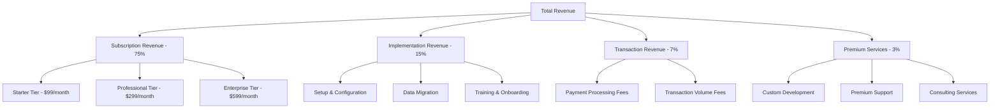

# 💰 Revenue Model - FranchiseHub

## Executive Summary

FranchiseHub employs a comprehensive SaaS revenue model with multiple revenue streams designed to maximize customer lifetime value while maintaining competitive pricing. Our tiered subscription model, combined with implementation services and transaction-based revenue, creates a scalable and predictable business model with strong unit economics.

---

## 🏗️ Revenue Architecture

### Primary Revenue Streams

---

## 📊 SaaS Subscription Tiers

### 🥉 **Starter Package** - $99/month per location

**Target Market**: New franchisors (1-5 locations), emerging brands
**Value Proposition**: Essential franchise management at affordable entry point

**Core Features Included**:
- ✅ **Basic User Management**: Up to 10 users per location
- ✅ **Application Processing**: Franchise application workflow
- ✅ **Order Management**: Basic order creation and tracking
- ✅ **Inventory Tracking**: Simple stock level monitoring
- ✅ **Financial Reporting**: Standard reports and dashboards
- ✅ **Mobile Access**: iOS and Android apps
- ✅ **Email Support**: Business hours support (9 AM - 6 PM)
- ✅ **Basic Integrations**: 5 third-party integrations

**Limitations**:
- ❌ Advanced analytics and forecasting
- ❌ Custom workflows and automation
- ❌ Priority support and dedicated account management
- ❌ Advanced reporting and business intelligence

**Annual Pricing**: $1,188 per location (2 months free)
**Setup Fee**: $500 per location (waived for annual plans)

### 🥈 **Professional Package** - $299/month per location

**Target Market**: Growing franchisors (5-25 locations), established brands
**Value Proposition**: Comprehensive franchise management with advanced features

**Everything in Starter Plus**:
- ✅ **Advanced Analytics**: Predictive analytics and forecasting
- ✅ **Workflow Automation**: Custom approval workflows and triggers
- ✅ **Advanced Reporting**: Custom reports and business intelligence
- ✅ **Priority Support**: 24/7 phone and chat support
- ✅ **API Access**: Full API access for custom integrations
- ✅ **Multi-Brand Management**: Manage multiple franchise concepts
- ✅ **Advanced Inventory**: Automated reordering and optimization
- ✅ **Financial Consolidation**: Multi-location financial reporting
- ✅ **Training Management**: Comprehensive training tracking
- ✅ **Compliance Monitoring**: Automated compliance tracking

**Annual Pricing**: $3,588 per location (2 months free)
**Setup Fee**: $1,500 per location (50% discount for annual plans)

### 🥇 **Enterprise Package** - $599/month per location

**Target Market**: Large franchisors (25+ locations), multi-brand enterprises
**Value Proposition**: Enterprise-grade platform with white-label capabilities

**Everything in Professional Plus**:
- ✅ **White-Label Solution**: Custom branding and domain
- ✅ **Dedicated Account Manager**: Personal customer success manager
- ✅ **Custom Development**: Quarterly custom feature development
- ✅ **Advanced Security**: SOC 2 compliance, SSO, advanced permissions
- ✅ **Data Warehouse**: Advanced data export and warehousing
- ✅ **Unlimited Integrations**: Custom API development included
- ✅ **Performance SLA**: 99.9% uptime guarantee with credits
- ✅ **Onsite Training**: Quarterly onsite training sessions
- ✅ **Strategic Consulting**: Monthly business strategy sessions
- ✅ **Priority Development**: Feature request prioritization

**Annual Pricing**: $7,188 per location (2 months free)
**Setup Fee**: $5,000 per location (included in annual plans)

---

## 🛠️ Implementation & Professional Services

### Implementation Services Revenue

**Standard Implementation**: $2,500 per location
- System configuration and setup
- Basic data migration (up to 1,000 records)
- User training (2 sessions, up to 10 users)
- Go-live support (first 30 days)

**Premium Implementation**: $7,500 per location
- Advanced system configuration
- Comprehensive data migration (unlimited records)
- Custom workflow setup
- Extended training program (5 sessions, unlimited users)
- Dedicated implementation manager
- 90-day post-launch support

**Enterprise Implementation**: $15,000+ per location
- White-label customization
- Complex data migration and integration
- Custom feature development
- Comprehensive training program
- Onsite implementation support
- 6-month dedicated support

### Professional Services Portfolio

**Custom Development**: $150-$250 per hour
- Custom feature development
- Advanced integrations
- Workflow customization
- Reporting and analytics development

**Training Services**: $2,500 per session
- Advanced user training
- Administrator certification
- Best practices workshops
- Change management consulting

**Consulting Services**: $300 per hour
- Franchise operations consulting
- Technology strategy advisory
- Process optimization
- Performance improvement consulting

---

## 💳 Transaction-Based Revenue

### Payment Processing Fees
**Revenue Share**: 0.25% of processed payment volume
**Target Volume**: $50M annually by Year 3
**Projected Revenue**: $125,000 annually

### Transaction Volume Fees
**High-Volume Locations**: $0.10 per order for locations processing >1,000 orders/month
**Target Volume**: 500,000 orders annually by Year 3
**Projected Revenue**: $50,000 annually

### Marketplace Revenue
**Third-Party Integration Fees**: 15% revenue share on marketplace transactions
**Target Volume**: $500,000 annually by Year 3
**Projected Revenue**: $75,000 annually

---

## 📈 Revenue Projections & Unit Economics

### 5-Year Revenue Projection

| Year | Locations | Avg Monthly Revenue | Annual Subscription | Implementation | Total Revenue |
|------|-----------|-------------------|-------------------|----------------|---------------|
| **Year 1** | 200 | $200 | $4.8M | $1.0M | $6.2M |
| **Year 2** | 600 | $250 | $18.0M | $2.5M | $21.8M |
| **Year 3** | 1,200 | $300 | $43.2M | $4.0M | $48.9M |
| **Year 4** | 2,000 | $350 | $84.0M | $5.5M | $92.1M |
| **Year 5** | 3,000 | $400 | $144.0M | $7.0M | $155.8M |

### Customer Lifetime Value (LTV) Analysis

**Average Customer Metrics**:
- **Average Locations per Customer**: 4.2
- **Average Monthly Revenue per Location**: $300
- **Average Monthly Revenue per Customer**: $1,260
- **Average Customer Lifespan**: 4.5 years
- **Annual Churn Rate**: 8% (improving to 5% by Year 3)

**LTV Calculation**:
- **Monthly Revenue**: $1,260
- **Annual Revenue**: $15,120
- **Customer Lifespan**: 4.5 years
- **Gross LTV**: $68,040
- **Gross Margin**: 85%
- **Net LTV**: $57,834

### Customer Acquisition Cost (CAC) Analysis

**Blended CAC**: $2,500 per customer
**CAC by Channel**:
- **Direct Sales**: $3,500 per customer
- **Partner Channel**: $2,000 per customer
- **Digital Marketing**: $1,500 per customer
- **Referrals**: $500 per customer

**LTV:CAC Ratio**: 23:1 (excellent SaaS benchmark >3:1)
**CAC Payback Period**: 2.1 months

---

## 🎯 Pricing Strategy & Optimization

### Competitive Pricing Analysis

| Competitor | Entry Level | Mid-Tier | Enterprise |
|------------|-------------|----------|------------|
| **FranConnect** | $500/month | $800/month | $1,200+/month |
| **Naranga** | $200/month | $400/month | $600/month |
| **Franchise Dynamics** | $150/month | $300/month | $500/month |
| **FranchiseHub** | $99/month | $299/month | $599/month |

**Pricing Positioning**:
- **40-50% below premium competitors** (FranConnect)
- **Competitive with modern alternatives** (Naranga)
- **Premium to boutique players** (Franchise Dynamics)

### Value-Based Pricing Justification

**Starter Tier ROI**:
- **Cost**: $1,188 annually per location
- **Value Delivered**: $15,000+ in operational efficiency savings
- **ROI**: 1,264% return on investment

**Professional Tier ROI**:
- **Cost**: $3,588 annually per location
- **Value Delivered**: $45,000+ in efficiency and growth acceleration
- **ROI**: 1,254% return on investment

**Enterprise Tier ROI**:
- **Cost**: $7,188 annually per location
- **Value Delivered**: $100,000+ in enterprise efficiency and compliance
- **ROI**: 1,391% return on investment

### Dynamic Pricing Strategies

**Volume Discounts**:
- **10+ locations**: 10% discount
- **25+ locations**: 15% discount
- **50+ locations**: 20% discount
- **100+ locations**: 25% discount + custom pricing

**Annual Payment Incentives**:
- **Annual Payment**: 2 months free (16.7% discount)
- **2-Year Payment**: 3 months free (12.5% annual discount)
- **3-Year Payment**: 4 months free (11.1% annual discount)

**Market Penetration Pricing**:
- **Early Adopter Discount**: 50% off first year for first 100 customers
- **Competitive Displacement**: 25% off first year for competitor migrations
- **Partner Channel**: 20% off for partner-referred customers

---

## 📊 Revenue Recognition & Financial Metrics

### Revenue Recognition Policy
- **Subscription Revenue**: Recognized monthly over service period
- **Implementation Revenue**: Recognized upon completion of implementation milestones
- **Professional Services**: Recognized as services are delivered
- **Transaction Revenue**: Recognized when transactions are processed

### Key Financial Metrics

**Monthly Recurring Revenue (MRR) Growth**:
- **Year 1**: $50K → $400K MRR (700% growth)
- **Year 2**: $400K → $1.5M MRR (275% growth)
- **Year 3**: $1.5M → $3.6M MRR (140% growth)

**Annual Recurring Revenue (ARR) Milestones**:
- **$1M ARR**: Month 8
- **$10M ARR**: Month 20
- **$25M ARR**: Month 32
- **$50M ARR**: Month 44

**SaaS Metrics Targets**:
- **Net Revenue Retention**: >110% by Year 2
- **Gross Revenue Retention**: >95% by Year 3
- **Monthly Churn Rate**: <0.5% by Year 3
- **Expansion Revenue**: 25% of total revenue by Year 3

---

## 🚀 Revenue Optimization Strategies

### 1. **Upselling & Cross-Selling**
- **Tier Upgrades**: 30% of Starter customers upgrade within 12 months
- **Add-On Services**: Professional services attach rate of 40%
- **Additional Locations**: Average 2.5x location growth per customer over 3 years

### 2. **Market Expansion**
- **Geographic Expansion**: New markets every 6 months
- **Vertical Expansion**: New industry verticals annually
- **Product Expansion**: Adjacent product offerings (POS, accounting)

### 3. **Partnership Revenue**
- **Channel Partners**: 30% of revenue through partners by Year 3
- **Technology Partners**: Revenue sharing on integrated solutions
- **Referral Programs**: 15% of new customers from referrals

### 4. **Premium Services Growth**
- **Consulting Services**: $5M annual revenue by Year 3
- **Custom Development**: $3M annual revenue by Year 3
- **Training Services**: $2M annual revenue by Year 3

---

*This revenue model provides multiple growth levers and creates a sustainable, scalable business with strong unit economics and predictable cash flows suitable for rapid scaling and investor returns.*
