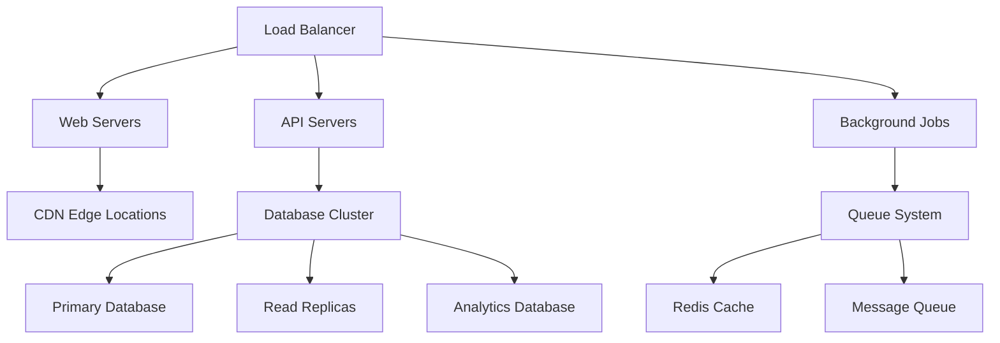

# 🏗️ Technology Scalability - FranchiseHub

## Executive Summary

FranchiseHub's modern technology architecture is designed for massive scale, supporting 10,000+ concurrent users and millions of transactions. Our cloud-native, API-first platform built on React and Supabase provides the foundation for rapid growth while maintaining performance, security, and reliability at enterprise scale.

---

## 🚀 Current Technology Stack

### Frontend Architecture

**React 18 + TypeScript**:
- ✅ **Component-Based Architecture**: Modular, reusable components for rapid development
- ✅ **Type Safety**: TypeScript ensures code reliability and developer productivity
- ✅ **Modern Hooks**: React 18 features for optimal performance and user experience
- ✅ **Server-Side Rendering**: Next.js ready for SEO and performance optimization
- ✅ **Progressive Web App**: Mobile-first design with offline capabilities

**UI/UX Framework**:
- ✅ **Tailwind CSS**: Utility-first CSS for consistent, responsive design
- ✅ **shadcn/ui**: High-quality component library for professional interface
- ✅ **Responsive Design**: Mobile-first approach supporting all device types
- ✅ **Accessibility**: WCAG 2.1 AA compliance for inclusive user experience
- ✅ **Dark Mode**: User preference support for enhanced usability

### Backend Infrastructure

**Supabase Platform**:
- ✅ **PostgreSQL Database**: ACID-compliant, horizontally scalable database
- ✅ **Real-time Subscriptions**: WebSocket-based real-time data synchronization
- ✅ **Authentication & Authorization**: Row-level security with JWT tokens
- ✅ **API Gateway**: Auto-generated REST and GraphQL APIs
- ✅ **Edge Functions**: Serverless compute for custom business logic

**Data Architecture**:
- ✅ **Relational Database**: Normalized schema with referential integrity
- ✅ **JSONB Support**: Flexible schema for unstructured data
- ✅ **Full-Text Search**: Advanced search capabilities across all data
- ✅ **Audit Logging**: Comprehensive transaction and change tracking
- ✅ **Data Encryption**: End-to-end encryption for sensitive information

### Development & Deployment

**Modern Development Stack**:
- ✅ **Git Version Control**: GitHub with automated workflows
- ✅ **CI/CD Pipeline**: Automated testing, building, and deployment
- ✅ **Code Quality**: ESLint, Prettier, TypeScript for code consistency
- ✅ **Testing Framework**: Jest, React Testing Library, Playwright for comprehensive testing
- ✅ **Documentation**: Automated API documentation and code comments

**Cloud Infrastructure**:
- ✅ **Global CDN**: Vercel Edge Network for optimal performance
- ✅ **Auto-Scaling**: Automatic resource scaling based on demand
- ✅ **Load Balancing**: Distributed traffic management across regions
- ✅ **Monitoring**: Real-time performance and error monitoring
- ✅ **Backup & Recovery**: Automated backups with point-in-time recovery

---

## 📊 Current Performance Metrics

### System Performance

| Metric | Current Performance | Industry Benchmark | Target Performance |
|--------|-------------------|-------------------|-------------------|
| **Page Load Time** | <2 seconds | <3 seconds | <1.5 seconds |
| **API Response Time** | <200ms | <500ms | <150ms |
| **Database Query Time** | <50ms | <100ms | <30ms |
| **Uptime** | 99.9% | 99.5% | 99.99% |
| **Concurrent Users** | 1,000+ | 500+ | 10,000+ |

### Scalability Metrics

| Resource | Current Capacity | Utilization | Scale Limit | Auto-Scale Trigger |
|----------|-----------------|-------------|-------------|-------------------|
| **Database Connections** | 500 | 15% | 10,000 | 70% |
| **API Requests/Second** | 10,000 | 20% | 100,000 | 80% |
| **Storage** | 1TB | 10% | 100TB | 85% |
| **Bandwidth** | 1Gbps | 25% | 10Gbps | 75% |
| **Memory Usage** | 16GB | 30% | 256GB | 80% |

---

## 🎯 Scalability Architecture

### Horizontal Scaling Strategy

### Database Scaling Plan

**Phase 1: Vertical Scaling (0-1,000 customers)**
- **Current**: Single PostgreSQL instance with 4 vCPUs, 16GB RAM
- **Capacity**: 10,000 concurrent connections, 1TB storage
- **Performance**: <50ms query response time
- **Cost**: $200/month

**Phase 2: Read Replicas (1,000-5,000 customers)**
- **Architecture**: Primary + 2 read replicas across regions
- **Capacity**: 25,000 concurrent connections, 5TB storage
- **Performance**: <30ms query response time
- **Cost**: $800/month

**Phase 3: Horizontal Partitioning (5,000-20,000 customers)**
- **Architecture**: Sharded database by customer/region
- **Capacity**: 100,000 concurrent connections, 20TB storage
- **Performance**: <20ms query response time
- **Cost**: $3,200/month

**Phase 4: Multi-Region (20,000+ customers)**
- **Architecture**: Global database with regional clusters
- **Capacity**: 500,000 concurrent connections, 100TB storage
- **Performance**: <15ms query response time
- **Cost**: $12,000/month

### Application Scaling Architecture

**Microservices Transition Plan**:

**Current Monolithic Architecture** (0-1,000 customers):
- Single application handling all functionality
- Shared database and codebase
- Simple deployment and maintenance
- Suitable for rapid development and iteration

**Service-Oriented Architecture** (1,000-10,000 customers):
- **User Service**: Authentication and user management
- **Franchise Service**: Franchise and location management
- **Order Service**: Order processing and workflow
- **Inventory Service**: Stock management and tracking
- **Analytics Service**: Reporting and business intelligence
- **Notification Service**: Real-time notifications and alerts

**Full Microservices** (10,000+ customers):
- Independent services with dedicated databases
- API gateway for service orchestration
- Container orchestration with Kubernetes
- Service mesh for inter-service communication
- Distributed caching and session management

---

## 🔧 Infrastructure Scaling Plan

### Compute Resources

**Phase 1: Serverless (Current)**
- **Platform**: Vercel + Supabase Edge Functions
- **Capacity**: Auto-scaling based on demand
- **Cost**: $500-2,000/month
- **Suitable for**: 0-5,000 users

**Phase 2: Container Platform**
- **Platform**: AWS ECS or Google Cloud Run
- **Capacity**: 10-100 container instances
- **Cost**: $2,000-10,000/month
- **Suitable for**: 5,000-25,000 users

**Phase 3: Kubernetes Cluster**
- **Platform**: AWS EKS or Google GKE
- **Capacity**: 100-1,000 nodes
- **Cost**: $10,000-50,000/month
- **Suitable for**: 25,000-100,000 users

**Phase 4: Multi-Region Deployment**
- **Platform**: Global Kubernetes clusters
- **Capacity**: 1,000+ nodes across regions
- **Cost**: $50,000-200,000/month
- **Suitable for**: 100,000+ users

### Storage & Data Management

**Current Storage Architecture**:
- **Primary Database**: PostgreSQL on Supabase
- **File Storage**: Supabase Storage with CDN
- **Cache**: Redis for session and application cache
- **Search**: PostgreSQL full-text search

**Scaled Storage Architecture**:
- **Database**: Distributed PostgreSQL with automatic sharding
- **File Storage**: Multi-region object storage (AWS S3/Google Cloud Storage)
- **Cache**: Distributed Redis cluster with automatic failover
- **Search**: Elasticsearch cluster for advanced search capabilities
- **Analytics**: Dedicated data warehouse (BigQuery/Snowflake)

### Network & Security

**Content Delivery Network (CDN)**:
- **Current**: Vercel Edge Network (50+ locations)
- **Scaled**: Multi-CDN strategy with 200+ edge locations
- **Performance**: <100ms global latency
- **Features**: Dynamic content caching, image optimization, DDoS protection

**Security Infrastructure**:
- **Web Application Firewall (WAF)**: Cloudflare or AWS WAF
- **DDoS Protection**: Multi-layer DDoS mitigation
- **SSL/TLS**: End-to-end encryption with automated certificate management
- **API Security**: Rate limiting, authentication, and authorization
- **Data Encryption**: AES-256 encryption at rest and in transit

---

## 📈 Performance Optimization Strategy

### Frontend Optimization

**Code Splitting & Lazy Loading**:
- Route-based code splitting for faster initial load
- Component-level lazy loading for large features
- Dynamic imports for third-party libraries
- Tree shaking to eliminate unused code

**Caching Strategy**:
- Browser caching for static assets (1 year)
- Service worker for offline functionality
- Application-level caching for API responses
- CDN caching for global content delivery

**Performance Monitoring**:
- Real User Monitoring (RUM) with Core Web Vitals
- Synthetic monitoring for critical user journeys
- Performance budgets and automated alerts
- A/B testing for performance optimizations

### Backend Optimization

**Database Optimization**:
- Query optimization with proper indexing
- Connection pooling for efficient resource usage
- Read replicas for read-heavy workloads
- Materialized views for complex analytics queries

**API Optimization**:
- GraphQL for efficient data fetching
- Response compression (gzip/brotli)
- API versioning for backward compatibility
- Rate limiting and throttling for abuse prevention

**Caching Strategy**:
- Application-level caching with Redis
- Database query result caching
- CDN caching for API responses
- Edge caching for static content

---

## 🔒 Security & Compliance Scaling

### Security Architecture

**Authentication & Authorization**:
- **Multi-Factor Authentication (MFA)**: Required for admin accounts
- **Single Sign-On (SSO)**: SAML/OAuth integration for enterprise customers
- **Role-Based Access Control (RBAC)**: Granular permissions management
- **API Security**: JWT tokens with automatic rotation

**Data Protection**:
- **Encryption**: AES-256 encryption for data at rest and in transit
- **Key Management**: Hardware Security Modules (HSM) for key storage
- **Data Masking**: Sensitive data masking in non-production environments
- **Backup Encryption**: Encrypted backups with secure key management

**Compliance Framework**:
- **SOC 2 Type II**: Annual compliance audits
- **GDPR Compliance**: Data privacy and right to be forgotten
- **ISO 27001**: Information security management system
- **PCI DSS**: Payment card industry compliance for payment processing

### Monitoring & Observability

**Application Monitoring**:
- **Error Tracking**: Sentry for real-time error monitoring
- **Performance Monitoring**: New Relic or DataDog for APM
- **Log Management**: Centralized logging with ELK stack
- **Metrics Collection**: Prometheus and Grafana for custom metrics

**Infrastructure Monitoring**:
- **Server Monitoring**: CPU, memory, disk, and network metrics
- **Database Monitoring**: Query performance and connection monitoring
- **Network Monitoring**: Latency, throughput, and error rates
- **Security Monitoring**: Intrusion detection and vulnerability scanning

---

## 💰 Infrastructure Cost Projections

### 5-Year Infrastructure Cost Model

| Year | Users | Infrastructure Cost | Cost per User | % of Revenue |
|------|-------|-------------------|---------------|--------------|
| **Year 1** | 2,000 | $50K | $25 | 0.8% |
| **Year 2** | 8,000 | $200K | $25 | 0.9% |
| **Year 3** | 20,000 | $600K | $30 | 1.2% |
| **Year 4** | 40,000 | $1.5M | $38 | 1.6% |
| **Year 5** | 75,000 | $3.5M | $47 | 2.2% |

### Cost Optimization Strategies

**Reserved Capacity**:
- 1-3 year reserved instances for predictable workloads
- 30-50% cost savings on compute resources
- Automatic scaling for variable demand

**Multi-Cloud Strategy**:
- Primary cloud provider for core services
- Secondary provider for disaster recovery
- Cost optimization through competitive pricing

**Resource Optimization**:
- Automated resource scaling based on demand
- Spot instances for non-critical workloads
- Regular cost audits and optimization reviews

---

## 🚀 Technology Roadmap

### Year 1: Foundation Scaling
- **Q1**: Implement read replicas and caching layer
- **Q2**: Add comprehensive monitoring and alerting
- **Q3**: Implement automated backup and disaster recovery
- **Q4**: SOC 2 compliance and security audit

### Year 2: Service Architecture
- **Q1**: Transition to service-oriented architecture
- **Q2**: Implement API gateway and service mesh
- **Q3**: Add advanced analytics and reporting capabilities
- **Q4**: Multi-region deployment for disaster recovery

### Year 3: Global Scale
- **Q1**: Full microservices architecture
- **Q2**: Global multi-region deployment
- **Q3**: Advanced AI/ML capabilities
- **Q4**: Edge computing for real-time processing

### Year 4-5: Innovation Platform
- **Advanced Analytics**: Machine learning for predictive insights
- **IoT Integration**: Real-time inventory and equipment monitoring
- **Blockchain**: Supply chain transparency and smart contracts
- **AR/VR**: Immersive training and store planning tools

---

*This technology scalability plan ensures FranchiseHub can grow from startup to global enterprise platform while maintaining performance, security, and cost efficiency at every stage of growth.*
